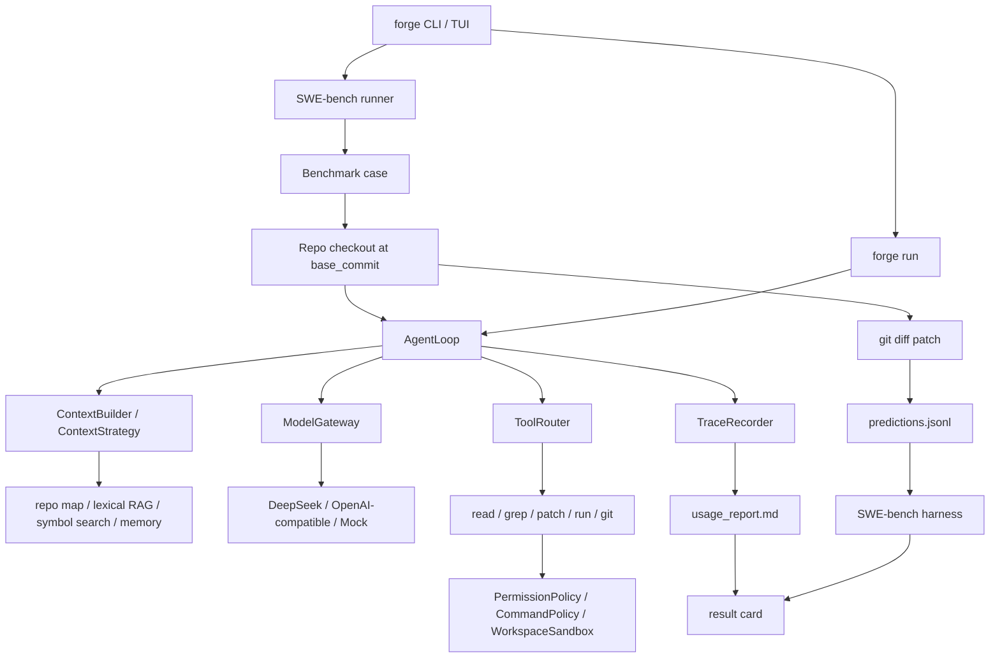

# Agent Forge

[](https://github.com/semi-hollow/NanoHarness/actions/workflows/agent-forge-ci.yml)
[](https://www.python.org/downloads/)
[](LICENSE)

Agent Forge is a SWE-bench-oriented CodingAgent harness. It focuses on the
runtime control plane behind coding agents: context engineering, model gateway,
tool governance, sandboxed execution, trace/replay, usage accounting, patch
prediction, and benchmark result cards.

The project intentionally avoids a heavy IDE product surface, but it does ship a
small local browser UI so the full loop can be demonstrated without memorizing
CLI commands. The goal is a compact codebase that makes the agent engineering
loop easy to inspect and defend:

```text
SWE-bench issue -> clean repo checkout -> AgentLoop -> tool execution
               -> git patch -> predictions.jsonl -> SWE-bench harness
               -> trace / usage / result card
```

## Quick Start

```bash
cd /path/to/NanoHarness
python3 -m venv .venv
source .venv/bin/activate
python -m pip install -U pip setuptools wheel
python -m pip install -e '.[bench]'
```

Check the local environment:

```bash
forge doctor
```

Open the local browser demo UI:

```bash
forge ui
```

It serves `http://127.0.0.1:8765` and gives you buttons for environment checks,
Mock/DeepSeek runs, SWE-bench samples, latest report, and trace replay. This is
the recommended way to demonstrate the project locally.

Run a normal coding task in the current repository:

```bash
forge run "fix the failing test in this repository" --provider deepseek
```

Run a small SWE-bench Lite prediction loop:

```bash
forge bench swebench --limit 1 --provider deepseek --direct-baseline
```

Read the latest report:

```bash
forge report latest
forge replay latest
```

If you prefer a guided terminal menu:

```bash
forge tui
```

## DeepSeek

DeepSeek is the default real-model provider because it is OpenAI-compatible and
cheap enough for local benchmark experiments.

```bash
echo 'export DEEPSEEK_API_KEY="your-key"' >> ~/.zshrc
source ~/.zshrc
forge doctor
```

Default DeepSeek settings are resolved in this order:

1. CLI flags: `--base-url`, `--api-key`, `--model`
2. `AGENT_FORGE_*` environment variables
3. `DEEPSEEK_*` environment variables
4. built-in DeepSeek defaults: `https://api.deepseek.com`, `deepseek-v4-flash`

Mock mode is still available for offline smoke checks:

```bash
forge run "修复 examples/demo_repo 里的测试失败问题" --provider mock
scripts/verify.sh
```

## SWE-bench Loop

The main project proof is not an author-created demo. It is compatibility with
the SWE-bench task shape:

- load SWE-bench Lite/Verified cases;
- clone the target GitHub repo;
- checkout the exact `base_commit`;
- run Agent Forge against the issue;
- write a patch into `predictions.jsonl`;
- optionally call the official SWE-bench Docker harness;
- generate a human-readable result card.

Typical local command:

```bash
forge bench swebench \
  --dataset princeton-nlp/SWE-bench_Lite \
  --split test \
  --limit 5 \
  --provider deepseek \
  --direct-baseline
```

Official evaluation is heavier and requires the SWE-bench package plus Docker:

```bash
forge bench swebench --limit 5 --provider deepseek --evaluate --max-workers 1
```

On Apple Silicon, the runner automatically adds the empty SWE-bench namespace
flag so images can be built locally when needed.

## Output Layout

Runtime outputs are ignored by Git and live under `.agent_forge/`:

```text
.agent_forge/runs/<run-id>/
  report.md                # read first for benchmark runs
  results.json             # machine-readable run summary
  predictions.jsonl        # SWE-bench-compatible predictions
  direct_baseline_predictions.jsonl
  cases/<instance_id>/
    trace.json             # step-by-step evidence
    usage_report.md        # token, cost, context, and tool breakdown
    patch.diff             # generated candidate patch
  workspaces/<instance_id>/
    ...                    # clean repo checkout at base_commit
```

`forge report latest` opens the newest result card. `forge replay latest` prints
a compact trace timeline.

## Architecture



Core packages:

```text
agent_forge/
  bench/          SWE-bench loading, checkout, prediction, result cards
  runtime/        AgentLoop, control, state, session, planning
  context/        repo map, file ranking, lexical retrieval, memory, token budget
  tools/          read/write/grep/patch/run/git/MCP-style adapters
  safety/         sandbox, command policy, permission, guardrails
  models/         provider gateway, retry/fallback, usage telemetry
  observability/  trace, metrics, usage reports
```

## What This Project Is Not

- It is not a full Claude Code/OpenCode replacement.
- It does not ship an IDE plugin or production SaaS backend.
- It does not claim resolved-rate without the official SWE-bench harness.
- It does not use self-authored webhook/calculator demos as the main evidence.
- It keeps tests and smoke checks small; benchmark result cards are the primary evidence.

## Documentation

- [Evaluation Guide](docs/evaluation/README.md)
- [Architecture Notes](docs/architecture.md)
- [Technical Defense Notes](docs/technical-defense/coding-agent-defense-zh.md)

## Development Smoke Check

```bash
scripts/verify.sh
scripts/verify_mcp.sh
```

These commands only verify that the local runtime starts. They are not the
project's effect proof. Use `forge bench swebench ...` for the closed loop.
