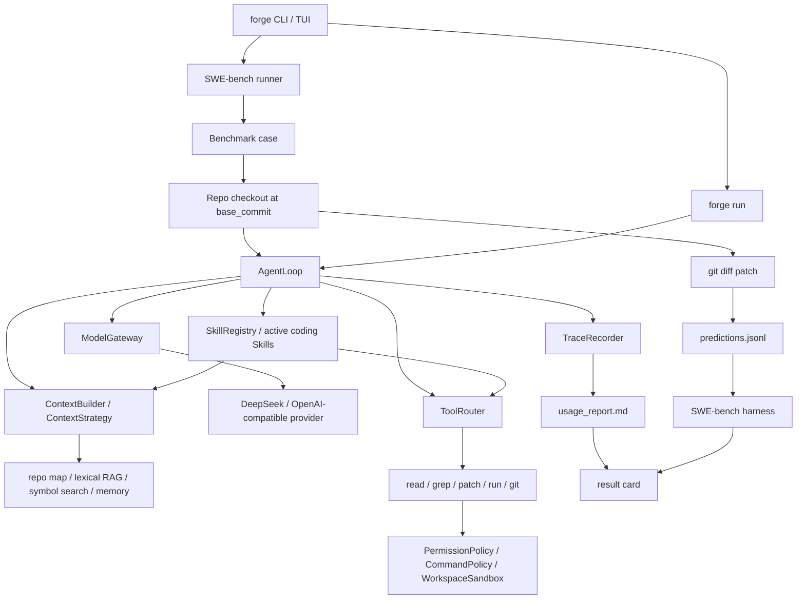

# Agent Forge

[](https://github.com/semi-hollow/NanoHarness/actions/workflows/agent-forge-ci.yml)
[](https://www.python.org/downloads/)
[](LICENSE)

Agent Forge is a SWE-bench-oriented CodingAgent harness. It focuses on the
runtime control plane behind coding agents: context engineering, model gateway,
tool governance, sandboxed execution, trace/replay, usage accounting, patch
prediction, and benchmark result cards.

The project intentionally avoids a heavy IDE product surface, but it does ship a
local browser workbench so the full loop can be configured from a page instead
of memorizing command flags. The goal is a compact codebase that makes the
agent engineering loop usable for real repository work and easy to inspect:

```text
SWE-bench issue -> clean repo checkout -> AgentLoop -> tool execution
               -> git patch -> predictions.jsonl -> SWE-bench harness
               -> trace / usage / result card
```

## Quick Start

Project name: Agent Forge. The Python package is `agent-forge`, the import package is `agent_forge`, and the CLI is `forge`.

```bash
cd /path/to/agent-forge
python3 -m venv .venv
source .venv/bin/activate
python -m pip install -U pip setuptools wheel
python -m pip install -e '.[bench]'
```

Check the local environment:

```bash
forge doctor
```

Open the local browser workbench:

```bash
forge ui
```

On macOS you can also double-click:

```text
scripts/start_workbench.command
```

It serves `http://127.0.0.1:8765`. The page contains the real run parameters:
task, provider, model, base URL, optional temporary API key, max steps, context
budget, approval mode, output folder, Skill selection, and MCP tools. The
evidence panels render result summary, token/cost usage, context breakdown,
tool efficiency, and trace timeline as cards/tables instead of raw JSON logs.

Daily use starts from the page:

1. Click `Run Doctor` once.
2. Fill the `CodingAgent Workbench` task and model settings.
3. Click `Run Agent` for real repository work, or `Run Reference Case` for the
   fixed SWE-bench closure case.
4. Open `Result Summary`, `Usage Dashboard`, and `Trace Timeline`.

The terminal commands below are still available for automation and debugging,
but they are not the primary user entry anymore.

Run a normal coding task in the current repository:

```bash
forge run "fix the failing test in this repository" --provider deepseek
```

Use it for day-to-day code work:

```bash
# Read-only repo orientation. This activates repo_orientation and read tools only.
forge run "阅读这个项目结构并说明入口，不要修改文件" --provider deepseek

# A normal implementation task. This activates targeted_code_edit and validation tools.
forge run "在 agent_forge 里补一个小功能并验证" --provider deepseek

# A debugging task. This activates bug_fix/test_failure_triage.
forge run "修复当前 failing test，并说明根因" --provider deepseek

# Load external MCP-style tools for a run.
forge run "读取项目策略并给出修改建议" \
  --provider deepseek \
  --mcp-config mcp_tools.json \
  --mcp-tool forge.repo_policy
```

Run a small SWE-bench Lite prediction loop:

```bash
forge bench swebench --showcase --provider deepseek --direct-baseline
```

`--showcase` fixes the case to `astropy__astropy-12907`, a real Astropy nested
CompoundModel separability issue. Keeping the case stable makes before/after
harness improvements visible in the same trace, usage, and patch artifacts.

Run the fixed regression set when you want a broader before/after signal:

```bash
forge bench swebench --regression-set core --provider deepseek --direct-baseline
```

The report includes `failure_class`, diagnosis evidence, and next actions for
each case so failed runs become optimization targets instead of raw logs.

Read the latest report:

```bash
forge report latest
forge replay latest
```

Inspect and control runtime Skills:

```bash
forge skills list
forge run "只阅读项目结构并说明入口，不要修改文件" --skills repo_orientation
forge run "修复一个 failing test 并验证" --skills bug_fix,test_failure_triage
```

`forge run` uses built-in coding Skills by default. A selected Skill is not just
metadata: it injects an operating procedure into the prompt, widens or narrows
ToolRouter's allowed tools, and appears in `trace.json` as `skill_selection`.
`--skills none` disables this layer; `--skill-manifest` loads your own local
Skill definitions when you want to add company/repo-specific workflows.

If you prefer a guided terminal menu:

```bash
forge tui
```

## DeepSeek

DeepSeek is the default real-model provider because it is OpenAI-compatible and
cheap enough for local benchmark experiments.

```bash
echo 'export DEEPSEEK_API_KEY="your-key"' >> ~/.zshrc
source ~/.zshrc
forge doctor
```

Default DeepSeek settings are resolved in this order:

1. CLI flags: `--base-url`, `--api-key`, `--model`
2. `AGENT_FORGE_*` environment variables
3. `DEEPSEEK_*` environment variables
4. built-in DeepSeek defaults: `https://api.deepseek.com`, `deepseek-v4-flash`

## SWE-bench Loop

The main project proof is compatibility with the SWE-bench task shape:

- load SWE-bench Lite/Verified cases;
- clone the target GitHub repo;
- checkout the exact `base_commit`;
- run Agent Forge against the issue;
- write a patch into `predictions.jsonl`;
- optionally call the official SWE-bench Docker harness;
- generate a human-readable result card.

Typical local command:

```bash
forge bench swebench \
  --dataset princeton-nlp/SWE-bench_Lite \
  --split test \
  --limit 5 \
  --provider deepseek \
  --direct-baseline
```

Repeatable reference command:

```bash
forge bench swebench --showcase --provider deepseek --direct-baseline
```

Regression command:

```bash
forge bench swebench --regression-set core --provider deepseek --direct-baseline
```

Official evaluation is heavier and requires the SWE-bench package plus Docker:

```bash
forge bench swebench --limit 5 --provider deepseek --evaluate --max-workers 1
```

On Apple Silicon, the runner automatically adds the empty SWE-bench namespace
flag so images can be built locally when needed.

## Output Layout

Runtime outputs are ignored by Git and live under `.agent_forge/`:

```text
.agent_forge/runs/<run-id>/
  report.md                # read first for benchmark runs
  results.json             # machine-readable run summary
  predictions.jsonl        # SWE-bench-compatible predictions
  direct_baseline_predictions.jsonl
  cases/<instance_id>/
    trace.json             # step-by-step evidence
    usage_report.md        # token, cost, context, and tool breakdown
    patch.diff             # generated candidate patch
  workspaces/<instance_id>/
    ...                    # clean repo checkout at base_commit
```

`forge report latest` opens the newest result card. `forge replay latest` prints
a compact trace timeline.

## Architecture



Core packages:

```text
agent_forge/
  bench/          SWE-bench loading, checkout, prediction, result cards
  runtime/        AgentLoop, control, state, session, planning
  context/        repo map, file ranking, lexical retrieval, memory, token budget
  tools/          read/write/grep/patch/run/git/MCP-style adapters
  safety/         sandbox, command policy, permission, guardrails
  models/         provider gateway, retry/fallback, usage telemetry
  observability/  trace, metrics, usage reports
  skills/         versioned Skill manifests, dependencies, permissions, rollback
  mcp/            local MCP-style server/client for external tools
```

## What This Project Is Not

- It is not a full Claude Code/OpenCode replacement.
- It does not ship an IDE plugin or production SaaS backend.
- It does not claim resolved-rate without the official SWE-bench harness.
- It does not use self-authored calculator/webhook fixtures as proof.
- It keeps local checks small; real-model runs and benchmark result cards are the primary evidence.

## Documentation

- [Evaluation Guide](docs/evaluation/README.md)
- [Architecture Notes](docs/architecture.md)
- [Technical Defense Notes](docs/technical-defense/coding-agent-defense-zh.md)
- [Interview Response Playbook](docs/technical-defense/interview-response-playbook-zh.md)
- [Agent Engineer Question Bank](docs/technical-defense/interview-question-bank-zh.md)

## Development Smoke Check

```bash
scripts/verify.sh
scripts/verify_mcp.sh
```

These commands only verify that the local runtime starts. They are not the
project's effect proof. Use `forge bench swebench ...` for the closed loop.
