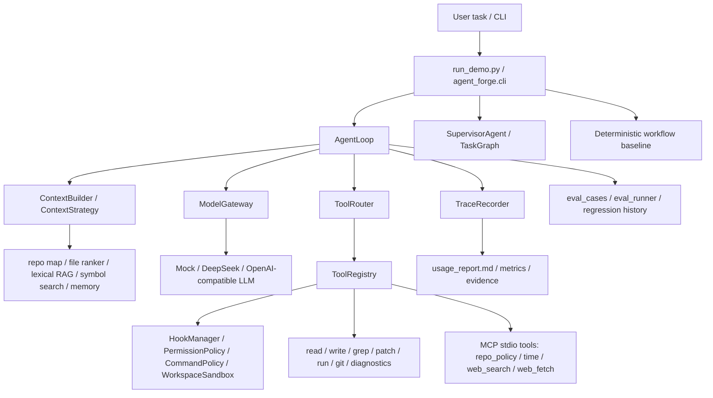
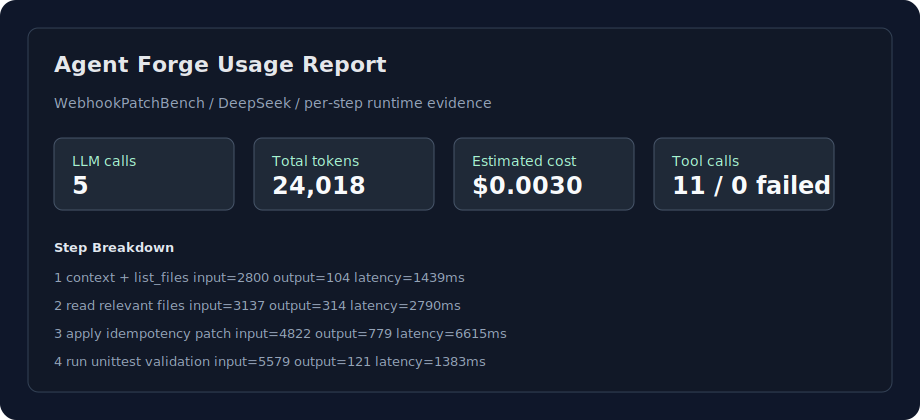

# Agent Forge

[](https://github.com/semi-hollow/NanoHarness/actions/workflows/agent-forge-ci.yml)
[](https://www.python.org/downloads/)
[](LICENSE)

Agent Forge is a production-style CodingAgent runtime core. It focuses on the
engineering control plane behind systems like Codex and Claude Code: context
engineering, model gateway, tool governance, execution environment, approval
hooks, task state, review workflow, trace, usage, and eval regression. Product
surfaces such as TUI/IDE plugins and cloud hosting are intentionally outside the
repo so the core runtime stays readable.

## Architecture At A Glance





## What This Project Teaches

- Context engineering: repo map, file ranking, lexical retrieval, selected file previews, token budget, memory summary, and topic-shift handling.
- Agent loop control: plan, LLM call, tool call, observation, recovery, final answer.
- Tool governance: schema validation, permission policy, sandbox path checks, high-risk command blocking, and human approval hooks.
- Runtime reliability: repeated-action detection, retryability classification, max steps, timeout, cost budget, trace, reports, and rollback bundle.
- Execution environment: local/worktree mode, network policy, branch-risk command blocking, and observation redaction.
- Runtime hooks: pre-tool approval, post-tool redaction, and stop-time audit hooks.
- Task state: checkpoint, resume seeding, and trace replay for long-running tasks.
- Review workflow: deterministic diff review for safety, runtime, and validation risk.
- MCP tools: built-in stdio MCP server, schema discovery, allowlist registration, repo policy, time, web fetch, and optional web search providers.
- Multi-agent orchestration: supervisor, role specs, task graph, artifact handoff, ownership, validation, retry, and review.
- Model switching: mock, Ollama, company OpenAI-compatible APIs, or online OpenAI-compatible providers.

## Quick Start

```bash
cd /path/to/NanoHarness
source .venv/bin/activate
python run_demo.py --mode single --trace-file trace-single.json
python run_demo.py --mode multi --trace-file trace-multi.json
python run_demo.py --mode workflow
```

For one-command local verification:

```bash
scripts/verify.sh
```

The terminal output is intentionally quiet. The detailed evidence is in the trace JSON, usage report, or session report.

## Core Commands

```bash
# Single runtime path: AgentLoop + context + tools + recovery.
python run_demo.py --mode single --trace-file trace-single.json

# Runtime-backed multi-agent path.
python run_demo.py --mode multi --trace-file trace-multi.json

# Deterministic workflow baseline, useful for comparison.
python run_demo.py --mode workflow

# Persisted run sessions.
python run_demo.py --list-sessions
python run_demo.py --show-run <session_id>
python run_demo.py --resume-run <session_id> --mode single
python run_demo.py --rollback-run <session_id>

# Review current git diff.
python run_demo.py --mode review

# Run in an isolated git worktree instead of the current checkout.
python run_demo.py --mode single --execution-env worktree

# Inspect task-state checkpoints and replay traces.
python run_demo.py --list-task-states
python run_demo.py --show-task-state <run_id>
python run_demo.py --resume-state <run_id> --mode single
python run_demo.py --replay-run .agent_forge/latest/webhook-deepseek/trace.json

# Load the built-in MCP stdio server as external tools.
scripts/verify_mcp.sh
python run_demo.py --mcp-config mcp_tools.example.json --mcp-allowed-tool forge.repo_policy \
  "use the repo_policy tool to summarize command rules"
```

## Validation Scenarios

`examples/demo_repo` is the calculator bootstrap scenario. It answers one
operational question: can the runtime start, read a file, patch code, run tests,
and write trace evidence?

`examples/webhook_service_repo` is the main validation scenario. It models a
webhook service that verifies signatures, stores events, and enqueues jobs. The
committed fixture starts with a duplicate-delivery bug: the same `event_id`
creates duplicate records and duplicate jobs. Running the benchmark asks the
agent to read the issue and relevant files, add idempotency before side effects,
run tests, and produce trace plus usage artifacts.

```bash
local_scripts/run_webhook_deepseek.sh
```

This is the primary real-model entrypoint. It uses DeepSeek and writes
`.agent_forge/latest/webhook-deepseek/usage_report.md` plus the raw
`.agent_forge/latest/webhook-deepseek/trace.json`.

This scenario is useful for engineering walkthroughs because it exercises
repo-level context selection, issue-driven code modification, tool calling,
patch application, test execution, sandbox boundaries, eval verification,
reviewer safety checks, trace evidence, and rollback/report artifacts without
forcing you to learn a large business system.

## MCP And External Tools

`mcp_tools.example.json` starts the built-in stdio MCP server:

```bash
python -m agent_forge.mcp.builtin_server --workspace . --list-tools
scripts/verify_mcp.sh
```

Available tools:

```text
forge.repo_policy   # read/search FORGE.md
forge.current_time  # local and UTC time
forge.web_search    # offline by default; optional DuckDuckGo/OpenAI/Claude lookup
forge.web_fetch     # fetch one HTTP/HTTPS page when network is explicitly enabled
```

Default web search is offline so company verification does not make network
calls. For a local live lookup:

```bash
AGENT_FORGE_MCP_ALLOW_NETWORK=1 \
AGENT_FORGE_WEB_PROVIDER=duckduckgo \
python run_demo.py --mcp-config mcp_tools.example.json \
  "search the web for public MCP tool examples"
```

OpenAI and Claude hosted web search can also be wrapped behind the same MCP
tool by setting `AGENT_FORGE_WEB_PROVIDER=openai` with `OPENAI_API_KEY`, or
`AGENT_FORGE_WEB_PROVIDER=claude` with `ANTHROPIC_API_KEY`.

## DeepSeek Runs

Personal Mac default, using DeepSeek V4 Flash. If you already wrote the key into
your macOS zsh environment, use one of these two scripts:

```bash
cd /Users/chenjiahui/Documents/GitHub/NanoHarness

# Main end-to-end scenario.
local_scripts/run_webhook_deepseek.sh

# Short single-agent bootstrap run.
local_scripts/run_deepseek.sh
```

One-time zsh setup on your personal Mac:

```bash
echo 'export DEEPSEEK_API_KEY="your-deepseek-api-key"' >> ~/.zshrc
source ~/.zshrc
```

Check that the key is available in a new terminal:

```bash
echo "$DEEPSEEK_API_KEY"
```

The equivalent raw CLI command is:

```bash
python run_demo.py --mode single --llm deepseek --trace-file .agent_forge/latest/single-deepseek/trace.json
```

Mock mode still works offline through the CLI:

```bash
python run_demo.py --mode single --llm mock --trace-file trace-mock.json
```

Any OpenAI-compatible API can still be used through the raw CLI when needed:

```bash
python run_demo.py --mode single --llm openai \
  --base-url http://localhost:11434/v1 \
  --api-key ollama \
  --model qwen2.5-coder:7b
```

Never commit real API keys. Keep `DEEPSEEK_API_KEY` in your personal shell
environment or a local ignored file only. `.env`, `.env.local`,
and `llm_profiles.json` are ignored. Company/offline verification should keep
using `--llm mock` or `scripts/verify.sh`.

## Reading Run Output

The two DeepSeek shortcuts now write into `.agent_forge/latest/` instead of the
project root. Each new run overwrites the previous files for that shortcut.

```text
.agent_forge/latest/webhook-deepseek/
  usage_report.md   # read this first
  trace.json        # raw event evidence

.agent_forge/latest/single-deepseek/
  usage_report.md   # read this first
  trace.json        # raw event evidence
```

The scripts also restore the teaching fixtures after each run so your Git tree
does not stay dirty. If you want to inspect the generated code diff, run with
`KEEP_PATCH=1`.

`trace.json` is already indented JSON. The older `*.pretty.json` files were only
formatted copies of the same trace, so the local scripts no longer generate
them.

VS Code can format JSON with `Shift + Option + F` after opening the file.
PyCharm can format JSON with `Option + Command + L` or `Code -> Reformat Code`.

Open `usage_report.md` when you want the engineering view:

- Run Summary: total LLM calls, input/output tokens, cache hit/miss, estimated cost, latency.
- Step Breakdown: every model call by step, agent, provider/model, tokens, cost, latency, and action summary.
- Context Breakdown: where prompt budget went, such as system context, history, tool schemas, memory, retrieved docs, and file previews.
- Tool Efficiency: per-tool call count, success rate, failed observations, observation size, and duration.

`run_demo.py` can still produce machine-readable `usage.json` for raw CLI runs,
but the local scripts remove it by default because it is not the file you should
study by hand.

Committed snapshots are also available under `docs/run-artifacts/` so other
devices can read the reports without rerunning DeepSeek.

## Project Structure

```text
agent_forge/
  cli.py              # CLI composition and mode dispatch
  runtime/            # AgentLoop, hooks, execution environment, task state
  context/            # context strategy, repo map, memory, retrieval, ranking
  tools/              # built-in tools, MCP-style config loader, adapters
  mcp/                # built-in stdio MCP server and external lookup tools
  safety/             # guardrails, permission, command policy, sandbox
  models/             # provider gateway, retry/fallback, usage telemetry
  agents/             # SupervisorAgent and handoff policy
  workflows/          # TaskGraph, TaskScheduler, deterministic baseline
  observability/      # trace and metrics
  production/         # diff tracker, run report, ownership/readiness
docs/study-pack/      # runtime learning path
docs/technical-defense/ # project explanation and technical Q&A material
docs/PROJECT_READINESS.md # public maturity, benchmark, provider, and sandbox notes
examples/demo_repo/   # bootstrap validation fixture
examples/webhook_service_repo/ # webhook idempotency benchmark fixture
scripts/              # setup and verification scripts
local_scripts/        # two DeepSeek run shortcuts
```

## 学习和技术答辩

源码地图：

```text
agent_forge/README.md
```

runtime 学习路径：

```text
docs/study-pack/01-agent-loop-context-memory.md
docs/study-pack/02-tools-control-safety.md
docs/study-pack/03-orchestration-review-eval.md
docs/study-pack/04-runtime-control-and-extension-map.md
docs/study-pack/05-mcp-and-external-tools.md
```

项目讲法和技术追问：

```text
docs/technical-defense/README.md
```

开源成熟度材料：

```text
docs/PROJECT_READINESS.md
```

生成的 trace、报告、缓存和安装产物默认忽略，需要时可以重新生成。
