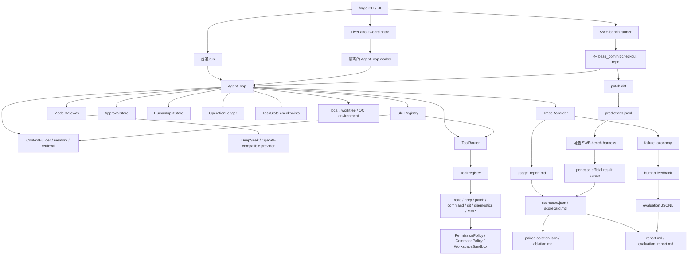

# Agent Forge / NanoHarness

[](https://github.com/semi-hollow/NanoHarness/actions/workflows/agent-forge-ci.yml)
[](https://www.python.org/downloads/)
[](LICENSE)

**Agent Forge 是一个面向 SWE-bench 形态软件工程任务的精简 AI Agent Runtime。**

它不是 chatbot wrapper，也不是完整 IDE。项目聚焦 Coding Agent 背后的工程控制层：
context construction、tool governance、隔离执行、人工审批、部分恢复、多 Agent
artifact handoff、隔离 fanout、trace、成本核算和评测证据。

```text
Issue -> repo snapshot -> AgentLoop / live fanout -> governed tools -> candidate patch
      -> trace / usage / official per-case result -> scorecard -> paired ablation
      -> failure taxonomy / human feedback -> evaluation data
```

## 为什么做这个项目

很多 Agent demo 只展示最终答案。Agent Forge 关注的是另一个问题：

> 能否让 AI Agent 的行为可检查、可恢复、受策略约束，并且具备足够清晰的 benchmark
> 形态，从而可以持续定位问题和验证改进？

项目的核心主张刻意保持克制：**只有 runtime 行为可观测、可比较，才能系统性改进
Coding Agent；单纯增加 prompt 长度并不能解决这个问题。**

## 已实现的核心能力

| 能力 | 真实实现 |
| --- | --- |
| Agent Runtime Loop | `AgentLoop` 统一编排 context、LLM call、tool call、observation、recovery、stop condition 和 trace event。 |
| 真实模型边界 | OpenAI-compatible client，默认支持 DeepSeek 配置，包含 retry/fallback、provider usage 和成本估算。 |
| 工具治理 | read/grep/patch/command/git/diagnostics 依次经过 routing、registry validation、permission hook、command policy 和 workspace sandbox。 |
| 隔离执行 | 支持当前 checkout、detached git worktree，以及基于隔离 snapshot 的受限 OCI container。Container command 带 network、CPU、memory、PID、capability 和 read-only root 控制。 |
| Human-in-the-loop | 信息型问题持久化到 `HumanInputStore`，在同一 turn 中优先阻断其他副作用，运行停在 `waiting_human`，只有 `forge respond` 加 resume 后才继续。写入授权由独立且带 fingerprint 的 `ApprovalStore` 负责。 |
| 部分恢复 | Checkpoint 为 continuation 提供状态；operation ledger 防止重复副作用；fanout checkpoint 校验 patch hash，只重跑未完成 worker。 |
| SWE-bench 运行链路 | 加载 case、checkout `base_commit`、生成 `predictions.jsonl`，安装官方 harness 后可执行评测，并解析 per-case resolved/unresolved/error artifact。 |
| 顺序多 Agent | `MultiAgentCoordinator` 让 Implementer/Reviewer/Verifier 复用同一个 `AgentLoop`，角色之间只通过显式 artifact 传递状态。 |
| Live Fanout | 校验后的任务 DAG 在 disposable worktree 中并发运行独立 `AgentLoop` worker，强制检查 write scope，并通过 conflict gate 确定性合并 patch。 |
| Evaluation Experiment | 固定五个 SWE-bench Lite case，记录 patch/local/official evidence、token、cost、latency、tool failure 和 failure class；`forge eval ablation` 对 matched run 做 paired comparison。 |
| Evidence Report | 每次运行生成 trace、usage、scorecard、result card、failure taxonomy 和 case study，而不是只输出 debug dump。 |
| Feedback Data Loop | 人工 outcome 和 label 可以挂到 run 上，再将安全筛选后的 trace、policy、environment 和 evaluation 字段导出为 JSONL。 |

每项能力的真实程度和不可声称边界，见
[能力真实性矩阵](docs/CAPABILITY_REALITY_MATRIX.md)。

## 五分钟审查路径

如果你正在快速审查这个仓库，建议按下面顺序：

1. 阅读本 README。
2. 打开 [Runtime 能力导览](docs/architecture/runtime-capability-guide.md)。
3. 检查核心实现：
   - [agent_forge/runtime/agent_loop.py](agent_forge/runtime/agent_loop.py)
   - [agent_forge/runtime/approval.py](agent_forge/runtime/approval.py)
   - [agent_forge/runtime/human_input.py](agent_forge/runtime/human_input.py)
   - [agent_forge/runtime/operation_ledger.py](agent_forge/runtime/operation_ledger.py)
   - [agent_forge/multi_agent/coordinator.py](agent_forge/multi_agent/coordinator.py)
   - [agent_forge/multi_agent/live_fanout.py](agent_forge/multi_agent/live_fanout.py)
   - [agent_forge/bench/swebench.py](agent_forge/bench/swebench.py)
   - [agent_forge/bench/official_results.py](agent_forge/bench/official_results.py)
   - [agent_forge/evaluation/scorecard.py](agent_forge/evaluation/scorecard.py)
   - [agent_forge/evaluation/experiment.py](agent_forge/evaluation/experiment.py)
4. 运行 `bash scripts/verify.sh`。
5. 使用 `forge ui` 查看本地 Evidence Console。

## 快速开始

第一次阅读代码时，先看[代码阅读地图](docs/guides/code-reading-map.md)，再用
[CONTRIBUTING.md](CONTRIBUTING.md) 理解类型、入口和可读性约定。

项目名是 Agent Forge，包名是 `agent-forge`，import package 是 `agent_forge`，
CLI 命令是 `forge`。

```bash
git clone https://github.com/semi-hollow/NanoHarness.git
cd NanoHarness
python3.11 -m venv .venv
source .venv/bin/activate
python -m pip install -U pip setuptools wheel
python -m pip install -e '.[bench,dev]'
forge doctor
```

启动本地工作台：

```bash
forge ui
```

本地 **NanoHarness Evidence Console** 提供真实运行控制，包括 model、budget、
approval、tool routing、network policy、execution isolation、Skills、MCP、顺序角色和
live fanout。Evidence view 会直接渲染 artifact 内容，同时展示 Multi 与 Single
trace，区分 candidate、runtime verifier、official evaluation 和 human feedback，
并提供真实 feedback/dataset export 操作。路径保留用于 provenance，但不再是主要
展示内容。

## 核心命令

运行普通 repository task：

```bash
forge run "fix the failing test in this repository" --provider deepseek
```

运行顺序多角色 profile：

```bash
forge run "fix the failing test in this repository" \
  --agent-mode multi \
  --profile coding_fix \
  --provider deepseek \
  --max-revision-rounds 2
```

通过真实 `AgentLoop` 并发运行两个独立只读 worker：

```bash
forge run "audit runtime and safety evidence" \
  --agent-mode fanout \
  --fanout-plan examples/fanout-plan.sample.json \
  --max-workers 2 \
  --provider deepseek
```

Fanout plan 包含经过机器校验的 dependency、write scope、tool view、expected
artifact 和每项任务的 `max_steps`，同时受 CLI 全局 budget 上限约束。Worker
worktree 从记录的 committed `base_head` 创建，因此启动 checkout 中未提交的文件
不会被静默继承。

写入型 fanout 应使用外层 worktree，让集成后的 candidate patch 与原 checkout
隔离。后续运行可以从之前的 checkpoint 恢复已完成 worker：

```bash
forge run "execute the validated task DAG" \
  --agent-mode fanout \
  --fanout-plan path/to/plan.json \
  --fanout-resume .agent_forge/runs/<previous-run-id> \
  --execution-mode worktree \
  --no-keep-worktree \
  --provider deepseek
```

回答持久化 clarification，并继续被暂停的 run：

```bash
forge respond <request_id> --answer "use the compatibility path"
forge resume .agent_forge/runs/<run-id> --provider deepseek
```

对写入型操作启用显式审批：

```bash
forge run "fix the failing test in this repository" \
  --provider deepseek \
  --approval-mode on-write \
  --no-auto-approve-writes

forge approve <operation_key>
forge resume .agent_forge/runs/<run-id> --provider deepseek
```

在 detached worktree 中运行，并保留环境用于检查：

```bash
forge run "fix the failing test in this repository" \
  --provider deepseek \
  --execution-mode worktree \
  --network-policy deny
```

在 detached snapshot 上的受限 OCI container 中运行 command 和 diagnostics。
镜像必须已经存在于本地，并包含目标仓库所需依赖：

```bash
docker pull python:3.11-slim
forge run "fix the failing test in this repository" \
  --provider deepseek \
  --execution-mode container \
  --container-image python:3.11-slim \
  --container-cpus 1 \
  --container-memory 1g \
  --container-pids-limit 256 \
  --network-policy deny \
  --no-keep-worktree
```

运行固定 SWE-bench reference case：

```bash
forge bench swebench --showcase --provider deepseek --direct-baseline
```

运行固定五 case 跨仓库 scorecard：

```bash
forge bench swebench \
  --regression-set core \
  --provider deepseek \
  --model deepseek-chat \
  --tool-routing task-aware \
  --execution-mode local \
  --evaluate \
  --max-workers 1
```

Benchmark runner 支持与 `forge run` 相同的 `worktree` 和 `container` 边界。Container
run 应使用包含目标仓库测试依赖的 project image，并增加
`--execution-mode container --container-image <image>`；execution mode 和 image
contract 会进入 scorecard identity 和 ablation comparability 检查。

使用相同模型和 case set 做 tool visibility ablation，再比较两个 run directory：

```bash
forge bench swebench --regression-set core --provider deepseek \
  --model deepseek-chat --tool-routing all --evaluate

forge bench swebench --regression-set core --provider deepseek \
  --model deepseek-chat --tool-routing task-aware --evaluate

forge eval ablation <all-tools-run-dir> <task-aware-run-dir> \
  --factor tool-routing \
  --control-label all-tools \
  --treatment-label task-aware \
  --output .agent_forge/evaluation/tool-routing
```

Comparator 会拒绝 dataset、split、provider/model identity 或 case id 不匹配的 run。
每个 variant 只运行一次，只足以形成 case study，不足以估计随机方差；更广泛的
质量结论必须基于重复运行。

生成 Single vs Multi-Agent comparison evidence：

```bash
forge bench swebench \
  --showcase \
  --agent-mode compare \
  --profile coding_fix \
  --provider deepseek \
  --direct-baseline
```

运行小型、确定性的非 Coding Agent scorecard：

```bash
forge eval mini-cases --case research-citation-quality --evidence evidence.json
forge eval mini-cases --case ops-approval-workflow --evidence evidence.json
```

写入人工反馈，并导出经过 review 的 run evidence：

```bash
forge eval feedback .agent_forge/runs/<run-id> \
  --outcome needs_work \
  --label context_miss \
  --note "Expected implementation file was not selected."

forge eval export-dataset .agent_forge/runs/<run-id> \
  --require-feedback \
  --output .agent_forge/evaluation/evidence_dataset.jsonl
```

默认导出不会包含完整 tool arguments、observations、绝对 workspace 和 candidate
patch 正文。代码和 trace 复用前需要 ownership、privacy 和 secret review，因此
只有显式传入 `--include-patch` 才会导出 patch。

## 架构



## 关键设计选择

**Runtime 先于 Prompt。** Prompt instruction 不能作为可靠策略边界。Tool call 必须
经过确定性 routing、validation、permission、command policy 和 sandbox 检查。

**Candidate Patch 不等于 Solved。** 生成 diff 只能证明存在 candidate。局部测试
可以形成 local evidence；只有解析到 official SWE-bench per-case result，才能声称
official resolved。

**人工审批是 Runtime Boundary。** 写入型操作可以在执行前停机并持久化 approval
request；continuation 执行前还会确认目标文件仍匹配已批准 fingerprint。

**Clarification 不等于 Approval。** `ask_human` 由 `AgentLoop` 拦截并原子持久化，
运行停止且不会合成虚假答案。`forge respond` 记录信息；`forge approve` 授权一个
具体副作用。二者的状态和 stale 语义完全分离。如果模型同一 turn 还输出其他工具，
human question 优先，回答加载后必须由模型重新提出那些副作用。

**Recovery 是显式的，不是魔法。** `--resume-state` 用 checkpoint summary 为新 run
提供 continuation context，不声称恢复隐藏 model state。Operation ledger 防止重复
副作用并检查 target drift。Fanout recovery 会分别校验 plan digest、base commit 和
patch hash，然后只在新的 integration workspace 中重放 accepted artifact。

**Isolation 必须可声明、可审计。** Local mode 提供 path 和 command boundary；
worktree mode 增加 git state isolation；container mode 在同一隔离 snapshot 上的受限
OCI process 中运行 command/diagnostics，并记录 image、limit、network policy、start
command 和 command history。它不是 hostile multi-tenant isolation。

**Metric 必须保留 Denominator。** Patch rate 使用全部 case。Local verification
只统计明确的 test evidence。Official resolved rate 只使用存在 parsed
resolved/unresolved report 的 case；没运行 official evaluation 时保持 `null`，不能
伪装成 `0%`。

**Multi-Agent 通过 Artifact 协作。** Reviewer 和 Verifier 不在隐藏 shared context
里聊天，而是读取前序角色输出的 artifact，并可触发有上限的 revision。

**Parallelism 必须有 Ownership。** Live fanout 接收显式 task DAG。声明 scope
重叠的任务会串行化；未声明 overlap、scope escape、patch failure 或 verifier
mutation 会 fail closed。系统不存在一个可以悄悄解决冲突写入的无限制模型。
每项任务的 step budget 由 runtime 强制，worker 会记录自己读取的 commit snapshot。
隔离 finalizer 能看到已集成 candidate diff，pre/post binary patch comparison 会检测
verifier 是否修改 candidate。

**Feedback 是数据，不是描述。** Human outcome 和 failure label 与 run evidence 一起
持久化。导出记录保留 provenance 和 policy context，使失败 case 可以进入 regression
selection 或后续 dataset curation。

## 证据产物

Runtime 输出被 Git 忽略，统一放在 `.agent_forge/`：

```text
.agent_forge/runs/<run-id>/
  report.md
  results.json
  scorecard.json
  scorecard.md
  feedback.json
  execution_environment.json
  predictions.jsonl
  direct_baseline_predictions.jsonl
  <model>.<run-id>.json
  multi_agent/
    artifact_index.json
    multi_agent_summary.json
    multi_agent_report.md
    artifacts/
  fanout/
    fanout_plan.json
    fanout_checkpoint.json
    fanout_summary.json
    fanout_report.md
    integration.patch
    workers/<task-id>/
      trace.json
      usage.json
      patch.diff
      execution_environment.json
    finalizer/
      verification.md
      trace.json
      usage.json
  cases/<instance_id>/
    execution_environment.json
    trace.json
    usage_report.md
    patch.diff
    case_study.md
    feedback.json
  workspaces/<instance_id>/
    ...
```

读取最新 artifact：

```bash
forge report latest
forge replay latest
```

## Package 地图

```text
agent_forge/
  bench/          SWE-bench 加载、checkout、prediction、result card
  runtime/        AgentLoop、checkpoint、human input、approval、ledger、control
  context/        repo map、file ranking、lexical retrieval、memory、token budget
  tools/          read/write/grep/patch/command/git/diagnostics/MCP wrapper
  safety/         sandbox、command policy、permission、guardrail
  models/         provider gateway、retry/fallback、usage telemetry
  multi_agent/    顺序角色、live fanout、worktree merge 和 recovery
  evaluation/     comparison metric、mini-case、evaluation report
                  scorecard、paired ablation、feedback、dataset export
  observability/  trace、usage、metric、evidence summary
  skills/         内置和自定义 runtime Skills
  mcp/            精简 stdio MCP server/client
  ui.py           本地 Evidence Console
```

## 项目不是什么

- 不是 Claude Code、Cursor 或 OpenCode 的替代品。
- 不是 production SaaS backend 或 IDE plugin。
- 不是 distributed swarm 或 quorum system。
- 不是 benchmark leaderboard。
- 不是 RL training platform，也不声称 raw trace 已经可以直接训练。
- 没有 official SWE-bench evaluation 时，不声称 official resolved rate。
- 不把 OCI mode 声称为 hostile multi-tenant security。
- 不把自写 calculator toy fixture 当作主要效果证据。

有些能力刻意保持精简。Fanout 是 local coordinator，不是 distributed queue 或
swarm；mini-case 是确定性 evaluation contract；本地 MCP adapter 只实现证明 tool
boundary 所需的协议子集。精确状态见[能力真实性矩阵](docs/CAPABILITY_REALITY_MATRIX.md)。

## 文档

- [能力真实性矩阵](docs/CAPABILITY_REALITY_MATRIX.md)
- [总体架构与运行链路](docs/AgentForge总体架构与运行链路.md)
- [Runtime 能力导览](docs/architecture/runtime-capability-guide.md)
- [能力入口索引](docs/guides/code-reading-map.md#能力入口索引)
- [Runtime 学习路径](docs/guides/runtime-learning-path.md)
- [持久化 Human Input 与 Live Fanout](docs/architecture/human-input-and-live-fanout.md)
- [Evaluation Experiment 与 OCI Execution](docs/architecture/evaluation-experiments-and-oci-execution.md)
- [Feedback 驱动的 Evaluation Loop](docs/architecture/feedback-evaluation-loop.md)
- [评测指南](docs/evaluation/评测目录说明与SWE-bench使用入口.md)
- [失败分类](docs/evaluation/failure-taxonomy.md)
- [小型回归集合](docs/evaluation/regression-set.md)
- [失败驱动的 Runtime 改进记录](docs/evaluation/failure-driven-improvements.md)
- [Roadmap](docs/ROADMAP.md)
- [Evidence Dataset 示例](examples/evidence_dataset.sample.jsonl)
- [变更记录](CHANGELOG.md)

## 开发验证

```bash
python3.11 -m unittest discover tests -v
git diff --check
bash scripts/verify.sh
```

`scripts/verify.sh` 会检查 compile、CLI import path、unit test；配置模型凭据后，还会
执行真实模型的 Single Agent 和双 worker 只读 fanout smoke。它是 runtime health
check。项目效果证据仍然来自 SWE-bench-shaped loop，以及生成的 trace、usage、report
和 evaluation artifact。
