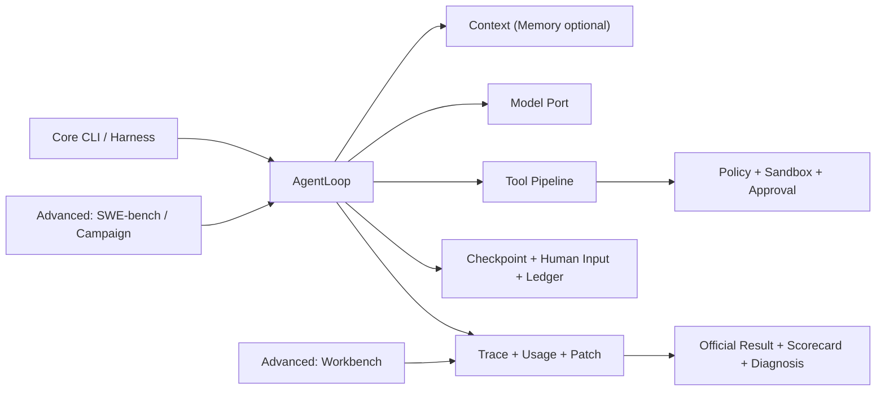

# NanoHarness

[](https://github.com/semi-hollow/NanoHarness/actions/workflows/agent-forge-ci.yml)
[](https://www.python.org/downloads/)
[](LICENSE)

**面向真实代码仓库的可治理软件工程智能体与评测工作台。**

NanoHarness 接收 repository issue，在隔离快照中驱动模型检索、编辑和验证代码；同时把
工具策略、人工控制、恢复状态、成本与评测结论保存为可检查证据。核心闭环只有一条：

```text
issue + base commit
  -> isolated workspace
  -> governed AgentLoop
  -> candidate patch + trace/checkpoint/usage
  -> local/official evaluation
  -> repeated campaign + failure diagnosis
```

模型负责提出下一步意图，Harness 负责决定它看见什么、能调用什么、动作如何执行、状态如何
恢复，以及结果能被怎样证明。

工程形态固定为：**统一薄 CLI 与单一 Single-Run Public API + 深度 Agent Runtime 机制 +
统一 Run Story 与可审计 Evidence**。状态、副作用和 Evidence 正确性是底线；在满足底线的
方案中，优先选择更短、更容易定位和解释的实现。

## 为什么做这个项目

模型能生成代码，不代表它能稳定完成真实软件工程任务。长任务常见问题包括上下文漂移、工具
误用、重复动作、危险副作用、中断后重复执行，以及把“生成了 patch”误报成“解决了问题”。

NanoHarness 因此聚焦三个层面：

| 层面 | 解决的问题 |
| --- | --- |
| 任务执行 | 在真实 repository、真实工具和固定 base commit 上完成 issue |
| Runtime 控制 | 治理 context、tool visibility、权限、隔离、HITL、checkpoint 和并发 |
| Evaluation 证据 | 区分 candidate、local verified、official resolved，并比较 Runtime 改动 |

项目不定位为通用 workflow 框架或完整 IDE Agent 产品。成熟框架适合快速交付通用 workflow；
NanoHarness 刻意收窄到软件工程执行与评测边界，让关键决策和失败原因可以完整检查。

## 证据语义

| 证据层级 | 能证明什么 | 不能证明什么 |
| --- | --- | --- |
| Candidate patch | Agent 到达有效编辑阶段 | patch 正确或任务 solved |
| Local verified | 已记录的测试型本地验证通过 | 官方环境一定通过 |
| Official resolved | SWE-bench per-case report 明确 `resolved=true` | 能外推到全部 300 题 |
| Repeated campaign | 同配置多次运行的稳定性、成本与 paired outcome | 单因素因果或模型排行榜 |

没有 official evaluator 时，resolved rate 保持 `null`；Reviewer `PASS` 不会替代官方结果。

## 五分钟审查

```bash
# 一个命令展示 approval -> checkpoint -> continuation
forge demo

# 同一只读入口检查 run、artifact 或源码 symbol
forge inspect latest
forge inspect AgentLoop.run
```

Core CLI 只有 `run / inspect / demo`；`resume` 是显式 continuation 的 Operator 入口。
`bench / ui` 属于 Advanced；同义兼容命令已删除，内部专项能力不进入默认学习面。
待处理人工输入或审批也由同一个 `resume` 完成：分别传 `--answer` 或
`--decision approved|rejected`，不需要记忆第二组公开命令。

随后只展开五个语义 owner：

1. [`Harness.run`](agent_forge/harness.py)：唯一 Single-Run Public API。
2. [`AgentLoop.run`](agent_forge/runtime/application/agent_loop.py)：单次运行阶段编排。
3. [`ToolExecutionPipeline.execute_calls`](agent_forge/runtime/application/tool_execution.py)：工具治理与副作用边界。
4. [`OperationTracker`](agent_forge/runtime/application/operation_tracker.py) 与
   [`RunLifecycle`](agent_forge/runtime/application/run_lifecycle.py)：幂等、审批、checkpoint 与恢复。
5. [`RunStory`](agent_forge/observability/domain/run_story.py)：artifact 血缘和 Evidence Read Model。

完整 12-file Core Scope 和闭卷训练见
[NanoHarness Study Notes](https://github.com/semi-hollow/NanoHarness-Study-Notes)。

## 核心能力

| 能力 | 当前主链 | 明确边界 |
| --- | --- | --- |
| Agent Runtime | context -> model -> tool -> observation 的有界循环 | 不是完整 IDE Agent 产品 |
| Context | 分区预算、安全压缩、完整 model request 组装 | 不恢复 KV Cache，不声称 vector RAG |
| Tool Governance | routing、schema、permission、command policy、workspace sandbox | prompt 不是安全边界 |
| Human Control | clarification、写操作审批、pause/cancel/steer、checkpoint/resume | 不自动回滚已执行副作用 |
| Advanced：Memory / Integration | long-term memory、Skills、MCP | 不进入默认学习面，不创建第二套 Runtime |
| Advanced：Isolation / Multi-Agent | local/worktree/OCI、顺序 artifact handoff、DAG fanout | 本机 coordinator，不是 distributed swarm |
| Evaluation | Smoke-5、official parser、taxonomy、scorecard、ablation、campaign | 小集合不代表总体 resolved rate |
| Integration | `Harness` facade、类型化配置、Ports、Hooks、事件流、OTEL adapter | 当前是 `0.x` 本地 Runtime SDK |

完整状态与不能声称的内容见[能力真实性矩阵](docs/CAPABILITY_REALITY_MATRIX.md)。

## 快速开始

```bash
git clone https://github.com/semi-hollow/NanoHarness.git
cd NanoHarness
python3.11 -m venv .venv
source .venv/bin/activate
python -m pip install -U pip setuptools wheel
python -m pip install -e '.[bench,dev]'
forge --help
```

Windows 原生环境使用独立 PowerShell 入口，现有 macOS/WSL 流程保持不变：

```powershell
powershell.exe -NoProfile -ExecutionPolicy Bypass -File .\scripts\setup_windows_local.ps1
```

运行一个真实 repository task：

```bash
export DEEPSEEK_API_KEY=...
forge run "fix the failing test in this repository" \
  --provider deepseek \
  --execution-mode worktree \
  --network-policy deny
```

配置驱动运行：

```bash
forge run --config examples/agent.sample.yaml
```

Core 命令分别使用 `forge run --help`、`forge inspect --help`、`forge demo --help` 和
`forge resume --help`；Advanced 能力再查 `forge bench --help` 或 `forge ui --help`。README
不展开隐藏内部命令，避免默认学习面再次增长。项目名是 NanoHarness；distribution package
是 `agent-forge`，Python import package 是 `agent_forge`，唯一 console command 是 `forge`。

## 嵌入式 API

外部项目只需要顶层 facade，不需要了解内部 application service 和 adapter：

```python
from agent_forge import Harness, HarnessConfig

harness = Harness(
    model=my_model,
    tools=my_tool_gateway,
    config=HarnessConfig(workspace="/path/to/repository"),
)
result = harness.run("fix the failing test")

print(result.status.value)
print(result.artifact_dir)
```

稳定扩展协议从 `agent_forge.extensions` 导入。`Harness.resume` 从 durable checkpoint 创建
continuation run，不声称恢复隐藏模型状态。完整 consumer 见
[`examples/embed_harness.py`](examples/embed_harness.py)。

## Advanced：Benchmark 闭环

`smoke-5` 从 SWE-bench Lite test 的 300 个 case 中人工分层选择五个不同仓库和问题族，
用于低成本机制回归，不声称统计代表性。一个 case 的证据链是：

```text
dataset issue/base commit
  -> clean checkout
  -> AgentLoop + candidate patch
  -> FAIL_TO_PASS / PASS_TO_PASS
  -> per-case official result
  -> scorecard / failure class
```

正式 campaign 固定 case、模型、温度、预算、安全策略和执行环境，交错比较两个同核 Runtime
preset：

```bash
forge bench campaign \
  --regression-set smoke-5 \
  --repetitions 3 \
  --evaluate \
  --publish
```

这会规划 `5 cases x 2 presets x 3 repetitions = 30 runs`。每个槽位原子保存，恢复时只重试
未完成项。两个 preset 同时改变 routing 与 Skill，因此属于 preset comparison，不伪装成
单因素因果实验。公开结果只在存在真实 artifact 时进入
[`benchmarks/campaigns`](benchmarks/campaigns/README.md)。

## 架构



Capability 内部按需使用 `domain -> application -> ports <- adapters`，外部调用只经过具名
API 和 composition root。六边形边界用于替换外部 Port、隔离副作用和测试核心规则，不为目录
风格增加转发层。架构依赖约束由测试执行，不只写在图里；理解预算、抽象收益与 Navigation
Contract 见[架构契约](docs/ARCHITECTURE.md)。

## 当前边界

- 一条命令对应一个 run/task；没有会话级 `active_task` 调度器。
- Pause/cancel 是协作式 safe point，不会强制终止正在执行的 HTTP 或进程调用。
- Resume 恢复显式 checkpoint 与 continuation context，不恢复模型隐藏状态。
- Fanout 接收显式 DAG；scope overlap 串行化，scope escape 或 patch conflict fail closed。
- Local mode 不是 OS 级隔离；OCI mode 也不宣称 hostile multi-tenant security。
- 项目不是 hosted SaaS、distributed swarm、RL training platform 或 benchmark leaderboard。

## 文档

首次审查只读三份：

- [Facade 目录](docs/architecture/facade-catalog.md)：所有正式动作、唯一入口与学习决策。
- [NanoHarness Study Notes](https://github.com/semi-hollow/NanoHarness-Study-Notes)：12-file Core Scope、五个必会问题与演示脚本。
- [架构契约](docs/ARCHITECTURE.md)：模块职责、依赖方向和主要入口。

按问题查阅：

- [能力真实性矩阵](docs/CAPABILITY_REALITY_MATRIX.md)：真实能力与 claim boundary。
- [Runtime 控制面](docs/architecture/runtime-control-plane.md)
- [工程演进史](docs/PROJECT_EVOLUTION.md)
- [SWE-bench Smoke-5](docs/evaluation/smoke-5-case-catalog.md)
- [失败分类](docs/evaluation/failure-taxonomy.md)
- [失败驱动改进记录](docs/evaluation/failure-driven-improvements.md)
- [Roadmap](docs/ROADMAP.md)

`failure-driven-improvements.md` 是受保护、只追加的问题档案；不要求顺序通读，遇到具体故障时按关键词检索。

## 开发验证

```bash
scripts/verify.sh
```

该脚本执行 compile、mypy、CLI 检查和 regression suite；配置模型凭据后还会执行真实模型
Single Agent 与双 worker 只读 fanout smoke。行为改动必须同时提供测试或可复核 artifact，
不能只修改 README claim。
