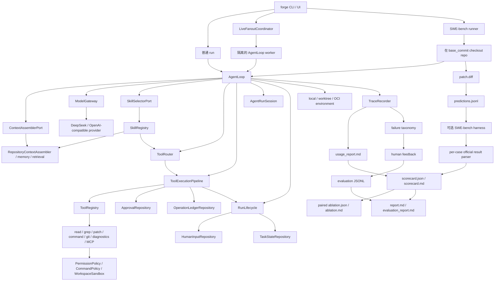

# NanoHarness

[](https://github.com/semi-hollow/NanoHarness/actions/workflows/agent-forge-ci.yml)
[](https://www.python.org/downloads/)
[](LICENSE)

**面向真实代码仓库的可治理软件工程智能体与评测工作台。**

NanoHarness 接收 repository task，在隔离快照中让 Agent 检索、编辑和验证代码，同时把
工具策略、人工控制、恢复状态、成本和评测结论变成可检查 artifact。它不是只有输入框和
最终回答的 demo；核心产品闭环是：

```text
Repository task -> isolated snapshot -> governed AgentLoop -> candidate patch
                -> trace / usage / checkpoint -> local + official evaluation
                -> repeated campaign -> failure diagnosis -> next runtime change
```

## 项目主张

模型能生成代码，不代表它能稳定完成软件工程任务。真正困难的是让它在真实仓库、真实工具和
真实副作用中保持可治理、可恢复、可验证。NanoHarness 因此把能力分成三层：

1. **任务层**：完成 repository issue，产出 candidate patch 和验证证据。
2. **控制层**：治理 context、tool visibility、权限、隔离、HITL、checkpoint 和并发。
3. **证据层**：区分 candidate、local verified、official resolved，并用重复 matched run
   判断 Runtime preset 是否真的改善结果。

项目不是为了宣称“自研框架优于 LangGraph”。成熟框架适合快速交付通用工作流；
NanoHarness 刻意收窄到软件工程执行与评测边界，让工具决策、副作用和失败原因可以完整检查。
生产接入时，这些领域组件也可以作为 node、middleware 或 service 与现有框架组合。

## 证据优先

| 证据层级 | 能证明什么 | 不能证明什么 |
| --- | --- |
| Candidate patch | Agent 到达了有效编辑阶段 | patch 正确或任务 solved |
| Local verified | 已记录的测试型本地验证通过 | 官方环境一定通过 |
| Official resolved | 官方 SWE-bench per-case report 明确 `resolved=true` | 能外推到全部 300 题 |
| Repeated campaign | 同配置多次运行的稳定性、成本和 paired outcome | 单因素因果或模型排行榜 |

没有 official evaluator 时，resolved rate 保持 `null`，不会显示成 0%，也不会拿 Reviewer
`PASS` 替代官方结果。完整边界见[能力真实性矩阵](docs/CAPABILITY_REALITY_MATRIX.md)。

## 三分钟审查路径

1. 启动 `forge ui`，先看 **Overview -> Run Evidence -> Benchmark**。
2. 运行 `forge showcase hitl start`，检查真实 waiting checkpoint 和 continuation 命令。
3. 运行 `forge bench cases --regression-set smoke-5`，查看为什么从 300 题中选择这 5 题。
4. 阅读五个主入口：[AgentLoop](agent_forge/runtime/application/agent_loop.py)、
   [工具治理](agent_forge/runtime/application/tool_execution.py)、
   [SWE-bench 用例](agent_forge/bench/application/swebench.py)、
   [重复评测 Campaign](agent_forge/bench/application/campaign.py)、
   [证据工作台](agent_forge/workbench/presentation/http.py)。

## 重复评测实验（Repeated Benchmark）

`smoke-5` 从 SWE-bench Lite 的 300 个 test case 中人工分层选择五个不同仓库和问题族，
用于低成本机制回归，不声称统计代表性。正式 campaign 固定 case、模型、温度、预算、安全
策略和执行环境，比较两个同核 Runtime preset：

- `minimal-control`：完整工具可见性、关闭 Skill。
- `governed-runtime`：task-aware tool routing、启用内置 Skill。

```bash
forge bench campaign \
  --regression-set smoke-5 \
  --repetitions 3 \
  --evaluate \
  --publish
```

这会规划 `5 cases x 2 presets x 3 repetitions = 30 runs`。每个槽位前后原子保存
`campaign.json`；使用相同 `--campaign-id` 重跑时，只重试 failed/running 槽位。公开 bundle
只包含 source revision、配置摘要、聚合结果和脱敏 scorecard，不包含 API key、绝对路径、
raw prompt、trace 内容或 patch 正文。当前公开 campaign 结果见
[benchmarks/campaigns](benchmarks/campaigns/README.md)。

## 核心能力

| 能力面 | 已接入的真实主链 |
| --- | --- |
| 仓库任务智能体 | 上下文选择、工具调用、补丁生成、诊断与 Git 证据 |
| 运行时治理 | 工具路由、Schema 校验、权限判定、命令策略与 workspace sandbox |
| 持久化控制 | HITL、审批指纹、checkpoint/resume、操作账本、暂停取消与 steer |
| 上下文与记忆 | 分区预算、事务安全压缩、working/checkpoint/long-term memory 分层 |
| 隔离与编排 | local/worktree/OCI、顺序角色 artifact handoff、DAG fanout 与冲突门禁 |
| 评测闭环 | Smoke-5、官方结果解析、failure taxonomy、scorecard、ablation 与反馈数据集 |
| 集成界面 | `Harness.run/resume`、类型化配置、Model/Tool/State/Event/Environment Ports |

## 快速开始

第一次阅读代码时，先看[架构契约](docs/ARCHITECTURE.md)，再用
[CONTRIBUTING.md](CONTRIBUTING.md) 理解类型、入口和可读性约定。

项目名是 NanoHarness；为避免破坏已有使用方式，Python distribution 仍是 `agent-forge`，
import package 是 `agent_forge`，CLI 命令是 `forge`。

```bash
git clone https://github.com/semi-hollow/NanoHarness.git
cd NanoHarness
python3.11 -m venv .venv
source .venv/bin/activate
python -m pip install -U pip setuptools wheel
python -m pip install -e '.[bench,dev]'
forge doctor
```

### 嵌入式 Public API

外部 Python 项目只需要依赖顶层 facade；`AgentLoop`、application service、Adapter 和
wiring 都是内部实现：

```python
from agent_forge import Harness, HarnessConfig

harness = Harness(
    model=my_model,
    tools=my_tool_gateway,
    config=HarnessConfig(workspace="/path/to/repository"),
)
result = harness.run("fix the failing test")

print(result.status.value)
print(result.artifact_dir)
```

`Harness.run` 返回类型化 `RunResult`，包含状态、停止原因、checkpoint，以及 trace、usage
和 candidate patch 路径；`Harness.resume` 从 durable checkpoint 创建新 run，不声称恢复
隐藏模型状态。完整的自定义 Model/Tool consumer 见
[examples/embed_harness.py](examples/embed_harness.py)。稳定扩展契约统一从
`agent_forge.extensions` 导入。

需要嵌入 UI 或 IDE 时，可给 `HarnessExtensions` 注入 `RunController`、`RuntimeHook`、
`RuntimeEventListener` 和 `OpenTelemetryEventListener`。控制是协作式的：不会中止正在
执行的 HTTP/进程调用，也不会回滚已提交副作用；事件默认删除 task、prompt、tool 参数和
observation 等内容字段。

配置驱动运行使用受版本约束的 YAML/JSON；CLI 参数优先于模型环境变量和配置文件，密钥
字段、未知字段和任意 Python import 均会被拒绝：

```bash
export DEEPSEEK_API_KEY=...
forge run --config examples/agent.sample.yaml
```

每次 CLI run 会写入不含密钥的 `resolved_config.json`，保留 schema、配置摘要和最终值。
省略 `tools.enabled` 表示使用默认 coding-tool preset；显式空列表表示不暴露任何 built-in
tool，非空列表是严格 allowlist。

Public compatibility 约定：`agent_forge` 与 `agent_forge.extensions` 是公开导入面；
`application`、`domain`、`adapters` 和 `wiring` 不承诺兼容。项目仍处于 `0.x`，minor
版本可以包含记录在 CHANGELOG 中的破坏性变化，patch 版本保持公开 API 兼容；artifact
schema 独立版本化。

启动本地工作台：

```bash
forge ui
```

不依赖在线模型、可重复展示真实暂停与恢复控制面：

```bash
forge showcase hitl start
forge showcase approval start
```

每条命令都会停在人工控制点，并打印 checkpoint、trace 和下一条可直接执行的
continuation 命令。Showcase 只固定模型的 tool call；HITL、审批、账本和工具执行仍走
正式 Runtime。完整说明见[Runtime 控制面](docs/architecture/runtime-control-plane.md)。

本地 **NanoHarness Workbench** 提供真实运行控制，包括 model、budget、
approval、tool routing、network policy、execution isolation、Skills、MCP、顺序角色和
live fanout。Evidence view 会直接渲染 artifact 内容，同时展示 Memory 召回、Context
压缩、Tool Calling 修复、工具 burst 治理以及 Multi 与 Single
trace，区分 candidate、runtime verifier、official evaluation 和 human feedback，
并提供真实 feedback/dataset export 操作。路径保留用于 provenance，但不再是主要
展示内容。

## 核心命令

运行普通 repository task：

```bash
forge run "fix the failing test in this repository" --provider deepseek
```

运行顺序多角色 profile：

```bash
forge run "fix the failing test in this repository" \
  --agent-mode multi \
  --profile coding_fix \
  --provider deepseek \
  --max-revision-rounds 2
```

通过真实 `AgentLoop` 并发运行两个独立只读 worker：

```bash
forge run "audit runtime and safety evidence" \
  --agent-mode fanout \
  --fanout-plan examples/fanout-plan.sample.json \
  --max-workers 2 \
  --provider deepseek
```

Fanout plan 包含经过机器校验的 dependency、write scope、tool view、expected
artifact 和每项任务的 `max_steps`，同时受 CLI 全局 budget 上限约束。Worker
worktree 从记录的 committed `base_head` 创建，因此启动 checkout 中未提交的文件
不会被静默继承。

写入型 fanout 应使用外层 worktree，让集成后的 candidate patch 与原 checkout
隔离。后续运行可以从之前的 checkpoint 恢复已完成 worker：

```bash
forge run "execute the validated task DAG" \
  --agent-mode fanout \
  --fanout-plan path/to/plan.json \
  --fanout-resume .agent_forge/runs/<previous-run-id> \
  --execution-mode worktree \
  --no-keep-worktree \
  --provider deepseek
```

回答持久化 clarification，并继续被暂停的 run：

```bash
forge respond <request_id> --answer "use the compatibility path"
forge resume .agent_forge/runs/<run-id> --provider deepseek
```

对写入型操作启用显式审批：

```bash
forge run "fix the failing test in this repository" \
  --provider deepseek \
  --approval-mode on-write \
  --no-auto-approve-writes

forge approve <operation_key>
forge resume .agent_forge/runs/<run-id> --provider deepseek
```

在 detached worktree 中运行，并保留环境用于检查：

```bash
forge run "fix the failing test in this repository" \
  --provider deepseek \
  --execution-mode worktree \
  --network-policy deny
```

在 detached snapshot 上的受限 OCI container 中运行 command 和 diagnostics。
镜像必须已经存在于本地，并包含目标仓库所需依赖：

```bash
docker pull python:3.11-slim
forge run "fix the failing test in this repository" \
  --provider deepseek \
  --execution-mode container \
  --container-image python:3.11-slim \
  --container-cpus 1 \
  --container-memory 1g \
  --container-pids-limit 256 \
  --network-policy deny \
  --no-keep-worktree
```

运行固定 SWE-bench reference case：

```bash
forge bench swebench --showcase --provider deepseek --direct-baseline
```

先查看固定集合为什么选、每题测什么；这两条命令不运行 Agent：

```bash
forge bench cases
forge bench case astropy__astropy-12907
```

默认只显示 Agent 输入和测试名称。`--show-test-patch`、`--show-gold` 只应用于运行后
复盘，避免把验收实现或参考答案带入 prompt。完整目录见
[Smoke-5 Case Catalog](docs/evaluation/smoke-5-case-catalog.md)。

运行固定五 case 跨仓库 scorecard：

```bash
forge bench swebench \
  --regression-set smoke-5 \
  --provider deepseek \
  --model deepseek-chat \
  --temperature 0 \
  --tool-routing task-aware \
  --execution-mode local \
  --evaluate \
  --max-workers 1
```

Benchmark runner 支持与 `forge run` 相同的 `worktree` 和 `container` 边界。Container
run 应使用包含目标仓库测试依赖的 project image，并增加
`--execution-mode container --container-image <image>`；execution mode 和 image
contract 会进入 scorecard identity 和 ablation comparability 检查。

使用相同模型和 case set 做 tool visibility ablation，再比较两个 run directory：

```bash
forge bench swebench --regression-set smoke-5 --provider deepseek \
  --model deepseek-chat --temperature 0 --tool-routing all --evaluate

forge bench swebench --regression-set smoke-5 --provider deepseek \
  --model deepseek-chat --temperature 0 --tool-routing task-aware --evaluate

forge eval ablation <all-tools-run-dir> <task-aware-run-dir> \
  --factor tool-routing \
  --control-label all-tools \
  --treatment-label task-aware \
  --output .agent_forge/evaluation/tool-routing
```

Comparator 会拒绝 dataset、split、provider/model、temperature identity 或 case id
不匹配的 run，除非 temperature 本身就是声明的实验变量。
每个 variant 只运行一次，只足以形成 case study，不足以估计随机方差；更广泛的
质量结论必须基于重复运行。

生成 Single vs Multi-Agent comparison evidence：

```bash
forge bench swebench \
  --showcase \
  --agent-mode compare \
  --profile coding_fix \
  --provider deepseek \
  --direct-baseline
```

运行小型、确定性的非 Coding Agent scorecard：

```bash
forge eval mini-cases --case research-citation-quality --evidence evidence.json
forge eval mini-cases --case ops-approval-workflow --evidence evidence.json
```

写入人工反馈，并导出经过 review 的 run evidence：

```bash
forge eval feedback .agent_forge/runs/<run-id> \
  --outcome needs_work \
  --label context_miss \
  --note "Expected implementation file was not selected."

forge eval export-dataset .agent_forge/runs/<run-id> \
  --require-feedback \
  --output .agent_forge/evaluation/evidence_dataset.jsonl
```

默认导出不会包含完整 tool arguments、observations、绝对 workspace 和 candidate
patch 正文。代码和 trace 复用前需要 ownership、privacy 和 secret review，因此
只有显式传入 `--include-patch` 才会导出 patch。

## 架构



## 关键设计选择

**Runtime 先于 Prompt。** Prompt instruction 不能作为可靠策略边界。Tool call 必须
经过确定性 routing、validation、permission、command policy 和 sandbox 检查。

**Candidate Patch 不等于 Solved。** 生成 diff 只能证明存在 candidate。局部测试
可以形成 local evidence；只有解析到 official SWE-bench per-case result，才能声称
official resolved。

**人工审批是 Runtime Boundary。** 写入型操作可以在执行前停机并持久化 approval
request；continuation 执行前还会确认目标文件仍匹配已批准 fingerprint。

**Clarification 不等于 Approval。** `ask_human` 由 `AgentLoop` 拦截并原子持久化，
运行停止且不会合成虚假答案。`forge respond` 记录信息；`forge approve` 授权一个
具体副作用。二者的状态和 stale 语义完全分离。如果模型同一 turn 还输出其他工具，
human question 优先，回答加载后必须由模型重新提出那些副作用。

**Request Cancel 不等于 Task Cancel。** 当前一次命令只拥有一个 task/run，不提供
会话级 active-task 切换或进程抢占。取消 human request 会阻断其 continuation，拒绝
approval 会保证对应工具未执行；更早 turn 已完成的副作用不会被自动回滚。

**Recovery 是显式的，不是魔法。** `--resume-state` 用 checkpoint summary 为新 run
提供 continuation context，不声称恢复隐藏 model state。Operation ledger 防止重复
副作用并检查 target drift。Fanout recovery 会分别校验 plan digest、base commit 和
patch hash，然后只在新的 integration workspace 中重放 accepted artifact。

**Isolation 必须可声明、可审计。** Local mode 提供 path 和 command boundary；
worktree mode 增加 git state isolation；container mode 在同一隔离 snapshot 上的受限
OCI process 中运行 command/diagnostics，并记录 image、limit、network policy、start
command 和 command history。它不是 hostile multi-tenant isolation。

**Metric 必须保留 Denominator。** Patch rate 使用全部 case。Local verification
只统计明确的 test evidence。Official resolved rate 只使用存在 parsed
resolved/unresolved report 的 case；没运行 official evaluation 时保持 `null`，不能
伪装成 `0%`。

**Multi-Agent 通过 Artifact 协作。** Reviewer 和 Verifier 不在隐藏 shared context
里聊天，而是读取前序角色输出的 artifact，并可触发有上限的 revision。

**Parallelism 必须有 Ownership。** Live fanout 接收显式 task DAG。声明 scope
重叠的任务会串行化；未声明 overlap、scope escape、patch failure 或 verifier
mutation 会 fail closed。系统不存在一个可以悄悄解决冲突写入的无限制模型。
每项任务的 step budget 由 runtime 强制，worker 会记录自己读取的 commit snapshot。
隔离 finalizer 能看到已集成 candidate diff，pre/post binary patch comparison 会检测
verifier 是否修改 candidate。

**Feedback 是数据，不是描述。** Human outcome 和 failure label 与 run evidence 一起
持久化。导出记录保留 provenance 和 policy context，使失败 case 可以进入 regression
selection 或后续 dataset curation。

## 证据产物

Runtime 输出被 Git 忽略，统一放在 `.agent_forge/`：

```text
.agent_forge/runs/<run-id>/
  report.md
  results.json
  scorecard.json
  scorecard.md
  feedback.json
  execution_environment.json
  predictions.jsonl
  direct_baseline_predictions.jsonl
  <model>.<run-id>.json
  multi_agent/
    artifact_index.json
    multi_agent_summary.json
    multi_agent_report.md
    artifacts/
  fanout/
    fanout_plan.json
    fanout_checkpoint.json
    fanout_summary.json
    fanout_report.md
    integration.patch
    workers/<task-id>/
      trace.json
      usage.json
      patch.diff
      execution_environment.json
    finalizer/
      verification.md
      trace.json
      usage.json
  cases/<instance_id>/
    execution_environment.json
    trace.json
    usage_report.md
    patch.diff
    case_study.md
    feedback.json
  workspaces/<instance_id>/
    ...
```

读取最新 artifact：

```bash
forge report latest
forge replay latest
```

## Package 地图

```text
agent_forge/
  harness.py      可嵌入 Harness、类型化 RunRequest/RunResult 和 resume facade
  extensions.py   对外稳定的 Model/Tool/State/Event/Environment Protocol 与数据类型
  control.py      嵌入式协作式 pause/cancel/steer 控制器
  hooks.py        对外稳定的 model/tool/checkpoint/stop 生命周期 Hook
  configuration.py 版本化 YAML/JSON run config、优先级和密钥拒绝
  cli/            参数契约、命令分发、run/resume/operator 入站适配器
  runtime/        domain/application/ports/adapters + AgentLoop composition root
  context/        分层指令、repo retrieval、working/session/long-term memory、预算与压缩
  tools/          read/write/grep/patch/command/git/diagnostics/MCP wrapper
  safety/         sandbox、command policy、permission、guardrail
  models/         provider gateway、Tool Calling 标准化、retry/fallback、usage telemetry
  multi_agent/    orchestration domain/application/ports/adapters
  bench/          SWE-bench 执行、official adapter、诊断和 artifact 发布
  evaluation/     metric、comparison、scorecard、ablation、feedback data
  observability/  append-only trace、脱敏事件流、可选 OTEL、usage projection 和 presentation
  workbench/      Evidence Catalog、受限后台任务和本地 HTTP presentation
  skills/         内置和自定义 runtime Skills
  mcp/            精简 stdio MCP server/client
  forge_cli.py    控制台脚本要求的最小入口
```

## 项目不是什么

- 不是 Claude Code、Cursor 或 OpenCode 的替代品。
- 不是 production SaaS backend 或 IDE plugin。
- 不是 distributed swarm 或 quorum system。
- 不是 benchmark leaderboard。
- 不是 RL training platform，也不声称 raw trace 已经可以直接训练。
- 没有 official SWE-bench evaluation 时，不声称 official resolved rate。
- 不把 OCI mode 声称为 hostile multi-tenant security。
- 不把自写 calculator toy fixture 当作主要效果证据。

有些能力刻意保持精简。Fanout 是 local coordinator，不是 distributed queue 或
swarm；mini-case 是确定性 evaluation contract；本地 MCP adapter 只实现证明 tool
boundary 所需的协议子集。精确状态见[能力真实性矩阵](docs/CAPABILITY_REALITY_MATRIX.md)。

## 文档

- [能力真实性矩阵](docs/CAPABILITY_REALITY_MATRIX.md)
- [架构契约与治理标准](docs/ARCHITECTURE.md)
- [架构决策记录](docs/adr/0001-capability-first-hexagonal-architecture.md)
- [持久化 Human Input 与 Live Fanout](docs/architecture/human-input-and-live-fanout.md)
- [Evaluation Experiment 与 OCI Execution](docs/architecture/evaluation-experiments-and-oci-execution.md)
- [Feedback 驱动的 Evaluation Loop](docs/architecture/feedback-evaluation-loop.md)
- [失败分类](docs/evaluation/failure-taxonomy.md)
- [小型回归集合](docs/evaluation/regression-set.md)
- [失败驱动的 Runtime 改进记录](docs/evaluation/failure-driven-improvements.md)
- [Roadmap](docs/ROADMAP.md)
- [Evidence Dataset 示例](examples/evidence_dataset.sample.jsonl)
- [变更记录](CHANGELOG.md)

## 开发验证

```bash
python3.11 -m unittest discover tests -v
git diff --check
bash scripts/verify.sh
```

`scripts/verify.sh` 会检查 compile、CLI import path、unit test；配置模型凭据后，还会
执行真实模型的 Single Agent 和双 worker 只读 fanout smoke。它是 runtime health
check。项目效果证据仍然来自 SWE-bench-shaped loop，以及生成的 trace、usage、report
和 evaluation artifact。
