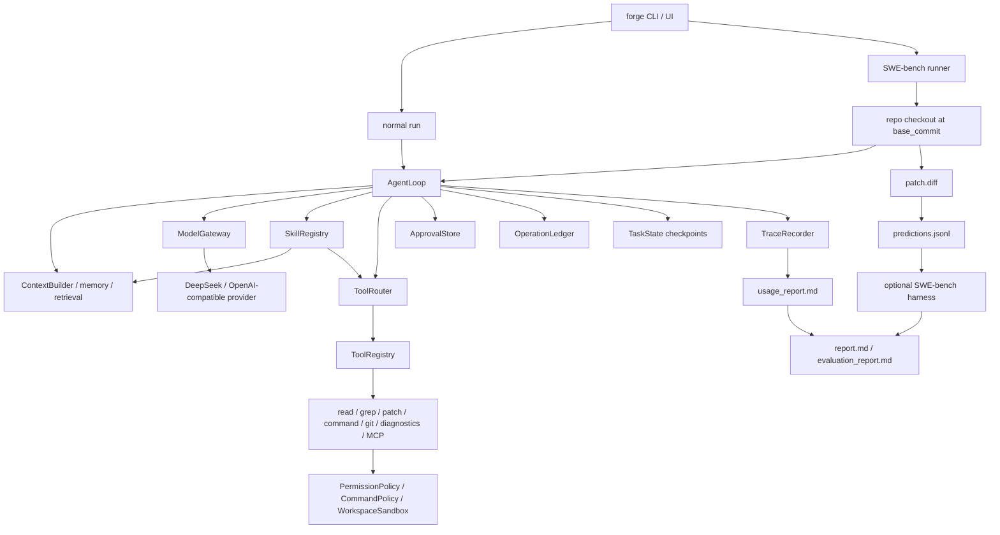

# Agent Forge / NanoHarness

[](https://github.com/semi-hollow/NanoHarness/actions/workflows/agent-forge-ci.yml)
[](https://www.python.org/downloads/)
[](LICENSE)

**Agent Forge is a compact AI agent runtime for SWE-bench-shaped coding tasks.**

It is not a chatbot wrapper and it is not a full IDE. The project focuses on
the hard engineering layer behind coding agents: context construction, tool
governance, sandboxed execution, human approval, partial recovery, multi-agent
artifact handoff, traceability, cost accounting, and evaluation evidence.

```text
Issue -> repo checkout -> AgentLoop -> governed tools -> candidate patch
      -> trace / usage / failure taxonomy / report
```

## Why This Exists

Many agent demos show only the final answer. Agent Forge is built around a
different question:

> Can we make an AI agent's behavior inspectable, recoverable, policy-governed,
> and benchmark-shaped enough to improve it systematically?

The core claim is intentionally narrow: **coding-agent quality improves only
when runtime behavior is observable and comparable, not when prompts get longer.**

## What Makes It Real

| Capability | What is implemented |
| --- | --- |
| Real runtime loop | `AgentLoop` coordinates context, LLM calls, tool calls, observations, recovery, stop conditions, and trace events. |
| Real model boundary | OpenAI-compatible client with DeepSeek defaults, retry/fallback hooks, provider usage capture, and cost estimates. |
| Governed tools | Read/grep/patch/command/git/diagnostics tools pass through routing, registry validation, permission hooks, command policy, and workspace sandboxing. |
| Human-in-the-loop | Write-like side effects can stop at an approval file; `forge approve` records the human decision before execution. |
| Partial recovery | Checkpoints seed continuation runs; operation ledger prevents duplicate side effects and detects stale approvals or stale target files. |
| SWE-bench shape | The runner loads cases, checks out the base commit, writes `predictions.jsonl`, and can call the official harness when installed. |
| Multi-agent workflow | `MultiAgentCoordinator` reuses the same `AgentLoop` for Implementer/Reviewer/Verifier roles and passes state through explicit artifacts. |
| Evidence reports | Each run writes trace, usage, result cards, failure taxonomy, and case-study artifacts instead of raw debug dumps only. |

For a precise green/yellow/red breakdown, read
[Capability Reality Matrix](docs/CAPABILITY_REALITY_MATRIX.md).

## Five-Minute Reviewer Path

If you are reviewing this repository, start here:

1. Read this README.
2. Open [Recent Agent Capability Map](docs/technical-defense/learn/最近新增Agent能力代码导览.md).
3. Inspect the runtime core:
   - [agent_forge/runtime/agent_loop.py](agent_forge/runtime/agent_loop.py)
   - [agent_forge/runtime/approval.py](agent_forge/runtime/approval.py)
   - [agent_forge/runtime/operation_ledger.py](agent_forge/runtime/operation_ledger.py)
   - [agent_forge/multi_agent/coordinator.py](agent_forge/multi_agent/coordinator.py)
   - [agent_forge/bench/swebench.py](agent_forge/bench/swebench.py)
4. Run `bash scripts/verify.sh`.
5. Use `forge ui` for the local evidence dashboard.

## Quick Start

Project name: Agent Forge. Package name: `agent-forge`. Import package:
`agent_forge`. CLI: `forge`.

```bash
git clone git@github.com:semi-hollow/NanoHarness.git
cd NanoHarness
python3.11 -m venv .venv
source .venv/bin/activate
python -m pip install -U pip setuptools wheel
python -m pip install -e '.[bench]'
forge doctor
```

Open the local workbench:

```bash
forge ui
```

The workbench exposes real run parameters: task, provider, model, API endpoint,
step budget, context budget, approval mode, output folder, Skills, and optional
MCP-style tools. It renders result summary, usage, context budget, tool
efficiency, trace timeline, and interview evidence.

## Core Commands

Run a normal repository task:

```bash
forge run "fix the failing test in this repository" --provider deepseek
```

Run the coordinator-driven profile:

```bash
forge run "fix the failing test in this repository" \
  --agent-mode multi \
  --profile coding_fix \
  --provider deepseek \
  --max-revision-rounds 2
```

Run with explicit approval for write-like actions:

```bash
forge run "fix the failing test in this repository" \
  --provider deepseek \
  --approval-mode on-write \
  --no-auto-approve-writes

forge approve <operation_key>
forge resume .agent_forge/runs/<run-id> --provider deepseek
```

Run the fixed SWE-bench reference case:

```bash
forge bench swebench --showcase --provider deepseek --direct-baseline
```

Run single-vs-multi comparison evidence:

```bash
forge bench swebench \
  --showcase \
  --agent-mode compare \
  --profile coding_fix \
  --provider deepseek \
  --direct-baseline
```

Run the small deterministic non-coding agent scorecards:

```bash
forge eval mini-cases --case research-citation-quality --evidence evidence.json
forge eval mini-cases --case ops-approval-workflow --evidence evidence.json
```

## Architecture



## Key Design Choices

**Runtime before prompting.** Prompt instructions are not trusted to enforce
policy. Tool calls go through deterministic routing, validation, permissions,
command policy, and sandbox checks.

**Candidate patch is not solved.** A generated diff is evidence, not a resolved
claim. Official SWE-bench correctness requires the Docker-based harness or a
focused validation result.

**Human approval is a runtime boundary.** Write-like operations can stop before
execution, persist an approval request, and later verify that the target file
still matches the approved fingerprint.

**Recovery is explicit, not magical.** `--resume-state` seeds a continuation
with checkpoint summaries. It does not pretend to restore hidden model state.
The operation ledger prevents duplicate side effects and detects target drift.

**Multi-agent is artifact-based.** Reviewer and verifier roles do not chat in a
hidden shared context. They read artifacts produced by earlier roles and can
request bounded revisions.

## Evidence Artifacts

Runtime outputs are ignored by Git and live under `.agent_forge/`:

```text
.agent_forge/runs/<run-id>/
  report.md
  results.json
  predictions.jsonl
  direct_baseline_predictions.jsonl
  multi_agent/
    artifact_index.json
    multi_agent_summary.json
    multi_agent_report.md
    artifacts/
  cases/<instance_id>/
    trace.json
    usage_report.md
    patch.diff
    case_study.md
  workspaces/<instance_id>/
    ...
```

Read the newest artifacts:

```bash
forge report latest
forge replay latest
```

## Package Map

```text
agent_forge/
  bench/          SWE-bench loading, checkout, predictions, result cards
  runtime/        AgentLoop, checkpoints, approval, operation ledger, control
  context/        repo map, file ranking, lexical retrieval, memory, token budget
  tools/          read/write/grep/patch/command/git/diagnostics/MCP wrappers
  safety/         sandbox, command policy, permissions, guardrails
  models/         provider gateway, retry/fallback, usage telemetry
  multi_agent/    coordinator, role profiles, artifact handoff, fanout primitive
  evaluation/     comparison metrics, mini-cases, evaluation reports
  observability/  trace, usage, metrics, evidence summaries
  skills/         built-in and custom runtime Skills
  mcp/            compact stdio MCP-style server/client
  ui.py           local browser workbench
```

## What This Project Is Not

- Not a Claude Code, Cursor, or OpenCode replacement.
- Not a production SaaS backend or IDE plugin.
- Not a distributed swarm or quorum system.
- Not a benchmark leaderboard.
- Not a claim of official resolved rate without official SWE-bench evaluation.
- Not a collection of self-authored toy calculator fixtures as the main proof.

Some parts are intentionally lightweight. The fanout module is a scheduling
primitive, mini-cases are deterministic evaluation contracts, and the local MCP
adapter implements the subset needed to prove the tool boundary. See
[Capability Reality Matrix](docs/CAPABILITY_REALITY_MATRIX.md) for the exact
status of each capability.

## Documentation

- [Capability Reality Matrix](docs/CAPABILITY_REALITY_MATRIX.md)
- [Architecture Notes](docs/AgentForge总体架构与运行链路.md)
- [Evaluation Guide](docs/evaluation/评测目录说明与SWE-bench使用入口.md)
- [Failure Taxonomy](docs/evaluation/failure-taxonomy.md)
- [Regression Set](docs/evaluation/regression-set.md)
- [Recent Agent Capability Map](docs/technical-defense/learn/最近新增Agent能力代码导览.md)
- [30-Minute Interview Pack](docs/technical-defense/learn/三十分钟面试准备包.md)
- [Core Code Reading Map](docs/technical-defense/learn/核心代码阅读路线图.md)
- [Multi-Agent Learning Guide](docs/technical-defense/learn/多Agent机制学习指南.md)
- [Five-Minute Demo Script](docs/technical-defense/demo/五分钟面试演示脚本.md)

## Development Verification

```bash
python3.11 -m unittest discover tests -v
git diff --check
bash scripts/verify.sh
```

`scripts/verify.sh` checks compile, CLI import paths, unit tests, and a
real-model read-only smoke when model credentials are configured. It is a
runtime health check. The effect proof remains the SWE-bench-shaped loop plus
the generated trace, usage, report, and evaluation artifacts.
