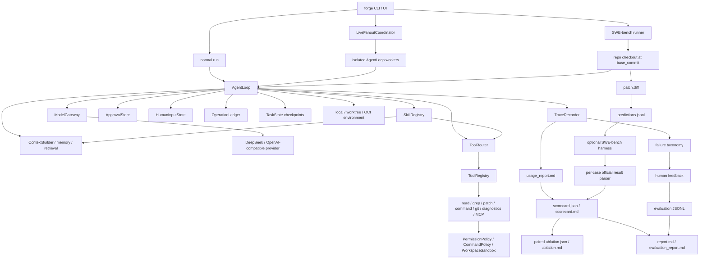

# Agent Forge / NanoHarness

[](https://github.com/semi-hollow/NanoHarness/actions/workflows/agent-forge-ci.yml)
[](https://www.python.org/downloads/)
[](LICENSE)

**Agent Forge is a compact AI agent runtime for SWE-bench-shaped coding tasks.**

It is not a chatbot wrapper and it is not a full IDE. The project focuses on
the hard engineering layer behind coding agents: context construction, tool
governance, sandboxed execution, human approval, partial recovery, multi-agent
artifact handoff, isolated fanout, traceability, cost accounting, and evaluation
evidence.

```text
Issue -> repo snapshot -> AgentLoop / live fanout -> governed tools -> candidate patch
      -> trace / usage / official per-case result -> scorecard -> paired ablation
      -> failure taxonomy / human feedback -> evaluation data
```

## Why This Exists

Many agent demos show only the final answer. Agent Forge is built around a
different question:

> Can we make an AI agent's behavior inspectable, recoverable, policy-governed,
> and benchmark-shaped enough to improve it systematically?

The core claim is intentionally narrow: **coding-agent quality improves only
when runtime behavior is observable and comparable, not when prompts get longer.**

## What Makes It Real

| Capability | What is implemented |
| --- | --- |
| Real runtime loop | `AgentLoop` coordinates context, LLM calls, tool calls, observations, recovery, stop conditions, and trace events. |
| Real model boundary | OpenAI-compatible client with DeepSeek defaults, retry/fallback hooks, provider usage capture, and cost estimates. |
| Governed tools | Read/grep/patch/command/git/diagnostics tools pass through routing, registry validation, permission hooks, command policy, and workspace sandboxing. |
| Isolated execution | Runs can use the current checkout, a detached git worktree, or a constrained OCI container over an isolated snapshot. Container commands apply network, CPU, memory, PID, capability, and read-only-root controls. |
| Human-in-the-loop | Informational questions persist in `HumanInputStore`, act as a same-turn barrier before sibling side effects, stop at `waiting_human`, and continue only after `forge respond` plus resume. Write approval remains a separate fingerprinted `ApprovalStore` boundary. |
| Partial recovery | Checkpoints seed continuation runs; operation ledger prevents duplicate side effects; fanout checkpoints restore hash-verified merged patches and rerun only incomplete workers. |
| SWE-bench shape | The runner loads cases, checks out the base commit, writes `predictions.jsonl`, calls the official harness when installed, and parses per-case resolved/unresolved/error artifacts. |
| Multi-agent workflow | `MultiAgentCoordinator` reuses the same `AgentLoop` for Implementer/Reviewer/Verifier roles and passes state through explicit artifacts. |
| Live task fanout | A validated task DAG runs independent `AgentLoop` workers concurrently in disposable git worktrees, enforces declared write scopes, and applies patches deterministically through a conflict gate. |
| Evaluation experiments | A fixed five-case SWE-bench Lite set writes scorecards for patch/local/official evidence, tokens, cost, latency, tool failures, and failure classes; `forge eval ablation` compares matched runs pairwise. |
| Evidence reports | Each run writes trace, usage, scorecard, result card, failure taxonomy, and case-study artifacts instead of raw debug dumps only. |
| Feedback data loop | Human outcomes and labels can be attached to runs, then exported with safe trace, policy, environment, and evaluation fields as JSONL. |

For a precise green/yellow/red breakdown, read
[Capability Reality Matrix](docs/CAPABILITY_REALITY_MATRIX.md).

## Five-Minute Reviewer Path

If you are reviewing this repository, start here:

1. Read this README.
2. Open [Runtime Capability Guide](docs/architecture/runtime-capability-guide.md).
3. Inspect the runtime core:
   - [agent_forge/runtime/agent_loop.py](agent_forge/runtime/agent_loop.py)
   - [agent_forge/runtime/approval.py](agent_forge/runtime/approval.py)
   - [agent_forge/runtime/human_input.py](agent_forge/runtime/human_input.py)
   - [agent_forge/runtime/operation_ledger.py](agent_forge/runtime/operation_ledger.py)
   - [agent_forge/multi_agent/coordinator.py](agent_forge/multi_agent/coordinator.py)
   - [agent_forge/multi_agent/live_fanout.py](agent_forge/multi_agent/live_fanout.py)
   - [agent_forge/bench/swebench.py](agent_forge/bench/swebench.py)
   - [agent_forge/bench/official_results.py](agent_forge/bench/official_results.py)
   - [agent_forge/evaluation/scorecard.py](agent_forge/evaluation/scorecard.py)
   - [agent_forge/evaluation/experiment.py](agent_forge/evaluation/experiment.py)
4. Run `bash scripts/verify.sh`.
5. Use `forge ui` for the local evidence dashboard.

## Quick Start

New to the codebase? Start with the [code reading map](docs/guides/code-reading-map.md),
then use [CONTRIBUTING.md](CONTRIBUTING.md) as the contract and readability rules.

Project name: Agent Forge. Package name: `agent-forge`. Import package:
`agent_forge`. CLI: `forge`.

```bash
git clone https://github.com/semi-hollow/NanoHarness.git
cd NanoHarness
python3.11 -m venv .venv
source .venv/bin/activate
python -m pip install -U pip setuptools wheel
python -m pip install -e '.[bench,dev]'
forge doctor
```

Open the local workbench:

```bash
forge ui
```

The local **NanoHarness Evidence Console** exposes real run controls for model,
budget, approval, tool routing, network policy, execution isolation, Skills,
MCP tools, sequential roles, and live fanout. Its evidence views render artifact
content in place, show Multi and Single traces together, separate candidate,
runtime-verifier, official-evaluation, and human-feedback claims, and provide
real feedback/dataset-export actions. Paths remain available as provenance; they
are not the primary presentation surface.

## Core Commands

Run a normal repository task:

```bash
forge run "fix the failing test in this repository" --provider deepseek
```

Run the coordinator-driven profile:

```bash
forge run "fix the failing test in this repository" \
  --agent-mode multi \
  --profile coding_fix \
  --provider deepseek \
  --max-revision-rounds 2
```

Run two independent read-only workers through real `AgentLoop` instances:

```bash
forge run "audit runtime and safety evidence" \
  --agent-mode fanout \
  --fanout-plan examples/fanout-plan.sample.json \
  --max-workers 2 \
  --provider deepseek
```

Fanout plans carry machine-validated dependencies, write scopes, tool views,
expected artifacts, and per-task `max_steps`; the global CLI budget remains the
ceiling. Worker worktrees are created from the recorded committed `base_head`,
so uncommitted files in the launching checkout are not silently inherited.

For mutating fanout, use an outer worktree so the integrated candidate patch is
isolated from the selected checkout. A later run can restore completed workers
from the prior checkpoint:

```bash
forge run "execute the validated task DAG" \
  --agent-mode fanout \
  --fanout-plan path/to/plan.json \
  --fanout-resume .agent_forge/runs/<previous-run-id> \
  --execution-mode worktree \
  --no-keep-worktree \
  --provider deepseek
```

Answer a durable clarification and continue the stopped run:

```bash
forge respond <request_id> --answer "use the compatibility path"
forge resume .agent_forge/runs/<run-id> --provider deepseek
```

Run with explicit approval for write-like actions:

```bash
forge run "fix the failing test in this repository" \
  --provider deepseek \
  --approval-mode on-write \
  --no-auto-approve-writes

forge approve <operation_key>
forge resume .agent_forge/runs/<run-id> --provider deepseek
```

Run in a detached worktree and retain the environment for inspection:

```bash
forge run "fix the failing test in this repository" \
  --provider deepseek \
  --execution-mode worktree \
  --network-policy deny
```

Run commands and diagnostics in a constrained OCI container over a detached
snapshot. The image must already exist locally and include the dependencies
needed by the target repository:

```bash
docker pull python:3.11-slim
forge run "fix the failing test in this repository" \
  --provider deepseek \
  --execution-mode container \
  --container-image python:3.11-slim \
  --container-cpus 1 \
  --container-memory 1g \
  --container-pids-limit 256 \
  --network-policy deny \
  --no-keep-worktree
```

Run the fixed SWE-bench reference case:

```bash
forge bench swebench --showcase --provider deepseek --direct-baseline
```

Run the fixed five-case cross-repository scorecard:

```bash
forge bench swebench \
  --regression-set core \
  --provider deepseek \
  --model deepseek-chat \
  --tool-routing task-aware \
  --execution-mode local \
  --evaluate \
  --max-workers 1
```

The benchmark runner accepts the same `worktree` and `container` execution
boundaries as `forge run`. For container runs, use a project image containing
the target repository's test dependencies and add `--execution-mode container`
plus `--container-image <image>`; the execution mode and image contract become part
of scorecard identity and ablation comparability checks.

Run a controlled tool-visibility ablation with the same model and case set,
then compare the two generated run directories:

```bash
forge bench swebench --regression-set core --provider deepseek \
  --model deepseek-chat --tool-routing all --evaluate

forge bench swebench --regression-set core --provider deepseek \
  --model deepseek-chat --tool-routing task-aware --evaluate

forge eval ablation <all-tools-run-dir> <task-aware-run-dir> \
  --factor tool-routing \
  --control-label all-tools \
  --treatment-label task-aware \
  --output .agent_forge/evaluation/tool-routing
```

The comparator rejects mismatched dataset, split, provider/model identity, or
case ids. A single run per variant is evidence for a case study, not a variance
estimate; repeat runs before making a broad quality claim.

Run single-vs-multi comparison evidence:

```bash
forge bench swebench \
  --showcase \
  --agent-mode compare \
  --profile coding_fix \
  --provider deepseek \
  --direct-baseline
```

Run the small deterministic non-coding agent scorecards:

```bash
forge eval mini-cases --case research-citation-quality --evidence evidence.json
forge eval mini-cases --case ops-approval-workflow --evidence evidence.json
```

Attach human feedback and export reviewed run evidence:

```bash
forge eval feedback .agent_forge/runs/<run-id> \
  --outcome needs_work \
  --label context_miss \
  --note "Expected implementation file was not selected."

forge eval export-dataset .agent_forge/runs/<run-id> \
  --require-feedback \
  --output .agent_forge/evaluation/evidence_dataset.jsonl
```

The export omits full tool arguments, observations, absolute workspaces, and
candidate patch text by default. `--include-patch` is explicit because code and
trace data require ownership, privacy, and secret review before reuse.

## Architecture



## Key Design Choices

**Runtime before prompting.** Prompt instructions are not trusted to enforce
policy. Tool calls go through deterministic routing, validation, permissions,
command policy, and sandbox checks.

**Candidate patch is not solved.** A generated diff is evidence, not a resolved
claim. Focused tests can provide local evidence; an official SWE-bench resolved
claim requires a parsed per-case result from the Docker-based harness.

**Human approval is a runtime boundary.** Write-like operations can stop before
execution, persist an approval request, and later verify that the target file
still matches the approved fingerprint.

**Clarification is not approval.** `ask_human` is intercepted by `AgentLoop`,
persisted atomically, and stops execution without synthesizing an answer.
`forge respond` records information; `forge approve` authorizes a concrete side
effect. Their state and stale-data semantics remain separate. If a model emits
other tools in the same turn, the question wins and those actions must be
proposed again after the recorded answer is loaded.

**Recovery is explicit, not magical.** `--resume-state` seeds a continuation
with checkpoint summaries. It does not pretend to restore hidden model state.
The operation ledger prevents duplicate side effects and detects target drift.
Fanout recovery separately validates plan digest, base commit, and patch hashes,
then reapplies only accepted artifacts in a fresh integration workspace.

**Isolation is declared and auditable.** Local mode provides path and command
boundaries, while worktree mode adds git-state isolation. Container mode executes
commands and diagnostics inside a constrained OCI process over the same isolated
snapshot and records image, limits, network policy, start command, and command
history. It is not presented as hostile multi-tenant isolation.

**Metrics keep their denominators.** Patch rate uses all cases. Local verification
uses explicit test evidence. Official resolved rate uses only cases with parsed
resolved/unresolved reports and remains `null`, not `0%`, when official evaluation
was not run.

**Multi-agent is artifact-based.** Reviewer and verifier roles do not chat in a
hidden shared context. They read artifacts produced by earlier roles and can
request bounded revisions.

**Parallelism requires ownership.** Live fanout consumes an explicit task DAG.
Declared scope overlap is serialized; undeclared overlap, scope escape, patch
failure, or verifier mutation fails closed. There is no unconstrained model
that silently resolves conflicting writes. Per-task step budgets are enforced
by runtime configuration, and every worker records the commit snapshot it read.
The isolated finalizer sees the integrated candidate diff; a pre/post binary
patch comparison detects any verifier mutation.

**Feedback is data, not prose.** Human outcomes and failure labels are persisted
beside run evidence. Exported records preserve provenance and policy context so
bad cases can drive regression selection or later dataset curation.

## Evidence Artifacts

Runtime outputs are ignored by Git and live under `.agent_forge/`:

```text
.agent_forge/runs/<run-id>/
  report.md
  results.json
  scorecard.json
  scorecard.md
  feedback.json
  execution_environment.json
  predictions.jsonl
  direct_baseline_predictions.jsonl
  <model>.<run-id>.json
  multi_agent/
    artifact_index.json
    multi_agent_summary.json
    multi_agent_report.md
    artifacts/
  fanout/
    fanout_plan.json
    fanout_checkpoint.json
    fanout_summary.json
    fanout_report.md
    integration.patch
    workers/<task-id>/
      trace.json
      usage.json
      patch.diff
      execution_environment.json
    finalizer/
      verification.md
      trace.json
      usage.json
  cases/<instance_id>/
    execution_environment.json
    trace.json
    usage_report.md
    patch.diff
    case_study.md
    feedback.json
  workspaces/<instance_id>/
    ...
```

Read the newest artifacts:

```bash
forge report latest
forge replay latest
```

## Package Map

```text
agent_forge/
  bench/          SWE-bench loading, checkout, predictions, result cards
  runtime/        AgentLoop, checkpoints, human input, approval, ledger, control
  context/        repo map, file ranking, lexical retrieval, memory, token budget
  tools/          read/write/grep/patch/command/git/diagnostics/MCP wrappers
  safety/         sandbox, command policy, permissions, guardrails
  models/         provider gateway, retry/fallback, usage telemetry
  multi_agent/    sequential roles, live fanout, worktree merge and recovery
  evaluation/     comparison metrics, mini-cases, evaluation reports
                  scorecards, paired ablations, feedback, dataset export
  observability/  trace, usage, metrics, evidence summaries
  skills/         built-in and custom runtime Skills
  mcp/            compact stdio MCP-style server/client
  ui.py           local browser workbench
```

## What This Project Is Not

- Not a Claude Code, Cursor, or OpenCode replacement.
- Not a production SaaS backend or IDE plugin.
- Not a distributed swarm or quorum system.
- Not a benchmark leaderboard.
- Not an RL training platform or a claim that raw traces are training-ready.
- Not a claim of official resolved rate without official SWE-bench evaluation.
- Not a claim of hostile multi-tenant security from OCI mode.
- Not a collection of self-authored toy calculator fixtures as the main proof.

Some parts are intentionally lightweight. Fanout is a local coordinator, not a
distributed queue or swarm; mini-cases are deterministic evaluation contracts;
and the local MCP adapter implements the subset needed to prove the tool
boundary. See
[Capability Reality Matrix](docs/CAPABILITY_REALITY_MATRIX.md) for the exact
status of each capability.

## Documentation

- [Capability Reality Matrix](docs/CAPABILITY_REALITY_MATRIX.md)
- [Architecture Notes](docs/AgentForge总体架构与运行链路.md)
- [Runtime Capability Guide](docs/architecture/runtime-capability-guide.md)
- [Runtime Learning Path](docs/guides/runtime-learning-path.md)
- [Durable Human Input and Live Fanout](docs/architecture/human-input-and-live-fanout.md)
- [Evaluation Experiments and OCI Execution](docs/architecture/evaluation-experiments-and-oci-execution.md)
- [Feedback-Driven Evaluation Loop](docs/architecture/feedback-evaluation-loop.md)
- [Evaluation Guide](docs/evaluation/评测目录说明与SWE-bench使用入口.md)
- [Failure Taxonomy](docs/evaluation/failure-taxonomy.md)
- [Regression Set](docs/evaluation/regression-set.md)
- [Failure-Driven Improvements](docs/evaluation/failure-driven-improvements.md)
- [Roadmap](docs/ROADMAP.md)
- [Evidence Dataset Example](examples/evidence_dataset.sample.jsonl)
- [Changelog](CHANGELOG.md)

## Development Verification

```bash
python3.11 -m unittest discover tests -v
git diff --check
bash scripts/verify.sh
```

`scripts/verify.sh` checks compile, CLI import paths, unit tests, and a
real-model single and two-worker read-only fanout smokes when model credentials
are configured. It is a runtime health check. The effect proof remains the SWE-bench-shaped loop plus
the generated trace, usage, report, and evaluation artifacts.
