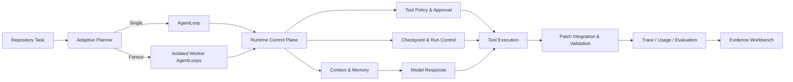

# NanoHarness

[](https://github.com/semi-hollow/NanoHarness/actions/workflows/agent-forge-ci.yml)
[](https://www.python.org/downloads/)
[](LICENSE)

**面向真实代码仓库的可治理 Coding Agent Harness。**

NanoHarness 将增量上下文、受控工具执行、持久化任务、多 Agent 协作和运行证据组织在同一套工作流中。
它既可以通过 CLI / TUI 直接运行，也可以作为 Python API 嵌入其他应用；从任务配置、人工干预到结果审阅，
每个阶段都有明确的状态、产物和代码 owner。

```text
Task → Context → AgentLoop → Tool Execution → Patch & Validation → Evidence
```

## 核心能力

| 能力 | Runtime 负责什么 | 形成的结果 |
| --- | --- | --- |
| **Incremental Context & Memory** | 按预算组合仓库证据、会话历史、阶段结论和可调用工具；通过 Snapshot + Delta 维持长任务连续性 | 有界的模型输入、Conversation Digest、Working Memory |
| **Governed Tool Execution** | 将模型的 Tool Intent 统一经过参数规范化、权限策略、Approval、Hook 和执行门禁 | Observation、Operation Ledger、Trace |
| **Durable Runs** | 显式管理 Human Input、Pause、Resume、Cancel、Checkpoint 与中断恢复 | 可继续的任务状态和可定位的持久化文件 |
| **Multi-Agent Coordination** | 在 Single-Agent 与 Fanout 之间规划，隔离 Worker，并管理依赖、Handoff、Patch 集成和 Finalizer | Worker 交付物、集成后的 Candidate Diff、协调证据 |
| **Evaluation & Workbench** | 用版本化配置运行任务和 Benchmark，并统一读取 Trace、Usage、Patch、Validation 与实验制品 | 可筛选、可比较的运行与评测视图 |

## 快速开始

需要 Python 3.11：

```bash
python3.11 -m venv .venv
source .venv/bin/activate
python -m pip install -e '.[dev]'
```

无需在线模型即可生成一条确定性运行记录，并在浏览器中查看完整工作流：

```bash
forge demo --scenario governed
forge ui
```

连接模型后，可以通过交互式 Console 在目标仓库中运行任务：

```bash
forge console --workspace /path/to/repository
```

需要可重复执行时，使用版本化配置启动非交互运行：

```bash
forge run \
  --config /path/to/run.yaml \
  --workspace /path/to/repository \
  "Implement the requested change and run focused validation"
```

所有 Provider、Context、Tool、Approval、Execution Environment 和 Agent Mode 参数均可由配置文件管理，
显式 CLI 参数会覆盖配置值。完整入口可通过 `forge run --help` 查看。

## 工作方式


```mermaid
flowchart LR
    T[Repository Task] --> P[Adaptive Planner]
    P -->|Single| A[AgentLoop]
    P -->|Fanout| W[Isolated Worker AgentLoops]
    A --> R[Runtime Control Plane]
    W --> R
    R --> C[Context & Memory]
    R --> G[Tool Policy & Approval]
    R --> D[Checkpoint & Run Control]
    C --> M[Model Response]
    G --> X[Tool Execution]
    D --> X
    M --> X
    X --> V[Patch Integration & Validation]
    V --> E[Trace / Usage / Evaluation]
    E --> UI[Evidence Workbench]
```

模型提出下一步行动；Runtime 负责准备输入、约束工具、维护任务状态并收口运行结果。
Single-Agent 与 Multi-Agent Worker 复用同一个 `AgentLoop`，因此 Context、Tool、Approval、
Checkpoint 和 Evidence 不需要维护两套语义。

## 增量上下文与记忆（Incremental Context & Memory）

长任务不会把全部历史机械地塞回每一次模型调用。NanoHarness 将模型输入拆成相邻但职责不同的部分：

- **System Context：**当前任务、仓库、预算、策略和稳定运行事实；
- **Conversation Window：**最近交互、完整 ToolCall / Observation 对和压缩后的历史摘要；
- **Tool Schemas：**当前 Turn 实际允许模型调用的工具契约；
- **Working Memory：**本次运行需要持续携带的阶段结论和长期记忆召回。

`PromptWindowManager` 根据预算生成滚动 Snapshot，并只追加尚未覆盖的 Delta；发生窗口收缩时保留最近原始尾部，
同时避免拆开 ToolCall 与对应 Observation。每次模型调用最终接收一份冻结的 `PreparedTurn`。

核心入口：[`context_builder.py`](agent_forge/context/application/context_builder.py)、
[`compaction.py`](agent_forge/context/application/compaction.py) 和
[`working_memory.py`](agent_forge/runtime/application/working_memory.py)。

## 受控工具执行（Governed Tool Execution）

模型输出 ToolCall 后，不会直接触碰工作区：

```text
ToolCall
  → Operation Intent
  → Authorization（ALLOW / ASK / DENY）
  → Approval / Hook / Sandbox
  → Tool Execution
  → Observation + Ledger + Trace
```

Tool Router 只暴露当前任务需要的 Schema；Runtime 再根据工具副作用、目标路径和运行策略作出确定性决策。
需要人工确认的操作会持久化 Approval，副作用操作由 Operation Ledger 跟踪，执行结果统一回填为下一 Turn 的
Observation。

核心入口：[`tool_execution.py`](agent_forge/runtime/application/tool_execution.py) 和
[`运行治理与工具执行`](docs/运行治理与工具执行.md)。

## 持久化运行（Durable Runs）

NanoHarness 把交互控制和任务恢复作为运行状态，而不是临时的终端行为：

```text
running
  ├── waiting_human → explicit resume
  ├── waiting_approval → approve / reject → explicit resume
  ├── paused → resume
  ├── cancelled
  └── completed / failed
```

Human Input、Approval、Operation Ledger、Task Checkpoint 和 Trace 分别由自己的 Repository 持久化。
一次 Resume 会从已保存状态创建明确的 continuation，而不是依赖仍然存活的 Python 进程。

运行 `forge demo --scenario governed` 可以在不调用模型的情况下观察这条状态链；
更完整的按钮式流程见 [`Debug Lab`](examples/debug_lab/README.md)。

## 多 Agent 协作（Multi-Agent Coordination）

Multi-Agent 不是另一套 Agent 实现，而是在规范 `AgentLoop` 之上增加规划、隔离、协作和集成：

```text
Repository Task
  → AdaptivePlanner
  → validated FanoutPlan
  → HARD dependencies / LIVE routes
  → isolated Worker AgentLoops
  → scoped candidate integration
  → read-only Finalizer
```

- **Adaptive Planning：**根据任务与仓库信息选择 Single 或 Fanout；
- **Dependency-aware Scheduling：**支持有屏障的 HARD 依赖和运行中的 LIVE Handoff；
- **Isolated Execution：**Worker 在独立 Git Worktree 中运行，并受写入范围与工具集合约束；
- **Structured Handoff：**阶段产物以版本化事件交付，并在 AgentLoop 安全边界进入消费者输入；
- **Controlled Integration：**候选 Patch 依次经过范围、可应用性、冲突和验证检查；
- **Finalizer：**只读检查合并结果是否满足整体任务标准。

```bash
forge run \
  --config /path/to/run.yaml \
  --workspace /path/to/repository \
  --agent-mode fanout \
  --fanout-plan examples/fanout-plan.sample.json
```

Public API 与控制流见 [`agent_forge/multi_agent/api.py`](agent_forge/multi_agent/api.py) 和
[`多 Agent 编排`](docs/多Agent编排.md)。

## 运行证据 Workbench（Evidence Workbench）

`forge ui` 启动统一的只读 Workbench，将 Runtime 和 Evaluation 产生的结构化制品组织成可导航视图，
帮助开发者快速理解运行过程、定位失败阶段并比较调整前后的行为变化。

```text
运行证据
└── 能力类型
    └── 不可变 Run
        └── Case / Worker
            ├── 运行概览
            ├── 执行过程
            ├── 上下文与决策
            └── 结果与证据

实验对比
└── 实验方向
    └── 轮次 / 测量
        └── 变量、结果、Case 转移与关联制品
```

Workbench 直接读取真实运行目录和版本化实验资产，不要求开发者先手工整理第二份展示数据。
同一入口可以审阅确定性 Lab、普通 Repository Run、Multi-Agent Worker 和 Benchmark Case。

## CLI 与嵌入式使用

```text
forge console   交互运行一个受治理的 Repository Agent
forge run       从 CLI 或版本化配置执行任务
forge demo      生成不依赖在线模型的确定性运行故事
forge resume    从持久化 Checkpoint 继续任务
forge inspect   只读查看 Run、Artifact 或源码 Symbol
forge bench     运行批量 Benchmark
forge ui        打开 Evidence Workbench
```

外部应用可以通过稳定的 [`Harness`](agent_forge/harness.py) facade 注入自己的 Model、ToolGateway、
Hook、Repository 或 Execution Environment。`Harness.run()` 返回类型化 `RunResult`，其中包含状态、
停止原因、Checkpoint 以及 Trace、Usage、Candidate Diff 和 Manifest 的路径。

## 源码导航

| 想理解的能力 | 核心入口 |
| --- | --- |
| Agent 主循环 | [`agent_forge/runtime/application/agent_loop.py`](agent_forge/runtime/application/agent_loop.py) |
| Context 与 Compaction | [`agent_forge/context/application/`](agent_forge/context/application/) |
| Working / Long-term Memory | [`agent_forge/memory/`](agent_forge/memory/) |
| Tool 治理与运行控制 | [`agent_forge/runtime/application/`](agent_forge/runtime/application/) |
| Multi-Agent | [`agent_forge/multi_agent/api.py`](agent_forge/multi_agent/api.py) |
| Benchmark 与 Evaluation | [`agent_forge/bench/`](agent_forge/bench/)、[`agent_forge/evaluation/`](agent_forge/evaluation/) |
| Evidence Workbench | [`apps/workbench/`](apps/workbench/) |
| CLI / Console / MCP | [`apps/`](apps/) |

核心库遵循 `application / domain / ports / adapters` 分层；`apps/` 只负责入站交互和组合，
不会复制 Runtime 的业务语义。统一入口见 [`架构导览`](docs/架构导览.md)。

## 文档

- [`架构导览`](docs/架构导览.md)：Ownership、端到端执行主链和能力边界；
- [`Agent 运行数据结构与模型输入`](docs/Agent运行数据结构与模型输入.md)：Session、PreparedTurn 与模型请求；
- [`上下文工程`](docs/上下文工程.md)：Context、Memory、Instructions 和 Tool Schema；
- [`上下文压缩与长任务设计`](docs/上下文压缩与长任务设计.md)：Snapshot、Delta、Compaction 与恢复；
- [`运行治理与工具执行`](docs/运行治理与工具执行.md)：权限、Approval、Ledger、Hook 和执行链；
- [`多 Agent 编排`](docs/多Agent编排.md)：Planning、调度、LIVE Handoff、集成和 Finalizer；
- [`运行产物与持久化契约`](docs/运行产物与持久化契约.md)：权威状态、审计证据和派生视图；
- [`生产化边界与扩展`](docs/生产化边界与扩展.md)：Port、Adapter、MCP、Hook 和外部集成；
- [`核心能力与代码入口`](docs/核心能力与代码入口.md)：从 Feature 定位到唯一代码 owner；
- [`实验总览`](benchmarks/experiments/README.md)：版本化实验配置、运行制品与结果入口。

## 开发

```bash
.venv/bin/python -m pytest -q
.venv/bin/python -m mypy agent_forge apps
```

NanoHarness 使用 [MIT License](LICENSE)。
