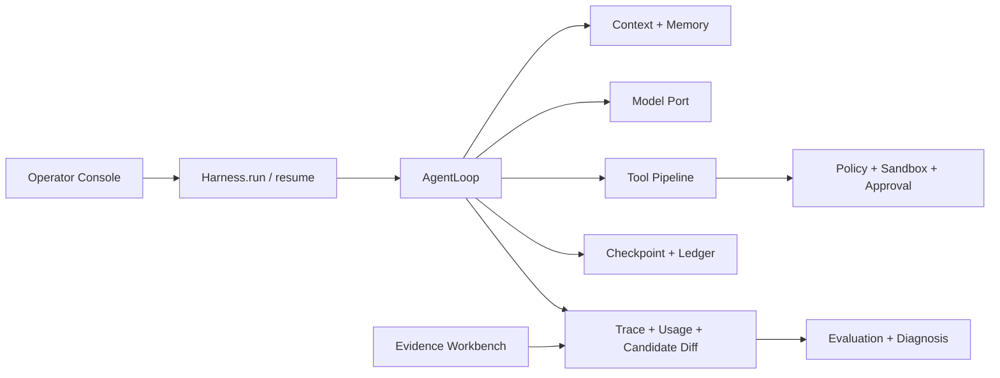

# NanoHarness

[](https://github.com/semi-hollow/NanoHarness/actions/workflows/agent-forge-ci.yml)
[](https://www.python.org/downloads/)
[](LICENSE)

**一个可治理、可恢复，并以运行证据为核心的 Coding Agent Runtime。**

NanoHarness 在隔离的真实代码仓库中驱动模型检索、编辑和验证代码。它不只交付一个
final answer，还把上下文、工具、权限、人工控制、恢复状态、成本和评测结论收敛为可检查的
Run Evidence。

```text
repository task
  -> isolated workspace
  -> governed AgentLoop
  -> candidate diff + validation
  -> trace + checkpoint + usage
  -> evaluation + failure diagnosis
```

## 项目解决什么

模型会写代码，不等于它能稳定完成长周期工程任务。真实运行中还需要回答：

- 模型这一轮应该看到哪些 Context 和 Tool？
- 写操作、命令和越界路径如何被确定性约束？
- 审批、进程中断或目标文件漂移后，副作用能否安全恢复？
- 多个 Agent 什么时候可以并行，最终由谁检查合并后的整体结果？
- 生成了 Diff、本地测试通过和官方解决之间，证据边界在哪里？

NanoHarness 把这些问题放进 Runtime 控制面，而不是交给 Prompt 或模型自我声明。

## 核心设计

| 能力 | 关键设计 | 可检查结果 |
| --- | --- | --- |
| AgentLoop | Context -> Model -> Tool -> Observation 的有界循环 | 逐轮 Trace、停止原因、Usage |
| Tool Governance | 任务级可见性、Schema、Hook、Permission、Sandbox | 路由、权限决策与真实 Observation |
| Durable Control | HITL、Approval、Checkpoint、Operation Key、Fingerprint、Ledger | 等待状态、恢复来源与副作用帐本 |
| Context & Memory | 分区预算、安全压缩、显式授权的跨 Run 记忆 | 每轮输入结构、压缩不变量、记忆快照 |
| Multi-Agent | 显式 DAG、独立 worktree、声明/实际写入范围校验、Finalizer | Worker Diff、冲突与最终验证 |
| Evaluation | candidate/local/official 分层，Taxonomy、Scorecard、配对实验 | per-case result、失败归因与 claim boundary |

## 证据工作台

Agent 运行往往介于白盒和黑盒之间：事件很多，但原始 JSON 并不能帮助人理解因果。
NanoHarness 的 Workbench 使用一个稳定 URL。先选择任意已发布的 Runtime Run、预置场景或评测
批次，再用四个不重叠的 Read Model 阅读同一份 Evidence：

- **运行概览：**任务、状态、关键计数和本次证据边界。
- **执行过程：**准备输入、模型决定、治理执行、回填持久化四个稳定阶段。
- **上下文与决策：**上一轮证据怎样改变本轮输入、可见工具和显式动作。
- **结果与证据：**候选改动、验证、恢复、编排或评测结论，以及它们不能证明什么。

页面不伪造隐藏思维链，也不用第二个 LLM 编故事；展示内容由真实 Runtime Event 确定性生成。
三个预置场景只是可复现样本，普通 `Harness.run` 发布的运行也会自动进入同一工作台。

## 运行证据与预置场景

| 场景 | 核心问题 | 作用 |
| --- | --- | --- |
| Lab 1 · Governed Repair | 写操作如何审批、停机、持久化并且只恢复一次 | 确定性验证控制面 |
| Lab 2 · Coordinated Agents | 独立任务如何并行、限制改动范围并最终收口 | 确定性验证编排不变量 |
| Lab 3 · Complex Live Repair | 真实模型如何在多模块缺陷中检索、试错、修改、回归和收敛 | 观察长任务行为与 Context 压力 |

Lab 1/2 故意排除模型随机性，用于证明 Runtime 不变量；Lab 3 调用真实模型，用于形成运行直觉和
失败样本。它们不是 Workbench 能读取的全部范围：普通 Single-Run 会作为最近一次 Runtime 运行出现，
已保存的 SWE-bench Campaign 则作为评测批次读取，彼此不混用结论。

## 与常见 Agent Demo 的差异

| 常见 Demo | NanoHarness |
| --- | --- |
| 只展示最终回答或 Diff | 同时保留输入结构、工具过程、状态和验证证据 |
| 用 Prompt 要求模型“不要做危险操作” | 由 Permission、Command Policy、Sandbox 和 Approval 确定性执行 |
| 中断后从头重跑 | 通过 Checkpoint 恢复显式状态，通过 Ledger/Fingerprint 防止盲目重放 |
| 将“多个 Agent”当作并行的充分条件 | 只对依赖满足、写入范围可分离的任务并发，合并后独立验证 |
| 把本地通过直接写成 solved | 严格区分 candidate、local verified 和 official resolved |

## 架构


```mermaid
flowchart LR
    UI["Operator Console"] --> API["Harness.run / resume"]
    API --> Loop["AgentLoop"]
    Loop --> Context["Context + Memory"]
    Loop --> Model["Model Port"]
    Loop --> Tools["Tool Pipeline"]
    Tools --> Guard["Policy + Sandbox + Approval"]
    Loop --> State["Checkpoint + Ledger"]
    Loop --> Evidence["Trace + Usage + Candidate Diff"]
    Evidence --> Eval["Evaluation + Diagnosis"]
    Workbench["Evidence Workbench"] --> Evidence
```

代码是一个模块化单体；Capability 内部按需使用
`domain -> application -> ports <- adapters`，对外保留一条 `Harness` 主入口。分层用来隔离副作用和
替换外部实现，不为形式增加空转发。

## Evidence 边界

| 层级 | 能证明 | 不能证明 |
| --- | --- | --- |
| Candidate diff | Agent 到达了有效编辑阶段 | 修改正确 |
| Local verified | 已记录的本地验证通过 | 官方环境一定通过 |
| Official resolved | per-case official report 明确 `resolved=true` | 小样本能外推总体解决率 |
| Repeated campaign | 同配置多次运行的稳定性和成本 | 未控制变量的因果结论 |

没有 official evaluator 时，resolved rate 保持未知；Reviewer `PASS` 不代替官方结果。

## 快速体验

环境要求为 Python 3.11。安装依赖后，可以从实时操作台或三个 PyCharm 共享场景进入：

```bash
python -m pip install -e '.[dev]'
forge console
forge ui
```

PyCharm 运行配置：

- `NanoHarness Lab 1 - Governed Repair`
- `NanoHarness Lab 2 - Coordinated Agents`
- `NanoHarness Lab 3 - Complex Live Repair`
- `NanoHarness Evidence Workbench - Read Only`：不执行 Agent，直接在 Chrome 打开最近一次 Lab 3 Evidence；页面内可切换其他已发布来源。

所有入口发布的 Evidence 都在同一个 Workbench 地址中切换，不需要记不同页面链接。具体运行顺序见
[Debug Lab](examples/debug_lab/README.md)。外部项目也可以通过
[`Harness`](agent_forge/harness.py) facade 注入自己的 Model 和 ToolGateway。

## 当前边界

- Pause/cancel 在 Runtime safe point 协作式生效，不强制中断正在进行的 HTTP 请求。
- Resume 恢复显式 Checkpoint 和 continuation context，不恢复模型 KV Cache 或隐藏状态。
- Fanout 是本机 Coordinator 和显式 DAG，不是 distributed swarm。
- Local mode 不是 OS 级隔离；OCI mode 也不声称 hostile multi-tenant security。
- 当前是本地 Runtime/Workbench，不是 hosted SaaS、完整 IDE 或模型训练平台。

## 进一步阅读

- 学习顺序只认 [NanoHarness Study Notes](https://github.com/semi-hollow/NanoHarness-Study-Notes)，公开仓库只维护产品事实与工程契约。
- [架构契约](docs/ARCHITECTURE.md)
- [能力真实性矩阵](docs/CAPABILITY_REALITY_MATRIX.md)
- [功能演进](docs/FEATURE_EVOLUTION.md)
- [代码结构演进](docs/architecture/code-structure-evolution.md)
- [评测契约](docs/evaluation/regression-set.md)
- [失败驱动改进记录](docs/evaluation/failure-driven-improvements.md)
