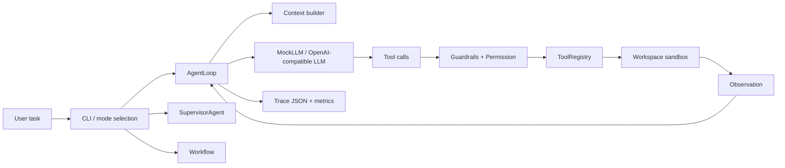

# Agent Forge

Agent Forge is a compact coding-agent runtime for learning and interviewing. It shows how an LLM becomes a controlled execution system: context assembly, tool calling, permission checks, sandboxed execution, observation feedback, trace, and executable eval.

The project is intentionally compact, but it now includes production-oriented slices expected in senior AI agent interviews: model gateway, runtime-backed multi-agent orchestration, task graph scheduling, session artifacts, diagnostics, diff tracking, rollback bundle, run reports, and eval history.

## Start Here

Use this order:

1. Run the project.
2. Read the code map.
3. Read the key-file walkthrough.
4. Run all modes and inspect trace.
5. Practice the interview narrative.
6. Prepare deep-dive answers.

The learning pack is here:

```text
docs/study-pack/README.md
```

## Quickstart

```bash
cd /path/to/NanoHarness/agent-forge
source .venv/bin/activate
scripts/verify.sh
```

Passing signals:

```text
Final: pass
final_status='success'
Ran 53 tests ... OK
eval_report.md generated
Verification passed.
```

Run the three modes directly:

```bash
scripts/run_all_modes.sh
```

Or run one mode at a time:

```bash
python run_demo.py --mode single --trace-file trace-single.json
python run_demo.py --mode multi --trace-file trace-multi.json
python run_demo.py --mode workflow
```

Session and rollback commands:

```bash
python run_demo.py --list-sessions
python run_demo.py --show-run <session_id>
python run_demo.py --rollback-run <session_id>
```

## LLM Switching

Default mode uses `MockLLMClient`, so it works offline.

OpenAI-compatible API:

```bash
python run_demo.py --mode single --llm openai \
  --base-url http://localhost:11434/v1 \
  --api-key ollama \
  --model qwen2.5-coder:7b
```

Reusable local profile:

```bash
cp llm_profiles.example.json llm_profiles.json
python run_demo.py --mode single --llm-profile ollama-qwen
```

Never commit real API keys. `llm_profiles.json`, `.env`, and `.env.local` are ignored.

## Architecture



## Project Structure

```text
agent_forge/
  cli.py                 # CLI, mode selection, LLM config
  runtime/               # AgentLoop, messages, tool calls, stop conditions
  models/                # ModelGateway, retry/fallback, usage telemetry
  tools/                 # read/write/patch/grep/run/git/ask_human
  safety/                # guardrails, permission, command policy, sandbox
  context/               # repo map, memory, retrieval, symbol search, ranking
  agents/                # Supervisor + Planner/Coding/Tester/Reviewer
  workflows/             # task graph scheduler + deterministic workflow contrast
  observability/         # trace, metrics, summary
  production/            # diff tracking, run reports, readiness notes
  eval/                  # eval runner and result model
tests/                   # unit tests
eval_cases/              # executable behavior checks
examples/demo_repo/      # tiny repo the agent fixes
scripts/                 # setup and verification scripts
docs/study-pack/         # concise learning/interview docs
```

## What To Read

```text
docs/study-pack/01-code-map-and-architecture.md
docs/study-pack/02-key-file-walkthrough.md
docs/study-pack/03-run-modes-and-trace-reading.md
docs/study-pack/04-interview-narrative.md
docs/study-pack/05-deep-dive-prep.md
docs/study-pack/06-personal-study-checklist.md
docs/study-pack/07-design-context-and-tradeoffs.md
docs/study-pack/08-production-interview-upgrade.md
```

## Generated Artifacts

These files are local run output and are ignored:

```text
eval_report.md
agent_forge_trace.json
trace-*.json
trace-*.pretty.json
summary.md
.agent_forge/runs/<run_id>/
```

Regenerate them with:

```bash
scripts/verify.sh
scripts/run_all_modes.sh
```
