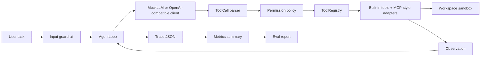

# Agent Forge

Agent Forge is a compact Agent Harness for learning and interviewing: agent loop, tool calling, safety, context engineering, observability, eval, and production-readiness design in one standard-library-first Python project.

It is not a model, not a Claude clone, and not an OpenCode config pack. It is a small engineering lab for one question: how can an LLM become a controlled execution system for code tasks?

The project source of truth is `00-项目原始设计方案-source-of-truth.md`. Read it first when comparing implementation gaps or continuing this project in a new Codex conversation.

## Quickstart

```bash
python3.11 run_demo.py --mode single
python3.11 run_demo.py --mode multi
python3.11 run_demo.py --mode workflow
python3.11 -m unittest discover tests
python3.11 -m agent_forge.eval.eval_runner
```

Default demos use `MockLLMClient`, so no API key is required. Optional OpenAI-compatible mode reads `AGENT_FORGE_BASE_URL`, `AGENT_FORGE_API_KEY`, and `AGENT_FORGE_MODEL`; it also accepts `OPENAI_BASE_URL`, `OPENAI_API_KEY`, and `OPENAI_MODEL` aliases.

Verified local results are recorded in `docs/run-results.md`: 44 unittest tests passed, 19/19 eval cases passed, and single/multi/workflow demos exited successfully.

## Why These Choices

- Python: easy to read, common in agent tooling, and friendly for interviews.
- `argparse`: standard-library CLI, no install step needed.
- `unittest`: standard-library test runner, stable on a fresh machine.
- MockLLM: deterministic demos and tests without API keys.
- JSON trace: readable, auditable, and easy to turn into metrics.
- keyword RAG / repo map first: teaches retrieval and context budget without vector database setup.
- no heavy framework by default: the goal is to expose the control layer directly.

## V1 / V2 Capability Matrix

| Area | V1 MVP | V2 |
| --- | --- | --- |
| LLM | MockLLMClient | Optional OpenAI-compatible client, tool call parsing, invalid response errors |
| Agent loop | Single-agent loop | Preserved and documented for deeper interview discussion |
| Multi-agent | Supervisor handoff demo | Eval and trace metrics make handoff explainable |
| Workflow | Deterministic workflow mode | Preserved as workflow-vs-agent contrast |
| Tools | read/write/patch/grep/run/git/ask_human | MCP-style local tool adapter |
| Context | repo map + keyword retrieval | symbol_search, file_ranker, budget report |
| Safety | guardrail, sandbox, permission | safety eval cases for secret/network/false claim |
| Observability | JSON trace | metrics summary from trace JSON |
| Eval | 6 cases | 19 cases, real verify.py execution, pass-rate report |
| Docs | learning notes | production readiness, LSP, MCP adapter, resume/project scripts |

## Architecture



## Eval

The benchmark currently has 19 cases. Each case includes:

- `task.md`
- `verify.py`

`eval_runner` executes each `verify.py` and writes `eval_report.md` with total, passed, failed, pass rate, failed case list, and metrics.

## Capability Evidence

See `docs/capability-evidence-map.md`.

## Project Structure

- `agent_forge/runtime`: agent loop, state, planner, LLM clients, stop conditions.
- `agent_forge/tools`: tool registry and built-in tools.
- `agent_forge/safety`: permission, sandbox, command policy, guardrails.
- `agent_forge/context`: repo map, memory, RAG, symbol search, file ranking, budget report.
- `agent_forge/agents`: Supervisor and Planner/Coding/Tester/Reviewer subagents.
- `agent_forge/observability`: trace JSON, summary writer, metrics.
- `agent_forge/eval`: executable eval runner and report generation.
- `docs`: design docs and interview materials.
- `tutorials`: nanoAgent-style learning path.

## Learning Route

1. Agent loop: `docs/01-agent-loop.md`
2. Tool calling: `docs/03-tool-calling.md`
3. Safety: `docs/08-permission-and-sandbox.md`, `docs/09-guardrails-and-human-approval.md`
4. Context V2: `docs/06-context-engineering.md`, `docs/19-lsp-and-symbol-search.md`
5. Observability/eval: `docs/10-observability-and-tracing.md`, `docs/11-evaluation.md`
6. Production: `docs/12-production-readiness.md`

## Interview Route

1. Start with `docs/20-resume-bullet-and-project-script.md`.
2. Use `docs/17-architecture-whiteboard.md` for the whiteboard story.
3. Practice `docs/14-interview-qa.md` for 80+ follow-up questions.
4. Run the commands in Quickstart during the demo.

30-second version:

> I built Agent Forge to make the control layer behind coding agents explicit: context assembly, tool routing, permission checks, observation feedback, tracing, and evaluation.

1-minute version:

> I built a compact Agent Harness to answer one question: how can we turn an LLM from a text generator into a controlled execution system for code tasks? The hardest part was not calling the model, but making tool execution safe, observable, and evaluatable. I implemented a single-agent loop, a supervisor/subagent workflow, permission sandboxing, trace logging, and an executable eval benchmark.

Architecture whiteboard entry:

> Let me draw the architecture to make sure we are aligned.

## Current Boundaries

- Default mode is MockLLM; it does not represent real model intelligence.
- Multi-agent mode is a supervisor/subagent demo, not complex autonomous collaboration.
- Sandbox is local workspace-level protection, not OS/container-level isolation.
- RAG is keyword retrieval, not a vector database.
- Symbol search is an AST MVP, not full LSP.
- MCP-style adapter is not full MCP.
- Production readiness is design documentation and roadmap, not a deployed production service.
- The OpenAI-compatible client is intentionally small and SDK-free.
- The MCP-style adapter is not a complete MCP protocol implementation.
- `symbol_search` uses Python AST, not a real LSP server.
- The benchmark is local and deterministic; it does not claim production traffic metrics.
- Trace metrics summarize local runs and are not a full telemetry backend.

## Roadmap

- Add an LSP-backed `SymbolProvider`.
- Add a model gateway abstraction with routing, fallback, cost tracking, and rate limits.
- Add GitHub PR bot integration with draft PR workflow.
- Store eval history over time for regression trends.
- Add richer typed tool schemas and argument validation.
