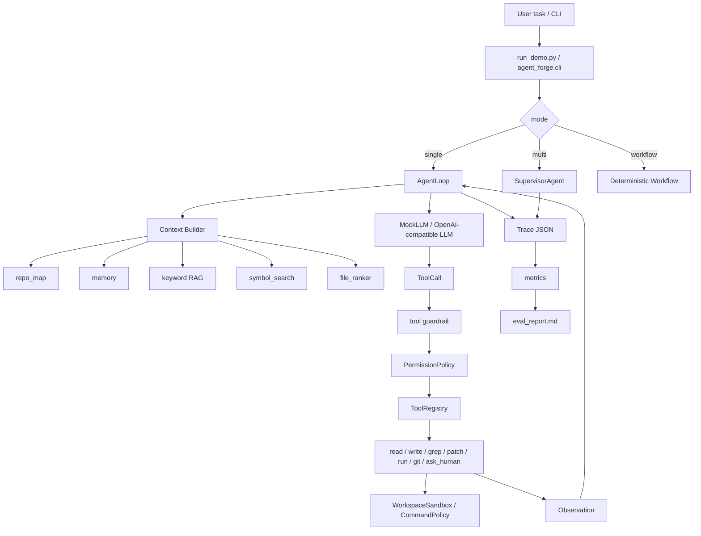

# 01 代码地图与整体架构

## 一句话定位

Agent Forge 是一个 coding agent harness。它的重点不是模型本身，而是把 LLM 变成“可控执行系统”的工程层：上下文、工具、安全、循环、trace、eval。

## 总体架构图

这张图描述的是**当前教学实现**，不是最终生产级架构。最容易误解的点是：现在只有 `single` mode 走完整 `AgentLoop`；`multi` 和 `workflow` 是为了单独演示 supervisor 编排和确定性流程，所以没有复用完整 agent loop。



## 先把三个 mode 的定位说清楚

| mode | 当前真实含义 | 是否完整 AgentLoop | 你该怎么理解 |
| --- | --- | --- | --- |
| `single` | 完整单 agent runtime | 是 | 项目最核心路径。看懂它，就看懂 context、LLM、tool、permission、observation、trace。 |
| `multi` | supervisor + 角色对象的教学 demo | 否 | 用来展示 Planner/Coder/Tester/Reviewer 的 handoff、retry、review gate，不是生产级多 agent。 |
| `workflow` | 固定状态机 demo | 否 | 用来对比 deterministic workflow 和 agent loop 的差异。它没有智能决策。 |

这个设计不是说“multi-agent 不需要 AgentLoop”。恰恰相反，生产级 multi-agent 通常应该让每个 subagent 复用类似 `AgentLoop` 的执行内核。当前代码没这么做，是为了先把概念拆开讲：

```text
single   -> 学 AgentLoop 内核
multi    -> 学 supervisor / handoff / retry / review gate
workflow -> 学固定流程和 agent 的边界
```

如果不写清楚，读代码时很容易误以为 `multi` 已经是工业级多 agent。它不是。它是教学切片。

## 当前实现和生产级实现的差距

当前 `multi`：

```text
SupervisorAgent.run
  -> PlannerAgent.run(state)
  -> CodingAgent.run(state)
  -> TesterAgent.run(state)
  -> optional CodingAgent retry
  -> ReviewerAgent.run(state)
```

生产级更合理的方向：

```text
Supervisor / Orchestrator
  -> Task DAG
      -> Planner worker  -> AgentLoop(role=planner)
      -> Backend worker  -> AgentLoop(role=coder, owned_files=...)
      -> Frontend worker -> AgentLoop(role=coder, owned_files=...)
      -> Test worker     -> AgentLoop(role=tester)
      -> Review worker   -> AgentLoop(role=reviewer)
  -> aggregate results
  -> detect conflicts
  -> retry / escalate / finish
```

缺的能力包括：

- 动态任务拆分，而不是写死顺序；
- 并发调度，而不是串行调用；
- 每个 subagent 自己的上下文检索、工具权限和停止条件；
- 文件 ownership 和 patch conflict 处理；
- 结构化任务状态，而不是共享 dict；
- 成本、延迟、重试预算；
- 人工审批和高风险升级策略；
- 更完整的 trace 聚合和失败归因。

面试时不要把当前 `multi` 说成生产级。更好的说法是：

> 当前 multi mode 是 supervisor orchestration 的最小教学实现。它展示了 handoff、phase transition、test failure retry、review gate 和 trace。生产化时，我会把 AgentLoop 抽成通用 AgentRuntime，让每个 subagent 都通过自己的 runtime 执行，再由 supervisor 基于任务 DAG 做动态调度、并发、冲突处理和结果聚合。

## 目录分布

```text
agent-forge/
  run_demo.py
  agent_forge/
    cli.py
    runtime/
    tools/
    safety/
    context/
    agents/
    workflows/
    observability/
    eval/
    production/
  tests/
  eval_cases/
  examples/demo_repo/
  scripts/
  local_scripts/
  docs/
```

## 每块代码负责什么

| 路径 | 角色 | 你该怎么理解 |
| --- | --- | --- |
| `run_demo.py` | 最薄入口 | 只负责调用 `agent_forge.cli.main()`。面试时说它是 CLI entrypoint。 |
| `agent_forge/cli.py` | 模式分发和配置入口 | 解析参数，选择 single/multi/workflow，组装 registry、trace、LLM。 |
| `agent_forge/runtime/agent_loop.py` | 单 Agent 主循环 | 最核心文件。完成 guardrail -> context -> LLM -> tool -> observation -> final。 |
| `agent_forge/runtime/llm_client.py` | LLM 客户端 | MockLLM 和 OpenAI-compatible API 都在这里。 |
| `agent_forge/runtime/llm_config.py` | LLM 配置解析 | 让模型可以从 CLI/env/profile 平滑切换。 |
| `agent_forge/tools/registry.py` | 工具路由表 | 注册工具、暴露 schema、按名字执行工具、处理 unknown tool。 |
| `agent_forge/tools/*.py` | 具体工具 | 读文件、写文件、patch、grep、跑命令、git status/diff。 |
| `agent_forge/safety/*.py` | 安全边界 | sandbox、权限、命令策略、输入输出 guardrail。 |
| `agent_forge/context/*.py` | 上下文工程 | repo map、检索、记忆、symbol search、文件排序、预算报告。 |
| `agent_forge/agents/*.py` | 多 Agent 角色 | Supervisor、Planner、Coding、Tester、Reviewer。 |
| `agent_forge/workflows/*.py` | 固定 workflow | 不依赖 LLM 的确定性流程，用来对比 agent。 |
| `agent_forge/observability/*.py` | 可观测性 | trace、metrics、summary。 |
| `agent_forge/eval/*.py` | 评测执行 | 扫 eval_cases，真实运行每个 verify.py。 |
| `tests/` | 单元测试 | 验证各模块行为。 |
| `eval_cases/` | 行为回归用例 | 每个 case 有 task 和 verify，证明项目能力不是口头说的。 |

## 依赖关系怎么读

最重要的依赖方向是单向的：

```text
cli
  -> runtime
  -> context / safety / tools / observability

agents
  -> tools / trace

eval
  -> run_demo.py / verify.py
```

你面试时可以强调：`AgentLoop` 不直接知道每个工具的细节，它只通过 `ToolRegistry` 执行工具；这让工具层可扩展，也让 loop 的职责保持清楚。

## 三条执行路径

### single

```text
run_demo.py
  -> cli.main
  -> AgentLoop
  -> MockLLM or OpenAI-compatible LLM
  -> ToolRegistry
  -> Observation
  -> Trace
```

这是最适合读 agent 基础架构的路径。

### multi

```text
run_demo.py
  -> cli.main
  -> SupervisorAgent
  -> PlannerAgent
  -> CodingAgent
  -> TesterAgent
  -> ReviewerAgent
  -> Trace
```

这是用来讲 supervisor/subagent 编排的路径。

### workflow

```text
run_demo.py
  -> cli.main
  -> run_workflow
  -> WorkflowState
```

这是用来讲 deterministic workflow 和 agent loop 差异的路径。

## 你看到一个文件时怎么定位

如果文件名在 `runtime/`，先问：它是不是控制 loop、状态、模型响应、停止条件？

如果文件名在 `tools/`，先问：它是不是一个可被 LLM 调用的动作？

如果文件名在 `safety/`，先问：它是在执行前拦截风险，还是执行后检查声明？

如果文件名在 `context/`，先问：它是不是帮 LLM 决定“应该看哪些信息”？

如果文件名在 `observability/`，先问：它是不是把运行过程变成可审计证据？

如果文件名在 `eval/` 或 `eval_cases/`，先问：它是不是证明某个能力真的跑通？
