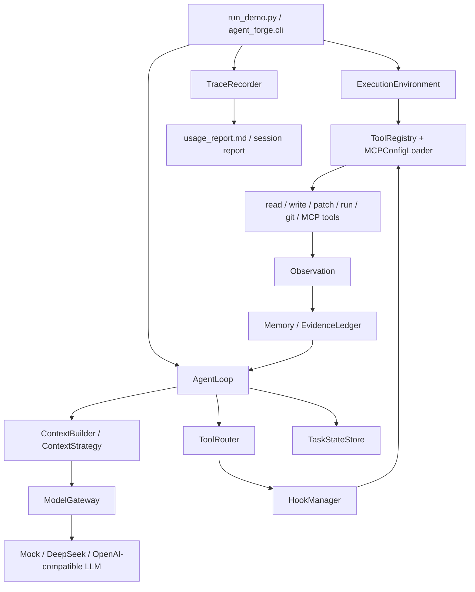

# Agent Forge Code Reading Map

This file is the code-level map. Read it before opening individual modules.
The goal is to reduce context switching: each package below is one mental
boundary, not just a filesystem folder.

## Main Call Chain

```text
run_demo.py
  -> agent_forge.cli.main()
  -> build_registry() / build_llm() / ExecutionEnvironment.prepare()
  -> AgentLoop.run()
  -> ContextBuildReport + ContextStrategy
  -> ModelGateway.chat()
  -> ToolRouter.route()
  -> HookManager.pre_tool()
  -> ToolRegistry.execute()
  -> Observation -> Memory/EvidenceLedger -> next AgentLoop step
  -> TraceRecorder.write() -> usage_report.md / session report
```

If you can explain this chain, you can explain most of the project.

## Runtime Flow



## Package Boundaries

| package | why it exists | what breaks if removed | first files to read |
|---|---|---|---|
| `runtime/` | Owns the live agent process: loop, budgets, hooks, environment, checkpoints, messages. | The project becomes a prompt script with no execution control, no resume, and no recovery policy. | `agent_loop.py`, `control.py`, `hooks.py`, `execution_environment.py`, `task_state.py` |
| `context/` | Decides what the model sees each turn: repo map, file ranking, retrieval, memory, token budget. | The model either sees too little evidence or too much noisy context, causing missed files and weak instruction following. | `context_builder.py`, `context_strategy.py`, `file_ranker.py`, `memory.py` |
| `tools/` | Converts model tool calls into safe local actions and external MCP-style tools. | The LLM could only chat; it could not inspect, patch, test, or call external tools through a governed protocol. | `registry.py`, `run_command.py`, `mcp_config.py`, `mcp_stdio.py` |
| `safety/` | Deterministic rules for path, command, permission, and guardrail checks. | Safety would rely on prompt wording, which is not enforceable when the model chooses bad actions. | `permission.py`, `command_policy.py`, `sandbox.py`, `guardrails.py` |
| `models/` | Normalizes model providers, retries, fallback, token usage, and cost telemetry. | AgentLoop would be tied to one vendor and could not report provider/cost behavior per step. | `gateway.py`, `usage.py`, `profile.py` |
| `observability/` | Turns raw runtime events into trace, metrics, evidence, and usage reports. | You could not debug why the agent chose a file, spent tokens, failed a tool, or stopped. | `trace.py`, `usage_report.py`, `metrics.py`, `evidence.py` |
| `mcp/` | Ships a small stdio MCP server so the agent can discover and call external tools by protocol. | MCP would be only a concept in docs, not a runnable capability. | `server.py`, `builtin_server.py`, `web_tools.py` |
| `agents/` | Implements supervisor-style orchestration on top of the same runtime primitives. | Multi-agent mode would be a hard-coded script rather than role specs, handoff, and retry policy. | `supervisor_agent.py`, `supervisor_policy.py`, `handoff.py` |
| `workflows/` | Deterministic baselines and gates: fixed workflow, task graph, review workflow. | There would be no contrast between agentic loops and rule-driven control paths. | `task_graph.py`, `review_workflow.py`, `coding_workflow.py` |
| `eval/` | Local regression and capability checks. | The project would depend on anecdotal demos instead of repeatable failure-mode cases. | `eval_runner.py`, `eval_case.py`, `flywheel.py` |
| `production/` | Public-run artifacts: diff summary, rollback bundle, ownership/readiness metadata. | Runs would mutate files without a readable report or a safe rollback record. | `diff_tracker.py`, `run_report.py`, `ownership.py` |

## Core Classes And Why They Are Necessary

| class | reason to exist | if missing |
|---|---|---|
| `AgentLoop` | Coordinates the ReAct loop and keeps context, model, tools, observations, safety, and trace in one controlled process. | Tool calls become scattered ad hoc code; stop/recovery behavior becomes impossible to reason about. |
| `ContextBuildReport` | Makes prompt assembly traceable as fields instead of one opaque string. | You cannot explain why a model saw or did not see a file, memory item, or tool. |
| `ContextStrategy` | Encapsulates retrieval, memory inheritance, attention anchor, and context budget policy. | Context selection logic leaks into AgentLoop and becomes hard to tune or replace. |
| `StepController` | Centralizes loop limits, repeated-action detection, retryability, timeout, and cost budget. | The agent can loop, retry unsafe failures, or stop for unclear reasons. |
| `HookManager` | Runs deterministic pre/post tool policies outside the model prompt. | Permission, environment, and redaction checks would be mixed into tool code or left to the model. |
| `ToolRegistry` | Validates tool names/arguments and converts all tool results into `Observation`. | A bad model tool call could crash the runtime instead of becoming recoverable evidence. |
| `ModelGateway` | Hides provider-specific clients behind a normalized response plus usage telemetry. | Switching Mock/DeepSeek/Ollama/company gateways would require touching runtime code. |
| `TraceRecorder` | Writes append-only evidence for every context/model/tool/recovery decision. | You only have final text and cannot debug or defend the run. |
| `SessionStore` | Persists run metadata, reports, and rollback pointers. | Local runs become disposable terminal output with no resume or audit trail. |
| `AgentForgeMCPServer` | Proves external tool discovery/call through a process boundary. | MCP remains theoretical and cannot be tested end to end. |

## What Not To Over-Read

Some modules are intentionally small wrappers. Read them only when a call chain
points there:

- `tools/read_file.py`, `tools/write_file.py`, `tools/list_files.py`: concrete
  `Tool` implementations. Their value is in sharing sandbox/registry policy.
- `runtime/message.py`, `runtime/tool_call.py`, `runtime/observation.py`: small
  protocol dataclasses. They exist so the rest of the runtime does not pass raw
  dicts everywhere.
- `production/readiness.py`, `production/risk_registry.py`: lightweight public
  checklist helpers, not the main runtime.

## Reading Order For A Full Understanding

1. `agent_forge/cli.py`
2. `agent_forge/runtime/agent_loop.py`
3. `agent_forge/context/context_builder.py`
4. `agent_forge/context/context_strategy.py`
5. `agent_forge/tools/registry.py`
6. `agent_forge/runtime/hooks.py`
7. `agent_forge/runtime/control.py`
8. `agent_forge/models/gateway.py`
9. `agent_forge/observability/usage_report.py`
10. `agent_forge/mcp/server.py`
