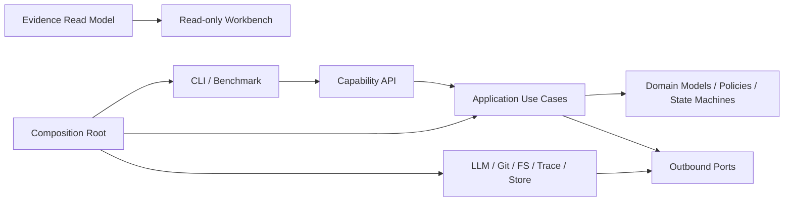
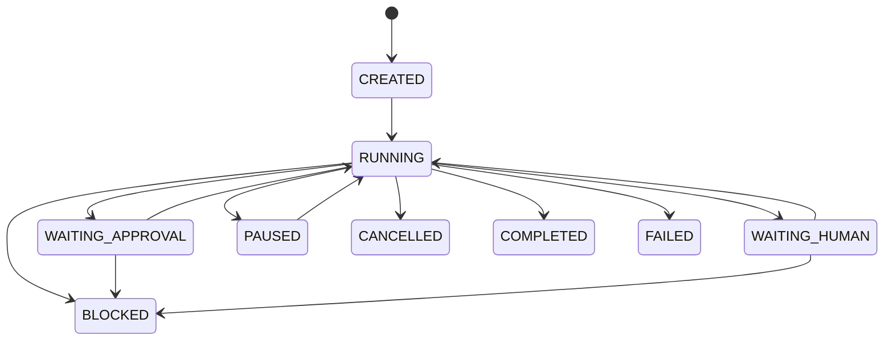

# NanoHarness 架构设计与治理标准

本文是 NanoHarness 唯一权威的项目架构契约。它同时回答三类问题：

1. 运行请求如何进入系统并完成一次 Agent 任务。
2. 各模块拥有什么数据、规则和副作用。
3. 新代码必须遵守哪些依赖、类型、状态和测试标准。

README 只负责项目定位与使用入口；能力细节由专题文档说明；重要决策记录在
`docs/adr/`。当其他文档与本文冲突时，以本文和可执行架构测试为准。

## 1. 架构目标

NanoHarness 是一个以运行时控制、可恢复执行和评测证据闭环为主线的模块化单体。
目标架构是：

> Capability-first Modular Monolith + Hexagonal Architecture + Explicit State Machines

这里的含义是：

- 先按 Runtime、Orchestration、Evaluation、Evidence、Presentation 划分能力边界。
- 只在复杂能力内部划分 Domain、Application、Ports、Adapters。
- 领域规则和应用流程不依赖文件系统、Git、网络、进程或具体存储。
- 所有状态变化都通过命名明确的转换发生，并留下可验证证据。
- CLI、UI、benchmark 只是进入系统的适配器，不拥有核心业务规则。

项目不追求完整 IDE、通用工作流平台或微服务拆分，也不照搬 Java 式一类一文件。
分层存在的理由是控制变化和依赖，而不是增加目录数量。

### 1.1 复杂度治理硬约束

状态与副作用正确、Evidence 真实可信是硬底线。在满足底线的设计中，复杂度按以下四条规则
分配，而不是按“框架是否看起来完整”分配。

#### 面试回报优先（项目定位与核心机制）

每个新增或保留的能力、抽象、CLI、状态和 artifact 必须至少直接服务一项：

- 真实 repository task 主链；
- Context、Tool Governance、HITL/Recovery 或 Evaluation 等核心机制；
- 状态、安全、恢复或 Evidence 正确性；
- 多个真实调用方的重复消除；
- 维护者定位、解释和验证代码的成本显著下降。

“更规范”“以后可能扩展”“更像框架”不能单独成为进入 Core 的理由。Advanced 能力可以保留，
但不得增加 Single-Agent 默认入口、主演示或首轮阅读面。

#### 理解成本必须有预算

| 预算项 | Core 上限 / 唯一 owner |
| --- | --- |
| Single-Run Runtime Public API | `Harness.run` 一个；`resume` 是显式 continuation 操作 |
| Core CLI | `run / inspect / demo` 三个；Operator 另有 `resume` |
| 首轮 Core Scope | 12 个文件；超过 15 个必须先完成合并审计 |
| Single-Agent Runtime construction | `Harness.run` 调用的唯一 wiring owner |
| Single-run artifact publication | Harness 边界 + 一个 manifest adapter |
| Single-run Evidence Read Model | `observability.domain.run_story` 一个 truth scope |
| Core Demo | 一个 Run Story + 一次 approval/recovery |

文件数和 LOC 不是机械 KPI；数字增加时必须写清新增语义、学习成本和无法合并的原因。CLI parser、
Adapter 序列化、Memory、Skills、MCP、Multi/Fanout、Campaign 和 UI 不计入首轮 Core Scope。

当前 12-file Core Scope（顺序即首轮阅读顺序）：

```text
agent_forge/harness.py
agent_forge/runtime/wiring.py
agent_forge/runtime/application/agent_loop.py
agent_forge/runtime/application/session.py
agent_forge/runtime/application/turn_preparation.py
agent_forge/runtime/application/tool_execution.py
agent_forge/runtime/application/operation_tracker.py
agent_forge/runtime/application/run_lifecycle.py
agent_forge/runtime/domain/task.py
agent_forge/runtime/domain/operation.py
agent_forge/observability/domain/event.py
agent_forge/observability/domain/run_story.py
```

#### 每个抽象必须有明确收益

抽象只有在表达真实领域状态、管理安全/生命周期、隔离外部基础设施、支持有价值的测试替身，
或消除多个调用方的重复时才保留。以下结构必须重点审查：

- 一行转发 Wrapper、无新增语义的 Service 或单字段 Mapper；
- 没有外部边界、替换场景或测试替身价值的单实现 Port；
- 重复 Runtime Builder、artifact publisher、projection 或 renderer；
- 只为目录整齐、参数数量或未来插件假设存在的类型和文件；
- 没有生产调用方、状态、不变量或 Evidence 的 public symbol。

六边形架构保留是为了 Port 替换、边界测试和副作用隔离，不是为了风格纯度。没有独立语义的
层允许合并、内联、私有化、降为 Advanced 或删除。

#### Navigation Contract

任意 Core symbol 必须能在两分钟内回答六问：

1. 属于哪一层、位于黄金主链哪里？
2. 规范上游 caller 是谁？
3. 下一语义 owner 或外部边界是谁？
4. 拥有哪些状态、不变量或副作用？
5. 哪个 trace、artifact 或行为测试证明它？
6. 删除/内联会失去什么；答不出时是否应降级或合并？

任意 run artifact 同样回答六问：kind/path、producer/flow stage、consumer、source/authority、
proves/does-not-prove、可重建性/删除影响。`forge inspect <symbol-or-artifact>` 是统一只读入口；
Code Compass 只声明静态 caller/callee，动态注入边由 Core owner 的 docstring 明确说明。

Core 模块、类和关键方法应标出流程位置、规范上游、下一 owner、状态与 Evidence、系统不变量。
注释解释“为什么、何时和失败语义”，不复制代码，也不手写所有 callers。

## 2. 五张项目地图

### 2.1 运行入口图

```text
forge / SWE-bench
        |
        v
Inbound Adapter
        |
        v
Capability API
        |
        v
Application Use Case
        |
        v
Domain Policy / State Machine
        |
        v
Outbound Port -> Adapter -> External System
```

外围代码只能通过 Capability API 调用能力。阅读一个功能时，顺序固定为：

```text
api.py -> application/use_case.py -> domain -> ports -> adapters
```

Single-Agent 的产品黄金主链更窄：

```text
forge run
-> CLI 参数归一化 / Adapter 选择
-> RunRequest
-> Harness.run
-> runtime wiring
-> AgentLoop.run
-> TurnPreparation / ModelPort
-> ToolExecutionPipeline / OperationTracker
-> RunLifecycle / TaskCheckpoint
-> RunResult + RunManifest
-> Run Story / inspect
```

Single-Agent CLI 不创建第二套 trace、environment、AgentLoop、patch 或 cleanup owner；`inspect`
与 Workbench 只读取 canonical Run Story，不从原始文件重新推断 Domain 状态。

### 2.2 依赖图



箭头表示“依赖”。Adapter 依赖 Port 并实现其契约；Application 只看到 Port，不知道
具体 Adapter。`wiring.py` 是首选 composition root。少数 `api.py` 同时承担 artifact
facade 与装配，但不能把 concrete Adapter 返回给调用方，也不能泄漏回 Application。

### 2.3 数据流图

```text
TaskRequest
  -> RuntimeConfig
  -> AgentRunSession
  -> ModelRequest
  -> ToolCall
  -> OperationIntent
  -> Observation
  -> Evidence Event
  -> RunResult / Patch / Artifact
  -> Evaluation Read Model
```

数据规则：

- 外部 JSON 在边界处解析并验证，进入内部后使用 dataclass、Enum 或 TypedDict。
- 每个核心数据结构只有一个 owner，不允许在多个模块重复定义近似字典。
- Application 返回类型化结果，不直接拼 Markdown、HTML 或 CLI 文本。
- Renderer 只消费 Read Model，不从原始 trace 重新推断“是否解决”等结论。
- `Any` 只允许出现在无法控制的协议边界，并应立即归一化。

### 2.4 状态流转图

单 Agent 任务的主状态为：



状态规则：

- 状态变化只能由拥有该状态机的领域或应用服务发起。
- 禁止外围模块直接赋值状态字符串。
- 非终态恢复必须携带 checkpoint、恢复提示和幂等边界。
- `COMPLETED` 只表示 harness 流程完成，不等于 official benchmark resolved。
- candidate patch、验证通过和 official resolved 是三个不同事实。

### 2.5 职责与所有权图

| 能力 | 拥有的数据与规则 | 允许的副作用 | 不拥有的职责 |
|---|---|---|---|
| Runtime | turn、tool intent、observation、pause/stop、预算 | 通过 Port 请求模型、工具、状态和事件 | Git 实现、JSON 格式、页面渲染 |
| Orchestration | role/fanout plan、依赖批次、冲突和整合决策 | 通过 Port 创建 worker、workspace 和 checkpoint | 直接调用 subprocess、拼报告 |
| Evaluation | case、metric、taxonomy、comparison、experiment | 通过 Port 获取执行结果和 official result | 克隆仓库、运行容器、UI 展示 |
| Evidence | event、artifact、run projection、case study | 读取/写入证据适配器 | 控制 Agent 或评测执行 |
| Presentation | 参数、HTTP、CLI、HTML/Markdown renderer | 启动 Use Case、查询 Read Model | 修改运行状态、解释原始 JSON |
| Adapters | LLM、Git、FS、process、具体 Store 和 Tool | 与外部世界交互 | 决定核心业务状态和结论 |

### 2.6 当前代码落点

```text
agent_forge/
├── harness.py           embeddable public facade
├── extensions.py        stable extension contracts
├── cli/                 public inbound adapter
├── runtime/             single-agent control plane
├── multi_agent/         sequential roles + live fanout
├── bench/               benchmark execution
├── evaluation/          metric/comparison/scorecard/data
├── observability/       trace facts + read models
└── workbench/           local evidence presentation
```

Single Agent 的真实入口：

```text
cli.dispatch.main -> cli.repository.run_repository_task
-> RunRequest -> agent_forge.Harness.run
-> runtime.wiring.build_agent_loop_from_request
-> runtime.application.AgentLoop.run
-> RunPreparation.start/execute
-> TurnPreparation.execute
-> Instruction Resolver / Skill discovery + activation / ContextAssemblerPort
-> before_model Hook -> ModelPort.chat -> after_model Hook
-> ToolExecutionPipeline.execute_calls
-> before_tool Hook -> governed tool -> after_tool + final redaction
-> RunLifecycle.stop
```

嵌入式控制与实时事件沿同一主链生效：

```text
RunController -> RunControlPort -> AgentLoop safe boundary -> checkpoint/stop/re-plan
TraceEvent -> Internal JSON evidence
           -> StreamingEventSink -> RuntimeEventListener -> optional OTEL spans
```

`pause/cancel/steer` 是协作式控制，只在 turn、模型返回和工具之间的边界检查；不会强杀
正在执行的 HTTP/进程，也不会自动回滚 operation ledger 已记录的副作用。实时流提供
run/turn/model/tool/checkpoint/control 事件，但当前模型 transport 是非流式请求，因此没有
伪造的 token delta。OTEL 是可选投影，内部 JSON evidence 仍是事实源。

顶层 `agent_forge` 与 `agent_forge.extensions` 是唯一承诺兼容的库导入面。Capability
内部的 `application`、`domain`、`adapters` 和 `wiring` 可以随架构治理演进；外部调用方
不得依赖这些路径。配置文件只选择已注册 built-in，不允许从字符串任意导入实现。

Benchmark 的完成顺序：

```text
bench.api.run_swebench
-> RunSwebench.execute
-> execute cases
-> stage predictions
-> optional official evaluator
-> final diagnosis + case study
-> aggregate scorecard/report
```

Evidence 的单向链路：

```text
TraceEvent fact
-> Internal JSON + optional redacted RuntimeEvent/OTEL projection
-> RunManifest artifact lineage
-> canonical RunStory projection
-> forge inspect / Markdown / Workbench renderer
```

Usage、scorecard、case evaluation 和 campaign aggregate 可以保留自己的 truth scope，但不得覆盖
Single-run Run Story 的事实，或把多个 scope 揉成一个万能 DTO。

## 3. 模块结构标准

复杂能力采用以下结构：

```text
capability/
├── api.py              # 外围稳定入口，只暴露少量用例
├── domain/             # 数据、值对象、纯规则、状态机
├── application/        # 用例编排，不包含基础设施细节
├── ports/              # Protocol 定义的外部能力契约
├── adapters/           # Port 的具体实现
└── wiring.py           # composition root；api.py 可做不泄漏 Adapter 的 facade
```

简单能力可以保持单文件或扁平目录。满足以下任一条件时才增加分层：

- 同一文件同时包含流程编排和文件、网络、Git、进程等副作用。
- 一个类因为多个不同原因频繁变化。
- 测试必须构造大量真实基础设施才能覆盖业务规则。
- 外围模块开始导入该能力的内部实现。

即使满足条件，新增层仍须通过 1.1 的抽象收益与理解预算检查；“可能出现第二种实现”不是当前
新增 Port 的充分条件。

## 4. 依赖约束

### 4.1 Domain

Domain 可以依赖：

- Python 标准库。
- 同一能力内的领域模块。
- 项目级纯类型契约。

Domain 禁止依赖：

- Application、Adapters、Presentation。
- 文件系统、HTTP、Git、subprocess 和具体数据库客户端。
- `TraceRecorder`、具体 Store、`ToolRegistry` 或具体 LLM Client。

### 4.2 Application

Application 可以依赖 Domain 和 Ports。Application 负责：

- 明确命名的 Use Case。
- 跨领域对象的流程编排。
- 事务、暂停、恢复和错误语义。
- 产生类型化结果与领域事件。

Application 不得创建具体 Adapter，不得读写任意文件，不得渲染报告。

### 4.3 Ports

Port 使用 `typing.Protocol` 描述 Application 真正需要的最小能力。Port 名称表达外部
能力，例如 `ModelPort`、`ToolPort`、`TaskStateRepository`、`WorkspacePort`、
`EventSink`，而不是笼统的 `Manager` 或 `Helper`。

不要为纯函数、模块私有细节或只有一个简单调用点的对象机械创建 Port。

### 4.4 Adapters

Adapter 负责：

- 外部格式解析、校验和错误归一化。
- 文件、Git、HTTP、容器、进程和数据库调用。
- 原子写入、重试、超时和资源清理。
- 将外部数据转换为内部类型。

Adapter 不得自行决定任务是否成功、是否应该恢复或 official evaluation 是否成立。

### 4.5 Presentation

CLI 和 UI 只负责输入、调用和呈现：

- 解析输入并构造类型化 Request。
- 调用 Capability API。
- 查询 Evidence Read Model。
- 使用独立 Renderer 输出文本或页面。

HTTP Handler 中不得自行实现 artifact discovery、解释新的 benchmark truth 或编排
Agent。它只通过 Workbench Port 查询并呈现 artifact；执行、审批和恢复统一留在
`forge` CLI / Public API，Workbench 的 POST 请求默认拒绝。

## 5. Python 实现约定

| 架构概念 | Python 实现 |
|---|---|
| Entity / Value Object | dataclass，稳定对象优先 `frozen=True` |
| State | Enum + 命名转换函数 |
| Application Service | 以动词命名的 Use Case 类或函数 |
| Domain Policy | 无 IO 的纯函数或小型策略类 |
| Repository Port | `typing.Protocol` |
| Gateway Port | LLM、Git、Tool、Workspace 等 Protocol |
| Adapter | 明确带实现语义的类，如 `JsonTaskStateRepository` |
| DTO | dataclass 或边界 TypedDict |
| Controller | CLI/HTTP inbound adapter |
| Dependency Injection | 构造函数注入 + 显式 `wiring.py` |

公共方法必须具备完整参数和返回类型。跨层返回裸 `dict` 时必须说明它是 JSON 协议还是
Read Model；否则应使用类型化对象。

## 6. 公共 API 标准

- `Harness.run(RunRequest) -> RunResult` 是唯一 Single-Run Runtime Public API；CLI single mode
  必须委托它，不能复制 Runtime construction 或 artifact publication。
- Public CLI 按使用频率分层：Core 为 `run / inspect / demo`，Operator 为 `resume`，Advanced
  为 `bench / ui`。Legacy/兼容命令隐藏且不进入 README、Core Scope 或主演示。
- `forge inspect` 是 run、artifact 和 source symbol 的统一只读入口；不得借 inspection 修改状态。
- 每个复杂能力只有一个推荐入口文件 `api.py`。
- `api.py` 只导出稳定 Request、Result 和 Use Case，不导出 Adapter。
- 跨能力导入只能指向对方的 `api.py`、`contracts.py` 或 Ports。
- 内部重构直接迁移调用方和测试，不长期保留历史导入 facade。
- `__init__.py` 不执行装配、不创建对象、不引入重量级循环依赖。
- 入口方法使用 `# 主要入口：` 标记，并通过导航测试保护。
- 附加 Lifecycle Hook 不能替换默认 environment、permission 和 secret-redaction 链；
  before-model/before-tool/on-stop 异常 fail closed，after/checkpoint 通知异常隔离并留证。
- `ModelCapabilities` 只驱动已有确定性策略；尚未消费的字段必须明确标为 Adapter
  声明，不能仅凭配置字段声称 Runtime 已支持对应协议。

## 7. 状态、错误与恢复标准

- 业务失败使用显式 Result、FailureSignal 或 StopRequest 表达。
- 外部异常在 Adapter 边界归一化，不能直接穿透到 AgentLoop。
- 可恢复暂停必须先持久化请求和 checkpoint，再向调用方返回。
- 副作用操作必须有稳定 operation key、前置 fingerprint 和 ledger 状态。
- 恢复时不得盲目重放已经执行或目标状态已经变化的副作用。
- timeout、cancel、provider error、policy denial、validation failure 必须可区分。
- pause/cancel 必须说明安全检查边界和既有副作用；steer 只能追加新的用户方向并丢弃
  边界内的过时模型结果，不重写已经发生的 observation。

## 8. Evidence 与报告标准

- Trace 是事实流，不是结论层。
- Read Model 将事实投影成 UI、CLI 和报告需要的稳定结构。
- Report 不得把 patch generated 写成 solved。
- Official resolved 只能来自 official evaluator 的明确结果。
- Single-run artifact 必须通过 `RunManifest` 记录 `kind`、`relative_path`、`producer_symbol`、
  `flow_stage`、`semantic_consumers`、`evidence_level`、`derived_from/source_event_refs`、
  `proves/does_not_prove`、`rebuildable/deletion_impact` 和完整性信息。
- 每个关键结论都应能回溯到 event、artifact、metric 或 evaluator result。
- 可从事实重新生成的 projection 可以删除后重建；checkpoint、ledger 或 evaluator authority 等
  不可重建事实必须按保留策略保存。不能为了给抽象辩护而声称所有 artifact 都不可删除。

## 9. 测试与架构守卫

每个迁移阶段至少包含：

1. 领域规则单元测试。
2. Port 的契约测试或 Adapter 测试。
3. Use Case 行为测试。
4. 一个跨层的确定性集成测试。
5. import direction、循环依赖和公共 API 架构测试。
6. mypy 和现有回归套件。
7. Core symbol/docstring、12-file Scope、唯一 wiring owner 和公开命令 allowlist 的导航守卫。

真实模型 smoke 用于集成证据，但不能作为唯一回归门禁，因为模型输出具有非确定性。

## 10. 变更完成定义

一个架构迁移阶段只有同时满足以下条件才算完成：

- 行为测试保持通过，公开 CLI 没有无意破坏。
- Application 不再直接依赖本阶段迁出的具体基础设施。
- 旧路径若保留，只是明确标注的兼容导出。
- 五张地图和代码一致，主要入口可从折叠视图识别。
- 新增类型和状态转换有测试。
- Core Scope、Public Entry 和唯一 owner 预算没有隐式增长；增长时已记录独立语义和学习成本。
- 随机 Core symbol 与 artifact 能按 Navigation Contract 回答六问。
- `docs/evaluation/failure-driven-improvements.md` 记录代表性问题、根因、修复和验证。
- README 只链接权威文档，不重复复制架构细节。

## 11. 架构决策标准

出现以下情况时新增 ADR：

- 调整 bounded context 或模块所有权。
- 引入新的外部 Port 或替换关键 Adapter。
- 修改持久化、恢复、幂等或状态语义。
- 改变评测结论或 Evidence truth model。

普通函数重命名、局部实现优化和无语义变化的文件移动不需要 ADR。
