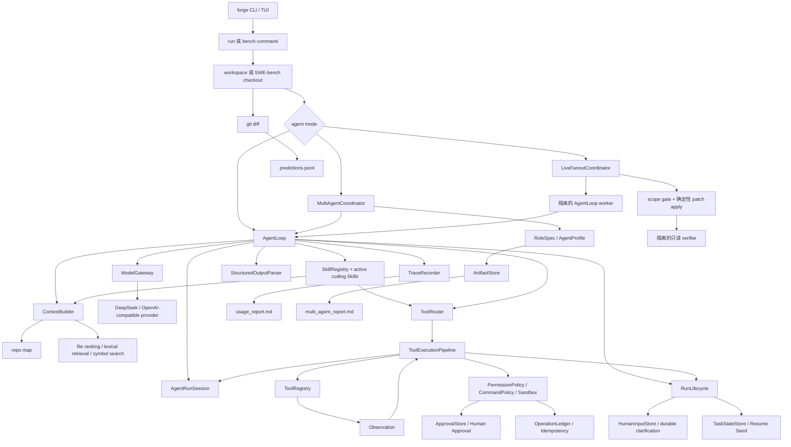

# Agent Forge 总体架构与运行链路

Agent Forge 围绕一个接近 production 的问题组织：

> CodingAgent 能否接收真实 issue，收集足够 context，执行受控 tool，生成 patch，并
> 留下可以评测的完整证据？

## 控制流

## 核心模块

| 模块 | 职责 | 为什么存在 |
| --- | --- | --- |
| `agent_forge/bench` | 加载 SWE-bench case、准备干净 workspace、写 prediction/report。 | 没有它，项目就没有外部效果闭环。 |
| `agent_forge/multi_agent` | 通过显式 artifact 和有界 revision 协调 role-specific AgentLoop。 | 没有它，multi-agent 只剩带隐藏状态的 prompt chaining。 |
| `agent_forge/evaluation` | 提供诚实 Single vs Multi comparison 的 data structure 和 report。 | 没有它，cost/quality tradeoff 只能靠主观描述。 |
| `agent_forge/runtime` | 运行 ReAct loop、stop condition、task state 和 model/tool interaction。 | 没有它，tool use 会变成零散且不可 replay 的逻辑。 |
| `runtime/agent_loop.py` | 只编排 run 的 prepare、turn 和 stop 阶段。 | 没有它，CLI、worker 与 benchmark 没有统一执行入口。 |
| `runtime/state.py` | 以 `AgentRunSession` 显式持有一次 run 的可变数据。 | 没有它，message、evidence、budget 和状态会散落为局部变量。 |
| `runtime/tool_execution.py` | 固定执行重复、HITL、policy、approval、ledger、tool 和 recovery 链。 | 没有它，工具治理会重新散落进主循环。 |
| `runtime/run_lifecycle.py` | 统一 checkpoint、人工暂停和 terminal transition。 | 没有它，不同分支会各自拼装恢复状态。 |
| `runtime/approval.py` | 按 operation key 保存 pending/approved/rejected side-effect approval。 | 没有它，HITL 只是 prompt 约定，不是 runtime boundary。 |
| `runtime/human_input.py` | 按稳定 thread identity 保存 pending/responded/cancelled question。 | 没有它，`ask_human` 只是模拟 response，不是 stop/respond/resume event。 |
| `runtime/operation_ledger.py` | 记录 planned、pending、approved、executed、failed、skipped side effect。 | 没有它，resume/rerun 可能重复 write、command 或 external action。 |
| `runtime/git_workspace.py` | 生成 HEAD-relative binary patch 和 changed-file list，包含 untracked source，排除 runtime artifact。 | 没有它，新文件会从 fanout、普通 run 和 benchmark prediction 中消失。 |
| `multi_agent/live_fanout.py` | 在隔离 AgentLoop worker 中运行 validated DAG，确定性 integration、final verification、selective recovery。 | 没有它，fanout 只是一层 callback scheduler。 |
| `evaluation/mini_cases.py` | 加载 research/ops 的小型非 Coding Agent case。 | 没有它，evaluation example 只覆盖 coding task。 |
| `evaluation/feedback_dataset.py` | 收集 human outcome，导出 privacy-conscious JSONL evidence。 | 没有它，trace 不能稳定进入 bad-case/regression input。 |
| `agent_forge/context` | 根据 repo structure、lexical retrieval、symbol、memory、budget 构建 prompt context。 | 没有它，模型要么拿到过少代码，要么收到 full-repo 噪声。 |
| `agent_forge/tools` | 提供 file、patch、grep、command、git、MCP-style tool。 | 没有它，模型无法安全检查和修改真实代码。 |
| `agent_forge/skills` | 提供内置 Coding Skill 和 custom manifest；selected Skill 将 procedure/expected tool 注入真实 run。 | 没有它，tool capability 无法变成可治理、可复用、task-specific workflow。 |
| `agent_forge/safety` | 强制 sandbox path、command policy、permission、guardrail。 | 没有它，Coding Agent 可能执行危险或无关 action。 |
| `agent_forge/models` | 标准化 provider call、retry、usage、latency、cost。 | 没有它，runtime logic 会绑定单一 LLM provider。 |
| `agent_forge/observability` | 将 raw event 转成 trace、metric、usage report。 | 没有它，failure 无法调试和解释。 |
| `runtime/structured_output.py` | 提取 JSON、校验 schema、构造 repair prompt，并参与 provider tool-call argument parsing。 | 没有它，下游 tool 可能把 malformed model text 当成可靠数据。 |

## AgentLoop 阶段与所有权

1. `AgentLoop._prepare_run`：input guardrail、clarification、planning mode 和 Skill。
2. `AgentLoop._run_turn`：context、tool routing、model call 和 final-answer 分流。
3. `ToolExecutionPipeline.execute_calls`：重复检测、HITL、permission、approval、ledger、
   tool execution、observation 和 recovery。
4. `RunLifecycle.update/stop`：checkpoint、人工暂停、stop hook 和 terminal trace。

`AgentRunSession` 只保存数据，不决定策略。折叠全部方法后，第一遍只展开
`AgentLoop.run`；调试 action 才进入工具管线，调试 pause/resume 才进入 lifecycle。

Loop 刻意从 Single Agent 开始，因为核心问题不是“很多 Agent 对话”，而是一个 Coding
Agent 能否在受控条件下闭合 issue-to-patch loop。

## Multi-Agent Coordinator（多 Agent 协调器）

`MultiAgentCoordinator` 是 `AgentLoop` 外层 workflow。

- `RoleSpec` 定义 role name、instruction、allowed tool、max step 和 expected artifact；
  revision round 还可以进一步收窄 tool，使 role 根据 reviewer artifact 修订，而不是
  继续无限收集证据。
- `AgentProfile` 将 role 组合成 `coding_fix`、`research_report` 等 profile。
- `ArtifactStore` 将 role output 写到
  `.agent_forge/runs/<run-id>/multi_agent/artifacts/`。
- Reviewer/verifier 必须返回 `PASS`、`NEEDS_REVISION` 或 `BLOCKED`。
- `NEEDS_REVISION` 会触发新的 primary-role round，直到达到 revision budget。

第一版是确定性顺序执行，不实现 parallel execution、quorum voting、decentralized
agent、Raft、blockchain 或 swarm learning。

## Fanout 调度

`multi_agent/fanout.py` 负责 dependency 和 overlap algorithm；
`multi_agent/live_fanout.py` 负责真实 runtime execution：

- `SubagentTask` 声明 id、dependency、tool hint、expected artifact、write scope。
- `build_execution_batches()` 将 task 分成 dependency-safe batch。
- 每个 runnable task 获得 disposable worktree、独立 LLM client、filtered registry、
  AgentLoop、trace、usage report、patch 和 execution manifest。
- Declared scope overlap 会进入串行 batch；actual scope escape、dynamic overlap 或 patch
  failure 产生 `conflict_resolution_required`。
- Accepted patch 按 task 顺序 apply；隔离 finalizer 读取 integrated candidate，但不能
  修改它。
- `fanout_checkpoint.json` 原子更新；resume 在跳过 completed worker 前校验 plan digest、
  base commit 和 patch hash。

这比 distributed runner 刻意更窄。JSON plan 是显式输入；没有模型会创建无限 swarm，
也不会静默解决 conflict。

## Resume 与 Human Approval

`RunLifecycle` 通过 `TaskStateStore` 写入紧凑 checkpoint。后续 run 可以传
`--resume-state <checkpoint.json>`，将 previous status、last tool、last observation、
stop reason 和 resume hint 注入 prompt memory。这是安全 continuation seed，不是隐藏
chat-state replay。

Manual approval（`--no-auto-approve-writes`）下，工具执行管线在副作用执行前写入 pending
`ApprovalRequest`，并停在 `waiting_approval`。`forge approve <operation_key>` 记录人工
决定；rerun/resume 只有在 target fingerprint 仍匹配获批状态时才执行。如果 target
已改变，approval 标记 `stale`，operation 不执行。

`OperationLedgerStore` 使用相同 operation identity：tool name、normalized argument、
workspace、action。Operation 成功后，后续 run 提出完全相同 operation 时会获得成功的
skipped observation，而不是重复执行。这是本地 idempotency，不是 distributed
transaction log。Path-targeted operation 保存 pre/post fingerprint；target 变化时记录
`stale_operation_record`，不继续假装旧 skip 安全。

`forge resume <run-dir>` 是用户入口：找到 `task_state/` 中最新 checkpoint，以
`--resume-state` 启动新 run，并写入 `resume_link.json`、`resume_chain.md` 和
`usage_report.md` 的 `Resume Chain`，使 continuation chain 在 report 中可见。

Informational human input 使用另一套状态机。工具执行管线拦截 `ask_human`，
`RunLifecycle` 原子写入 `HumanInputRequest`，将 id 写入 checkpoint，并在更多 tool
执行前停机。`forge respond`
记录答案；resume 注入 question/answer。Cancelled request 保持 terminal。Fanout worker
thread 在匹配 plan/base/task 下保持稳定，因此 selective rerun 可以复用已回答 clarification。

## 结果证据

每个 benchmark case 应留下：

- `trace.json`：event-level audit trail。
- `usage_report.md`：token/cost/context/tool breakdown。
- `patch.diff`：candidate git diff。
- `predictions.jsonl`：SWE-bench-compatible output。
- `report.md`：人类可读 result card。
- `multi_agent_report.md`：multi mode 的 role/artifact/revision summary。
- `fanout_report.md`：fanout mode 的 task batch、scope/merge outcome、resume marker、
  worker/finalizer usage 和 claim boundary。

这些证据比大量作者自写测试更重要。
