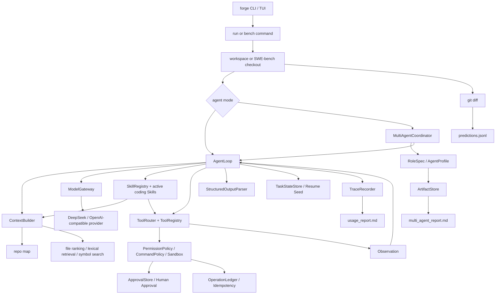

# Architecture Notes

Agent Forge is organized around one production-shaped question:

> Can a CodingAgent take a real issue, gather enough context, execute controlled
> tools, produce a patch, and leave behind evidence that can be evaluated?

## Control Flow

## Core Modules

| Module | Responsibility | Why it exists |
| --- | --- | --- |
| `agent_forge/bench` | Loads SWE-bench cases, prepares clean workspaces, writes predictions and reports. | Without it, the project has no external effect loop. |
| `agent_forge/multi_agent` | Coordinates role-specific AgentLoop runs through explicit artifacts and bounded revision rounds. | Without it, multi-agent behavior becomes prompt chaining with hidden state. |
| `agent_forge/evaluation` | Provides data structures and reports for honest single-vs-multi comparisons. | Without it, cost/quality tradeoffs are anecdotal. |
| `agent_forge/runtime` | Runs the ReAct loop, stop conditions, task state, model/tool interaction. | Without it, tool use becomes ad hoc and unreplayable. |
| `agent_forge/runtime/approval.py` | Stores pending/approved/rejected side-effect approvals by operation key. | Without it, human-in-the-loop is only a prompt convention instead of a runtime boundary. |
| `agent_forge/runtime/operation_ledger.py` | Records planned, pending, approved, executed, failed, and skipped side-effect operations. | Without it, resume/rerun can accidentally duplicate writes, commands, or external actions. |
| `agent_forge/evaluation/mini_cases.py` | Loads tiny non-coding Agent application cases for research and ops workflows. | Without it, the project positioning stays overly tied to coding-only interviews. |
| `agent_forge/context` | Builds prompt context from repo structure, lexical retrieval, symbols, memory, and budgets. | Without it, the model sees either too little code or noisy full-repo dumps. |
| `agent_forge/tools` | Provides file, patch, grep, command, git, and MCP-style tool access. | Without it, the model cannot inspect and modify real code safely. |
| `agent_forge/skills` | Provides built-in coding Skills and custom manifest loading; selected Skills inject operating procedures and expected tools into real runs. | Without it, tool capabilities cannot become governed reusable product capabilities or task-specific workflows. |
| `agent_forge/safety` | Enforces sandbox paths, command policy, permissions, and guardrails. | Without it, a coding agent can execute unsafe or irrelevant actions. |
| `agent_forge/models` | Normalizes provider calls, retries, usage, latency, and cost. | Without it, runtime logic is tied to one LLM provider. |
| `agent_forge/observability` | Converts raw events into trace, metrics, and usage reports. | Without it, failures cannot be debugged or defended. |
| `agent_forge/runtime/structured_output.py` | Extracts JSON, validates schema, builds repair prompts, and is used by provider tool-call argument parsing. | Without it, downstream tools may consume malformed model text as if it were reliable data. |

## AgentLoop Phases

1. Input guardrail and clarification check.
2. Planning-mode decision for traceability.
3. Skill selection with built-in/custom Skills, then context assembly with selected files, memory, active Skill cards, tools, and budget breakdown.
4. Model call through `ModelGateway`.
5. Tool-call validation and safety checks.
6. Human approval boundary for write-like or risky actions when approval mode requires it.
7. Tool execution and observation recording.
8. Recovery/stop-condition checks, including checkpoint updates for later resume.
9. Final answer guardrail and trace write.

The loop is intentionally single-agent first because the core problem is not
"many agents talk"; it is whether one coding agent can close the
issue-to-patch loop under control.

## Multi-Agent Coordinator

`MultiAgentCoordinator` is an outer workflow around `AgentLoop`.

- `RoleSpec` defines role name, instructions, allowed tools, max steps, and the
  expected artifact. It may also narrow tools on revision rounds, which is
  useful when a role should revise from reviewer artifacts instead of collecting
  more evidence.
- `AgentProfile` groups roles into a profile such as `coding_fix` or
  `research_report`.
- `ArtifactStore` writes each role output under
  `.agent_forge/runs/<run-id>/multi_agent/artifacts/`.
- Reviewer/verifier roles must return `PASS`, `NEEDS_REVISION`, or `BLOCKED`.
- `NEEDS_REVISION` triggers another primary-role round until the configured
  revision budget is reached.

The first version is deterministic and sequential. It does not implement
parallel execution, quorum voting, decentralized agents, Raft, blockchain, or
swarm learning.

## Fan-Out Scheduling

`agent_forge/multi_agent/fanout.py` is a small orchestration primitive for
task-plan execution:

- `SubagentTask` declares an id, dependency list, tool hints, expected artifact,
  and write scope.
- `build_execution_batches()` groups tasks into dependency-safe batches.
- `run_fanout()` can run a supplied worker concurrently for tasks in the same
  batch.
- Overlapping declared write scopes, or overlapping worker-reported touched
  files, produce `conflict_resolution_required` instead of silently merging.

This is deliberately narrower than a full distributed runner. The current
coordinator remains the production-shaped role workflow; fan-out exists to make
independent task concurrency and conflict policy explicit and testable.

## Resume And Human Approval

`TaskStateStore` writes compact checkpoints during AgentLoop execution. A later
run can pass `--resume-state <checkpoint.json>` to seed prompt memory with the
previous status, last tool, last observation, stop reason, and resume hint. This
is a safe continuation seed, not a hidden chat-state replay.

When approval is manual (`--no-auto-approve-writes`), `AgentLoop` writes a
pending `ApprovalRequest` and stops at `waiting_approval` before executing the
side effect. `forge approve <operation_key>` records the human decision; rerun
or resume can then execute the same approved operation.

`OperationLedgerStore` uses the same operation identity shape for side effects:
tool name, normalized arguments, workspace, and action. After an operation is
executed successfully, a later run that proposes the exact same operation gets a
successful skipped observation instead of applying it again. This is a local
idempotency mechanism, not a distributed transaction log.

`forge resume <run-dir>` is the user-facing convenience wrapper. It finds the
newest checkpoint under `task_state/`, starts a new run with `--resume-state`,
and writes `resume_link.json` in the continuation run so the chain is auditable.

## Result Evidence

Every benchmark case should leave:

- `trace.json`: event-level audit trail.
- `usage_report.md`: token/cost/context/tool breakdown.
- `patch.diff`: candidate git diff.
- `predictions.jsonl`: SWE-bench-compatible output.
- `report.md`: human-readable result card.
- `multi_agent_report.md`: role/artifact/revision summary when multi-agent mode
  is used.

This evidence is more important than a large set of author-created tests.
