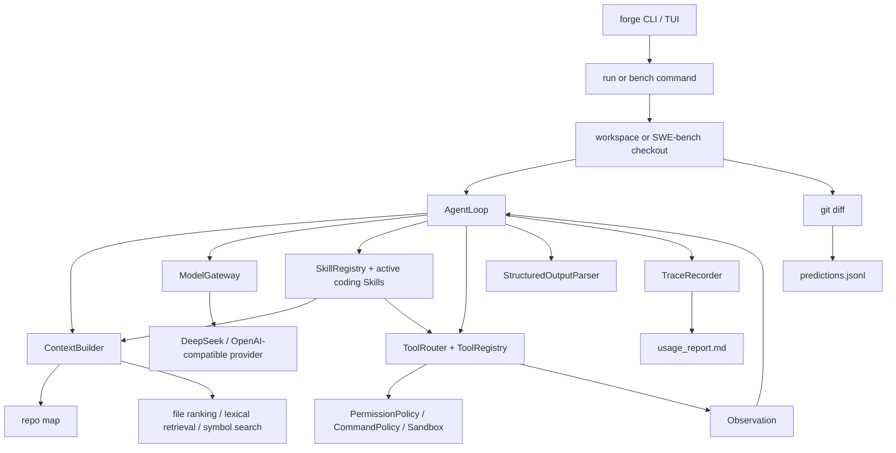

# Architecture Notes

Agent Forge is organized around one production-shaped question:

> Can a CodingAgent take a real issue, gather enough context, execute controlled
> tools, produce a patch, and leave behind evidence that can be evaluated?

## Control Flow

## Core Modules

| Module | Responsibility | Why it exists |
| --- | --- | --- |
| `agent_forge/bench` | Loads SWE-bench cases, prepares clean workspaces, writes predictions and reports. | Without it, the project has no external effect loop. |
| `agent_forge/runtime` | Runs the ReAct loop, stop conditions, task state, model/tool interaction. | Without it, tool use becomes ad hoc and unreplayable. |
| `agent_forge/context` | Builds prompt context from repo structure, lexical retrieval, symbols, memory, and budgets. | Without it, the model sees either too little code or noisy full-repo dumps. |
| `agent_forge/tools` | Provides file, patch, grep, command, git, and MCP-style tool access. | Without it, the model cannot inspect and modify real code safely. |
| `agent_forge/skills` | Provides built-in coding Skills and custom manifest loading; selected Skills inject operating procedures and expected tools into real runs. | Without it, tool capabilities cannot become governed reusable product capabilities or task-specific workflows. |
| `agent_forge/safety` | Enforces sandbox paths, command policy, permissions, and guardrails. | Without it, a coding agent can execute unsafe or irrelevant actions. |
| `agent_forge/models` | Normalizes provider calls, retries, usage, latency, and cost. | Without it, runtime logic is tied to one LLM provider. |
| `agent_forge/observability` | Converts raw events into trace, metrics, and usage reports. | Without it, failures cannot be debugged or defended. |
| `agent_forge/runtime/structured_output.py` | Extracts JSON, validates schema, builds repair prompts, and is used by provider tool-call argument parsing. | Without it, downstream tools may consume malformed model text as if it were reliable data. |

## AgentLoop Phases

1. Input guardrail and clarification check.
2. Planning-mode decision for traceability.
3. Skill selection with built-in/custom Skills, then context assembly with selected files, memory, active Skill cards, tools, and budget breakdown.
4. Model call through `ModelGateway`.
5. Tool-call validation and safety checks.
6. Tool execution and observation recording.
7. Recovery/stop-condition checks.
8. Final answer guardrail and trace write.

The loop is intentionally single-agent first because the core problem is not
"many agents talk"; it is whether one coding agent can close the
issue-to-patch loop under control.

## Result Evidence

Every benchmark case should leave:

- `trace.json`: event-level audit trail.
- `usage_report.md`: token/cost/context/tool breakdown.
- `patch.diff`: candidate git diff.
- `predictions.jsonl`: SWE-bench-compatible output.
- `report.md`: human-readable result card.

This evidence is more important than a large set of author-created tests.
