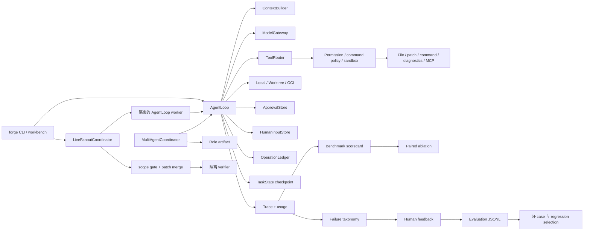

# Runtime 能力导览

这份文档把用户可见能力映射到真实 runtime 路径、证据和范围。快速阅读根目录
README 后，可以从这里进入实现。

## 系统地图

## 阅读顺序

| 步骤 | 文件 | 需要确认的事实 |
| --- | --- | --- |
| 1 | `agent_forge/forge_cli.py` | 公共命令进入统一运行路径，benchmark/evaluation utility 保持独立。 |
| 2 | `agent_forge/runtime/agent_loop.py` | Context、model call、action parsing、policy、observation、recovery、stop 是显式阶段。 |
| 3 | `agent_forge/tools/tool_router.py` | Tool visibility 会根据任务收敛，allowed/hidden summary 是真实证据。 |
| 4 | `agent_forge/runtime/execution_environment.py` | Local、worktree、OCI 分别提供不同的 path、git state、process、network、resource 边界。 |
| 5 | `agent_forge/runtime/approval.py` | 副作用可以在执行前停机，只能根据持久化人工决策继续。 |
| 6 | `agent_forge/runtime/human_input.py` | 信息型 question 有持久化 pending/responded/cancelled 状态和安全 id。 |
| 7 | `agent_forge/runtime/operation_ledger.py` | 稳定 operation key 防止重复副作用，并检测 stale target。 |
| 8 | `agent_forge/runtime/task_state.py` | Resume 使用 checkpoint summary，不声称恢复隐藏 model state。 |
| 9 | `agent_forge/multi_agent/coordinator.py` | Implementer、Reviewer、Verifier 复用 AgentLoop，只通过 artifact 协作。 |
| 10 | `agent_forge/multi_agent/live_fanout.py` | Task DAG 变成真实 worktree worker、确定性 integration、checkpoint 和 finalizer。 |
| 11 | `agent_forge/runtime/git_workspace.py` | Candidate patch 包含 tracked 和新 source file，同时排除 runtime artifact。 |
| 12 | `agent_forge/bench/failure_taxonomy.py` | Failure priority 能区分 runner、environment、evaluation、tool、context 和 loop failure。 |
| 13 | `agent_forge/evaluation/feedback_dataset.py` | Human outcome 和安全 trace projection 形成机器可读的改进输入。 |
| 14 | `agent_forge/bench/official_results.py` | Official quality 来自 per-case JSON，不来自 evaluator exit code。 |
| 15 | `agent_forge/evaluation/scorecard.py` | Patch、local、official metric 保留不同 denominator。 |
| 16 | `agent_forge/evaluation/experiment.py` | 计算 paired delta 前必须验证 matched run identity。 |

## 主要能力关系

### 受治理的执行

`ToolRouter` 决定模型能看见哪些工具；registry validation 检查 model-facing schema；
permission hook、command policy、workspace sandbox 和 execution environment 再判断该
action 是否可执行。Prompt instruction 只属于 context，不是强制执行边界。

OCI mode 仍复用相同 hook 和 sandbox chain。File tool 操作隔离后的 host snapshot；
command 和 unittest diagnostics 则被委托到挂载该 snapshot 为 `/workspace` 的 container。

### Human Input、Approval 与 Recovery

`HumanInputStore` 记录继续任务所需的信息，`ApprovalStore` 授权一个具体副作用，两者
刻意分离。Human question 会在后续工具执行前停止，并在新的 continuation 中注入
回答。Approval 保存 operation fingerprint，执行前再次检查 target state。
Operation ledger 记录 planned、pending、executed、failed、skipped 状态；task
checkpoint 用紧凑 continuation summary 为新的 model call 提供上下文。

### 多 Agent 编排

Coordinator 顺序运行不同 role 的 AgentLoop，并将 role output 写入 artifact store；
revision round 有明确上限。另一条 live fanout 路径则让显式 DAG task 在独立
AgentLoop/worktree/model context 中并发执行。Scope overlap 会串行化，accepted patch
通过 hash 标识，未完成任务可以从 checkpoint 重跑。它不是 distributed swarm，
也不声称自动拆解任务。

Canonical 和 sequential role run 支持逐 operation 的 manual write approval。
Live fanout 会拒绝该组合，直到 operation identity 可以跨 ephemeral worktree 稳定；
持久化 informational question 则可以跨 fanout resume 工作。

### Evaluation 与 Feedback

SWE-bench-shaped run 会生成 candidate patch、trace、usage、diagnosis、parsed official
outcome 和 denominator-aware scorecard。`forge eval ablation` 针对一个声明的 runtime
factor 比较 matched scorecard；`forge eval feedback` 增加 human outcome；
`forge eval export-dataset` 将安全字段投影成 JSONL，使重复坏 case 可以进入
regression selection 或后续 data curation。

## 证据边界

- Candidate patch：Agent 修改了 workspace，不证明修改正确。
- Local verification：当前环境中所有明确的 test-oriented validation event 都通过；
  只有 compile 不能算通过验证。
- Official evaluation：只有 official harness 的 per-case 输出可以支持 official
  resolved claim。
- Human feedback：operator judgment，不是 benchmark result。
- Exported JSONL：结构化证据，作为训练数据前仍需 privacy 和 quality review。

完整的 green/yellow/scoped 状态持续维护在
[`docs/CAPABILITY_REALITY_MATRIX.md`](../CAPABILITY_REALITY_MATRIX.md)。
