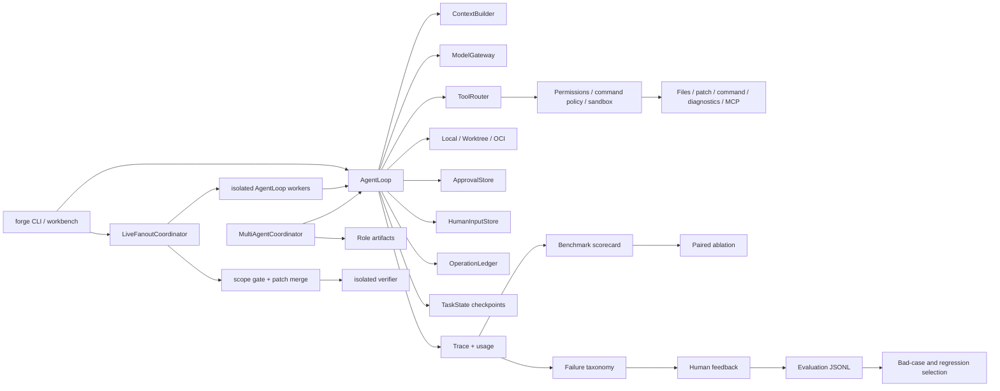

# Runtime Capability Guide

This guide maps user-visible capabilities to their runtime path, evidence, and
scope. Read it after the root README when reviewing the implementation.

## System Map

## Reading Order

| Step | File | What to verify |
| --- | --- | --- |
| 1 | `agent_forge/forge_cli.py` | Public commands enter one canonical run path and keep benchmark/evaluation utilities separate. |
| 2 | `agent_forge/runtime/agent_loop.py` | Context, model calls, action parsing, policy checks, observations, recovery, and stopping are explicit phases. |
| 3 | `agent_forge/tools/tool_router.py` | Tool visibility is task-aware and its allowed/hidden summary is evidence, not decoration. |
| 4 | `agent_forge/runtime/execution_environment.py` | Local, worktree, and OCI modes expose distinct path, git-state, process, network, and resource boundaries. |
| 5 | `agent_forge/runtime/approval.py` | Side effects can stop before execution and resume only from persisted human decisions. |
| 6 | `agent_forge/runtime/human_input.py` | Informational questions have durable pending/responded/cancelled state and safe ids. |
| 7 | `agent_forge/runtime/operation_ledger.py` | Stable operation keys prevent duplicate side effects and detect stale targets. |
| 8 | `agent_forge/runtime/task_state.py` | Resume uses checkpoint summaries and does not claim hidden model-state restoration. |
| 9 | `agent_forge/multi_agent/coordinator.py` | Implementer, Reviewer, and Verifier reuse AgentLoop and communicate through artifacts. |
| 10 | `agent_forge/multi_agent/live_fanout.py` | A task DAG becomes real worktree workers, deterministic integration, checkpoints, and a finalizer. |
| 11 | `agent_forge/runtime/git_workspace.py` | Candidate patches include tracked and new source files without collecting runtime artifacts. |
| 12 | `agent_forge/bench/failure_taxonomy.py` | Failure priority distinguishes runner, environment, evaluation, tool, context, and loop failures. |
| 13 | `agent_forge/evaluation/feedback_dataset.py` | Human outcomes and safe trace projections form a machine-readable improvement input. |
| 14 | `agent_forge/bench/official_results.py` | Official quality comes from per-case JSON, never evaluator exit code. |
| 15 | `agent_forge/evaluation/scorecard.py` | Patch, local, and official metrics retain separate denominators. |
| 16 | `agent_forge/evaluation/experiment.py` | Matched run identity is checked before paired deltas are reported. |

## Main Capability Relationships

### Governed execution

`ToolRouter` decides visibility. Registry validation checks the model-facing
schema. Permission hooks, command policy, workspace sandbox, and execution
environment then evaluate the requested action. Prompt instructions are
context, not the enforcement boundary.

OCI mode keeps the same hook and sandbox chain. File tools operate on the
isolated host snapshot; command and unittest diagnostics are delegated into the
container that mounts that snapshot at `/workspace`.

### Human input, approval, and recovery

`HumanInputStore` records information needed to continue; `ApprovalStore`
authorizes a concrete side effect. They are deliberately separate. A human
question stops before further tools and a response is injected into a later
continuation. An approval stores an operation fingerprint and rechecks target
state before execution. The operation ledger records planned, pending,
executed, failed, or skipped states. Task checkpoints seed a new model call
with a compact continuation summary.

### Multi-agent coordination

The coordinator runs role-specific AgentLoop instances sequentially and writes
role outputs to an artifact store. Revision rounds are bounded. The separate
live fanout path runs explicit DAG tasks concurrently through separate
AgentLoop/worktree/model contexts. Scope overlap is serialized, accepted patches
are hash-addressed, and incomplete tasks can be rerun from a checkpoint. It is
not presented as a distributed swarm or automatic task decomposer.

Per-operation manual write approval is supported by canonical and sequential
role runs. Live fanout rejects that combination until operation identity can be
made stable across ephemeral worktrees; durable informational questions do work
across fanout resume.

### Evaluation and feedback

SWE-bench-shaped runs produce candidate patches, traces, usage, diagnoses,
parsed official outcomes, and denominator-aware scorecards. `forge eval
ablation` compares matched scorecards for one declared runtime factor. `forge
eval feedback` adds a human outcome. `forge eval
export-dataset` projects safe fields into JSONL so repeated bad cases can drive
regression selection or later data curation.

## Evidence Boundaries

- Candidate patch: the agent changed the workspace; correctness is not proven.
- Local verification: all explicit test-oriented validation events passed in
  the current environment; compilation alone does not qualify.
- Official evaluation: only per-case output from the official harness can
  support an official resolved claim.
- Human feedback: an operator judgment, not a benchmark result.
- Exported JSONL: structured evidence requiring privacy and quality review
  before use as training data.

The full green/yellow/scoped status is maintained in
`docs/CAPABILITY_REALITY_MATRIX.md`.
