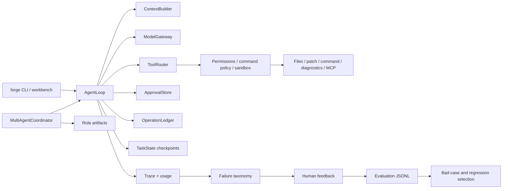

# Runtime Capability Guide

This guide maps user-visible capabilities to their runtime path, evidence, and
scope. Read it after the root README when reviewing the implementation.

## System Map

## Reading Order

| Step | File | What to verify |
| --- | --- | --- |
| 1 | `agent_forge/forge_cli.py` | Public commands enter one canonical run path and keep benchmark/evaluation utilities separate. |
| 2 | `agent_forge/runtime/agent_loop.py` | Context, model calls, action parsing, policy checks, observations, recovery, and stopping are explicit phases. |
| 3 | `agent_forge/tools/tool_router.py` | Tool visibility is task-aware and its allowed/hidden summary is evidence, not decoration. |
| 4 | `agent_forge/runtime/execution_environment.py` | Local and detached-worktree modes expose different isolation boundaries without claiming container security. |
| 5 | `agent_forge/runtime/approval.py` | Side effects can stop before execution and resume only from persisted human decisions. |
| 6 | `agent_forge/runtime/operation_ledger.py` | Stable operation keys prevent duplicate side effects and detect stale targets. |
| 7 | `agent_forge/runtime/task_state.py` | Resume uses checkpoint summaries and does not claim hidden model-state restoration. |
| 8 | `agent_forge/multi_agent/coordinator.py` | Implementer, Reviewer, and Verifier reuse AgentLoop and communicate through artifacts. |
| 9 | `agent_forge/bench/failure_taxonomy.py` | Failure priority distinguishes runner, environment, evaluation, tool, context, and loop failures. |
| 10 | `agent_forge/evaluation/feedback_dataset.py` | Human outcomes and safe trace projections form a machine-readable improvement input. |

## Main Capability Relationships

### Governed execution

`ToolRouter` decides visibility. Registry validation checks the model-facing
schema. Permission hooks, command policy, workspace sandbox, and execution
environment then evaluate the requested action. Prompt instructions are
context, not the enforcement boundary.

### Human approval and recovery

An approval request stores the operation fingerprint before a side effect. A
later continuation rechecks the target fingerprint, while the operation ledger
records planned, pending, executed, failed, or skipped states. Task checkpoints
seed a new model call with a compact continuation summary.

### Multi-agent coordination

The coordinator runs role-specific AgentLoop instances sequentially and writes
role outputs to an artifact store. Revision rounds are bounded. The separate
fanout module currently proves dependency batching and conflict detection but is
not presented as a live distributed swarm.

### Evaluation and feedback

SWE-bench-shaped runs produce candidate patches, traces, usage, diagnoses, and
reports. `forge eval feedback` adds a human outcome. `forge eval
export-dataset` projects safe fields into JSONL so repeated bad cases can drive
regression selection or later data curation.

## Evidence Boundaries

- Candidate patch: the agent changed the workspace; correctness is not proven.
- Local verification: focused tests or diagnostics produced evidence in the
  current environment.
- Official evaluation: only per-case output from the official harness can
  support an official resolved claim.
- Human feedback: an operator judgment, not a benchmark result.
- Exported JSONL: structured evidence requiring privacy and quality review
  before use as training data.

The full green/yellow/scoped status is maintained in
`docs/CAPABILITY_REALITY_MATRIX.md`.
