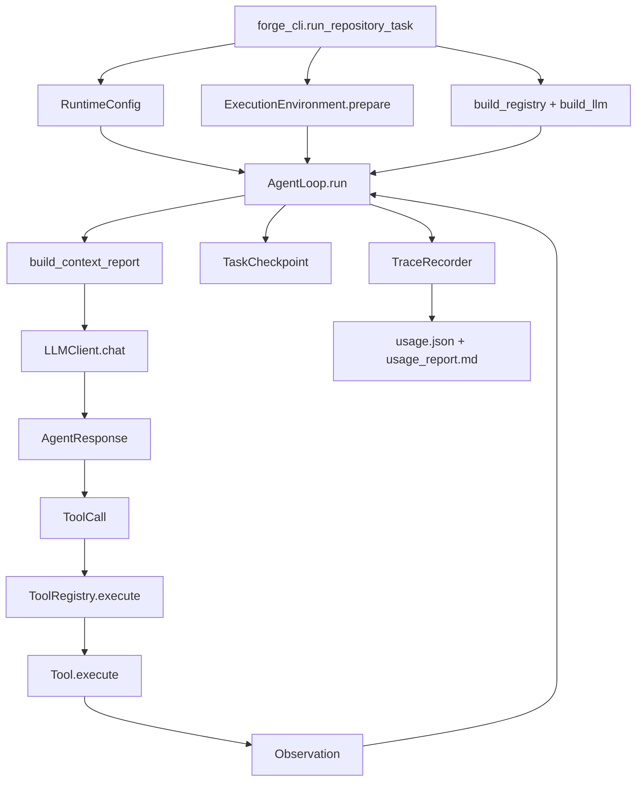
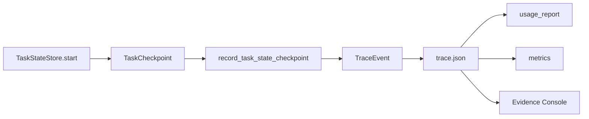
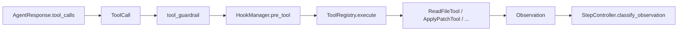
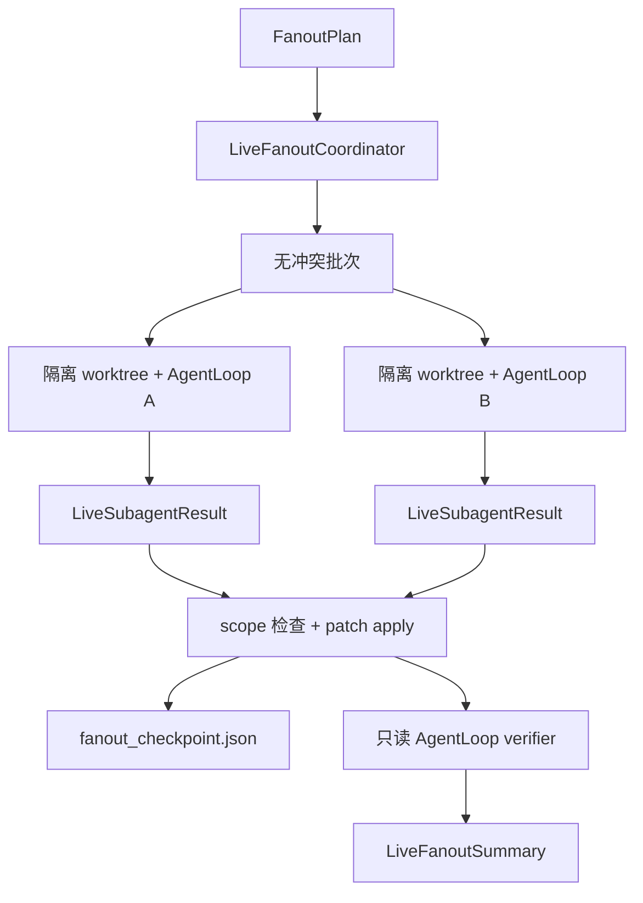
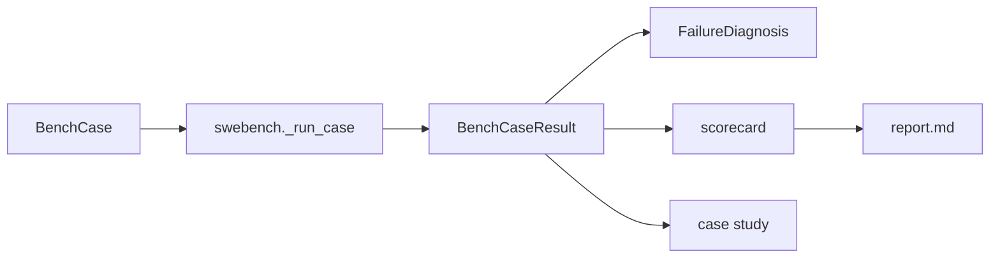

# NanoHarness 代码阅读地图

这份文档只解决一个问题：打开一个函数后，怎样不必反向追完整个仓库，也能知道
数据从哪里进入、以什么形式离开、下一步流向哪里。

## 一句话模型

```text
CLI 任务 -> RuntimeConfig -> AgentLoop -> LLM/ToolCall -> Observation -> Trace/Checkpoint -> Report/Evaluation
```

## 折叠阅读约定

NanoHarness 会直接在源码中标记方法的重要程度。即使你在 IDE 中折叠了全部方法，
展开一个类后仍然能先看见系统骨架。

| 标记 | 什么时候读 | 含义 |
| --- | --- | --- |
| `PRIMARY ENTRYPOINT` | 第一遍 | 一项能力的起点，负责核心编排或用户可见的状态迁移。 |
| `RUNTIME PORT` | 第二遍 | 被入口跨模块调用的边界，通常负责策略、持久化或证据。 |
| 没有标记 | 调试对应分支时 | 辅助实现。第一遍只看名字和类型通常就够了。 |
| `_` 开头 | 最后 | 私有步骤、存储细节或 helper，不是稳定的连接点。 |

这些标记只是注释，不是 decorator，也不是运行时元数据，不会改变程序行为。
一个状态机可以有多个主入口，因为不同参与者会从不同位置进入。比如 HITL 同时
包含运行时暂停、操作者回答和 continuation 三个入口。

## 能力入口索引

把下面这张表当成项目目录。先打开主入口，保持所有方法体折叠；只有准备理解某条
具体分支时，才继续打开“下一步”列出的端口。

| 能力 | 从这里开始 | 下一步跟随 | 第一遍跳过 | 证据或输出 |
| --- | --- | --- | --- | --- |
| CLI 分发 | `forge_cli.main` | 当前命令对应的入口函数 | parser 参数声明 | 输出的 artifact 路径 |
| 单次运行装配 | `forge_cli.run_repository_task` | `ExecutionEnvironment.prepare`，再进入一个 coordinator 的 `run` | `registry_factory`、latest pointer | 一份 run directory |
| Single Agent runtime | `AgentLoop.run` | `build_context_report` -> `ModelGateway.chat` -> `ToolRegistry.execute` | 在需要具体分支前先跳过所有 `_...` | final answer、trace、checkpoint |
| Context Engineering | `build_context_report` | `build_context_strategy` | rank、preview、truncate helper | `ContextBuildReport` 和 context trace event |
| 模型边界 | `ModelGateway.chat` | `OpenAICompatibleLLMClient.chat` | retry 记账和 response parsing helper | `AgentResponse`、`last_usage` |
| 工具治理 | `ToolRouter.route` -> `HookManager.pre_tool` -> `ToolRegistry.execute` | 只有调试具体工具时才进入对应 `Tool.execute` | registry schema helper 和无关工具 | routing、permission、tool、observation event |
| 路径与命令安全 | `WorkspaceSandbox.ensure_safe_path`、`check_command`、`PermissionPolicy.decide` | 需要区分 local/OCI 时读 `ExecutionEnvironment.execute_command` | policy summary renderer | permission decision 和 command history |
| 执行隔离 | `ExecutionEnvironment.prepare` | `probe`、`write_manifest`、`cleanup` | 某种模式失败前先跳过 `_prepare_*` | environment probe 和 manifest |
| 信息型 HITL | `AgentLoop.run` 暂停 -> `respond_to_human_input` -> `resume_repository_task` | `HumanInputStore.request/respond`、`TaskStateStore.update` | store 的 path/list/write helper | human request、waiting checkpoint、resume chain |
| 副作用审批 | `AgentLoop.run` 暂停 -> `approve_request` -> `resume_repository_task` | `ApprovalStore.request/decide`、loop 中的 fingerprint 检查 | approval 文件 I/O helper | approval record 和 permission trace |
| Runtime 恢复 | `StepController.classify_observation`、`resume_repository_task` | `TaskStateStore.start/update`、`OperationLedgerStore.ensure_planned` | summary renderer 和 record 序列化 | recovery event、checkpoint、operation record |
| 顺序多角色 | `MultiAgentCoordinator.run` | 多次 `AgentLoop.run`，然后读 `ArtifactStore` | 各 role 的 prompt 格式化 | role artifact 和 `MultiAgentRunSummary` |
| 并发 fanout | `LiveFanoutCoordinator.run` | `build_conflict_free_batches`、worker `AgentLoop.run` | merge/recovery 失败前先跳过 worktree/git helper | fanout checkpoint、worker trace、integration patch |
| 结构化输出 | `StructuredOutputParser.parse` | 解析失败后再读 `build_repair_prompt` | JSON 提取和 schema helper | `StructuredOutputResult` 和 retry evidence |
| Skills | `SkillRegistry.select_for_task` | 被选中的 `SkillSpec.prompt_card` 和 tool names | manifest parsing、version helper | active-skill context 和 trace metadata |
| MCP | `MCPConfigLoader.load_into`、`AgentForgeMCPServer.run` | 注册后的 tool -> stdio client call | JSON-RPC 格式化 helper | registration report 和 tool observation |
| SWE-bench 主链路 | `run_swebench` | `_run_case`、可选的 `parse_official_results` | case 失败前先跳过 checkout helper | predictions 和评测后的 case result |
| 失败诊断与报告 | `attach_failure_diagnosis` -> `write_case_study` / `write_bench_artifacts` | `classify_case_result`、scorecard writer | Markdown renderer | failure taxonomy、case study、result card |
| Run/variant 对比 | `compare_runs`、`compare_variants` | normalized metrics 和 recommendation rules | 数值兼容 helper | single/multi 和 before/after evidence |
| Scorecard/ablation | `build_benchmark_scorecard`、`compare_benchmark_scorecards` | normalized case 和 paired-case row | Markdown renderer | scorecard 和 paired delta artifact |
| 人工反馈与数据 | `record_feedback`、`export_feedback_dataset` | 审计隐私字段时再读 `_build_record` | path discovery helper | `feedback.json` 和 JSONL dataset |
| Evidence Console | `run_ui` | `UiState.start_job`，再读当前 view 对应的 renderer | HTML helper 和其他 renderer | 本地 HTTP 证据页面和受限 job |

### 三遍阅读法

1. 第一遍只读 `PRIMARY ENTRYPOINT` 的签名和 docstring，先重建整个系统骨架。
2. 选择一个场景，沿它的 `RUNTIME PORT` 继续。比如 HITL 只跟 request ->
   waiting checkpoint -> response -> resume，不要展开 store 的每个方法。
3. 只有解释具体策略或调试失败测试时才打开私有 helper。数据类可以先当字段表看，
   它的持久化 helper 并不定义能力本身。

在阅读控制流前，先认识项目中的五类对象：

| 对象类型 | 含义 | 主要定义位置 |
| --- | --- | --- |
| 配置 | 一次运行允许做什么 | `runtime/config.py`、`runtime/execution_environment.py` |
| 协议 | 模型和工具之间交换什么数据 | `runtime/message.py`、`runtime/tool_call.py`、`runtime/observation.py`、`tools/base.py` |
| 运行状态 | Agent 当前知道什么、停在什么位置 | `runtime/state.py`、`runtime/task_state.py` |
| 证据 | 发生了什么、为什么发生 | `observability/event.py`、`observability/trace.py`、`observability/evidence.py` |
| 结果 | 一次 run 或 benchmark 产出了什么 | `multi_agent/types.py`、`multi_agent/live_fanout.py`、`bench/types.py`、`evaluation/types.py` |

## 主 Runtime 调用链



按下面的顺序理解：

1. `forge_cli.run_repository_task` 负责运行装配和 artifact 路径。
2. `RuntimeConfig` 是传给 `AgentLoop` 的完整控制面输入。
3. `AgentLoop.run` 负责编排，但把 context、policy、tool 和 persistence 交给各自 owner。
4. 无论底层 provider 是什么，`LLMClient.chat` 都返回统一的 `AgentResponse`。
5. 在具体 `Tool` 看到参数前，`ToolRegistry` 先验证模型生成的参数。
6. 每个工具都返回 `Observation`，异常不会形成另一套隐式协议。
7. `TaskCheckpoint` 保存可恢复控制状态，`TraceRecorder` 保存审计时间线。

## Trace 示例

checkpoint 事件故意使用具名方法：

```python
self.trace.record_task_state_checkpoint(
    step=0,
    agent_name=agent_name,
    checkpoint=checkpoint,
)
```

只看调用位置就能知道：

- `step` 是 `int`。
- `agent_name` 是 `str`。
- `checkpoint` 是 `TaskCheckpoint`，跳到这个 dataclass 就能看到全部字段。
- 方法会写入 `task_state_checkpoint` 事件。
- 序列化只发生在 `TraceRecorder` 内部，而不是调用者中。

数据流如下：



JSON 仍保持向后兼容的扁平结构：

```json
{
  "run_id": "...",
  "step": 0,
  "agent_name": "CodingAgent",
  "event_type": "task_state_checkpoint",
  "success": true,
  "task_state": {
    "status": "created",
    "current_step": 0,
    "last_tool": ""
  }
}
```

`TraceEvent` 会阻止扩展 payload 覆盖 `run_id`、`event_type` 等 envelope 字段。
`TraceEventType` 定义支持的事件词表。`TraceRecorder.add` 是兼容旧事件的出口；
高价值事件应逐步获得具名 `record_*` 方法。

## 内部数据与边界数据

看到类型里出现 `Any` 时，使用下面的规则判断是否合理：

| 位置 | 推荐形式 | 原因 |
| --- | --- | --- |
| Runtime 自有状态 | dataclass、Enum、显式字段 | 项目可以控制其形状 |
| 函数之间调用 | 具体参数和返回类型 | 读者和静态工具都应知道契约 |
| Model/tool/MCP/HTTP JSON 输入 | 具名边界 alias + runtime validation | 外部数据在校验前不可信 |
| 持久化 JSON artifact | typed domain object + 单一 `to_dict` 边界 | 序列化应只发生在 owner 附近 |
| UI renderer 输入 | 校验后的 `dict[str, Any]` | 历史 artifact 可能存在版本差异 |

外部边界出现 `Any` 是诚实的；项目自有 runtime 状态里出现 `Any`，通常意味着应该
引入一个 domain model。

## Tool Call 调用链



重要的所有权边界：

- `ToolCall` 保存标准化后的模型意图。
- `ToolRegistry` 负责工具是否存在，以及参数 schema 校验。
- `HookManager` 负责 allow、ask、deny 决策。
- 具体工具负责自己的文件系统或命令行为。
- `Observation` 是返回给 `AgentLoop` 的唯一结果协议。
- `StepController` 负责 retry 或 stop 策略。

## Human Input 与 Approval

补充信息和副作用授权是两套不同状态机：

| 需求 | 对象 | Store | 停止状态 |
| --- | --- | --- | --- |
| 任务信息不足 | `HumanInputRequest` | `HumanInputStore` | `WAITING_HUMAN` |
| 授权副作用 | `ApprovalRequest` | `ApprovalStore` | `WAITING_APPROVAL` |
| 防止重复副作用 | `OperationRecord` | `OperationLedgerStore` | replay 或 stale block |

Store 负责持久化。`AgentLoop` 只负责判断何时创建、加载或消费这些记录。

## Live Fanout 调用链



两个关键类型是输入 `FanoutPlan` 和输出 `LiveFanoutSummary`。Worker 内部状态不应
以临时 dict 的形式泄漏给调用者。

## Evaluation 调用链



阅读时必须分开四层 claim：

- generated patch：存在 diff；
- local validation：指定的本地检查确实执行过；
- official evaluation：外部 harness 产生了评测结果；
- resolved：official evidence 明确说明该 case 通过。

## 静态契约门禁

```bash
.venv/bin/python -m mypy agent_forge
.venv/bin/python -m unittest tests.test_type_contracts -v
.venv/bin/python -m unittest tests.test_code_navigation -v
```

Mypy 检查全部生产模块。AST 回归测试会拒绝缺失完整参数或返回类型的新函数，也会
检查主入口和 runtime port 标记，避免代码导航质量依赖开发者手动记忆。

## 推荐的首次阅读顺序

第一遍只读这些文件：

1. `runtime/config.py`
2. `runtime/message.py`、`runtime/tool_call.py`、`runtime/observation.py`
3. `tools/base.py`，然后是 `tools/registry.py`
4. `runtime/task_state.py`
5. `observability/event.py`，然后是 `observability/trace.py`
6. `runtime/agent_loop.py`
7. `multi_agent/live_fanout.py`
8. `bench/types.py`，然后是 `bench/swebench.py`

读每个函数时，只回答四个问题：

1. 哪些 domain object 进入？
2. 返回的精确类型是什么？
3. 可能发生哪些副作用？
4. 下一步由哪个对象负责？

如果这四个问题必须先搜索最初调用者才能回答，应该改善函数契约，而不是继续增加
外围解释文档。
