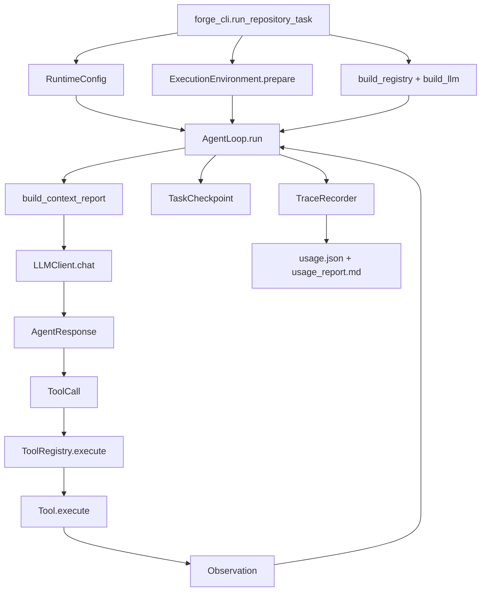
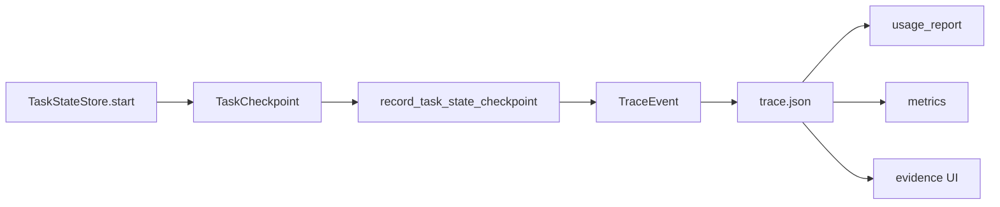
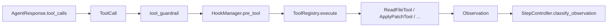
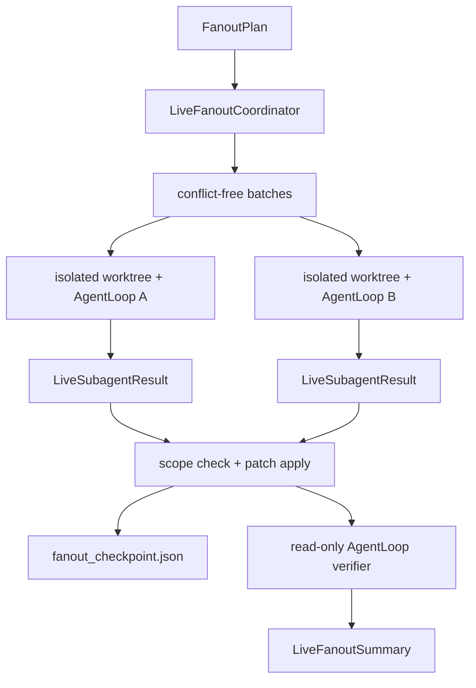
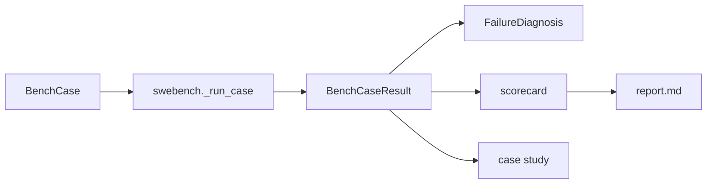

# NanoHarness Code Reading Map

This guide answers one question: when you open a function, how can you know
what enters it, what leaves it, and where the data goes without tracing the
entire repository backwards?

## The One-Line Model

```text
CLI task -> RuntimeConfig -> AgentLoop -> LLM/ToolCall -> Observation -> Trace/Checkpoint -> Report/Evaluation
```

The project has five kinds of objects. Learn these before reading control flow:

| Kind | Meaning | Main definitions |
| --- | --- | --- |
| Configuration | What one run is allowed to do | `runtime/config.py`, `runtime/execution_environment.py` |
| Protocol | Data exchanged with models and tools | `runtime/message.py`, `runtime/tool_call.py`, `runtime/observation.py`, `tools/base.py` |
| Runtime state | What the agent currently knows and where it stopped | `runtime/state.py`, `runtime/task_state.py` |
| Evidence | What happened and why | `observability/event.py`, `observability/trace.py`, `observability/evidence.py` |
| Outcome | What a run or benchmark produced | `multi_agent/types.py`, `multi_agent/live_fanout.py`, `bench/types.py`, `evaluation/types.py` |

## Main Runtime Call Chain



Read this path in order:

1. `forge_cli.run_repository_task` owns run setup and artifact paths.
2. `RuntimeConfig` is the complete control-plane input to `AgentLoop`.
3. `AgentLoop.run` owns orchestration, but delegates context, policy, tools, and persistence.
4. `LLMClient.chat` returns one normalized `AgentResponse` regardless of provider.
5. `ToolRegistry` validates model-generated arguments before a concrete `Tool` sees them.
6. Every tool returns an `Observation`; exceptions do not become an alternate protocol.
7. `TaskCheckpoint` stores resumable control state; `TraceRecorder` stores the audit timeline.

## The Trace Example

The checkpoint call is deliberately a named method:

```python
self.trace.record_task_state_checkpoint(
    step=0,
    agent_name=agent_name,
    checkpoint=checkpoint,
)
```

You can understand it locally:

- `step` is an `int`.
- `agent_name` is a `str`.
- `checkpoint` is a `TaskCheckpoint`; jump directly to that dataclass for every field.
- the method writes event type `task_state_checkpoint`.
- serialization occurs only inside `TraceRecorder`, not at the caller.

Its data path is:



The JSON stays backward compatible and flat:

```json
{
  "run_id": "...",
  "step": 0,
  "agent_name": "CodingAgent",
  "event_type": "task_state_checkpoint",
  "success": true,
  "task_state": {
    "status": "created",
    "current_step": 0,
    "last_tool": ""
  }
}
```

`TraceEvent` protects envelope fields such as `run_id` and `event_type` from
being overwritten by extension payloads. `TraceEventType` lists the supported
event vocabulary. `TraceRecorder.add` is a compatibility escape hatch;
high-value events should gain a named `record_*` method.

## Owned Data Versus Boundary Data

Use this rule when a type contains `Any`:

| Location | Expected style | Reason |
| --- | --- | --- |
| Runtime-owned state | dataclass, Enum, explicit fields | The project controls the shape |
| Function-to-function calls | concrete parameter and return types | Readers and static tools should know the contract |
| Model/tool/MCP/HTTP JSON input | named boundary alias plus runtime validation | External data is untrusted until checked |
| Stored JSON artifact | typed domain object with one `to_dict` boundary | Serialization should happen once, near the owner |
| UI rendering input | validated `dict[str, Any]` | Historical artifacts may have different versions |

`Any` at an external boundary is honest. `Any` inside owned runtime state is a
signal to introduce a domain model.

## Tool Call Chain



Important ownership boundaries:

- `ToolCall` owns normalized model intent.
- `ToolRegistry` owns existence and argument-schema validation.
- `HookManager` owns allow, ask, and deny decisions.
- a concrete tool owns its filesystem or command behavior.
- `Observation` is the only result returned to `AgentLoop`.
- `StepController` owns retry versus stop policy.

## Human Input And Approval

Clarification and authorization are separate:

| Need | Object | Store | Stop state |
| --- | --- | --- | --- |
| Missing task information | `HumanInputRequest` | `HumanInputStore` | `WAITING_HUMAN` |
| Permission for a side effect | `ApprovalRequest` | `ApprovalStore` | `WAITING_APPROVAL` |
| Prevent duplicate side effects | `OperationRecord` | `OperationLedgerStore` | replay or stale block |

The stores own persistence. `AgentLoop` only decides when to create, load, or
consume these records.

## Live Fanout Call Chain



The two key types are `FanoutPlan` for validated input and
`LiveFanoutSummary` for output. Worker internals should not leak ad hoc dicts
into callers.

## Evaluation Call Chain



Keep these claims separate while reading:

- generated patch: a diff exists;
- local validation: selected local checks ran;
- official evaluation: the external harness produced a result;
- resolved: official evidence says the case passed.

## Static Contract Gate

```bash
.venv/bin/python -m mypy agent_forge
.venv/bin/python -m unittest tests.test_type_contracts -v
```

Mypy checks all production modules. The AST regression test also rejects a new
function without complete parameter and return annotations, so basic navigation
quality does not depend on a developer remembering to run a separate tool.

## A Practical Reading Order

For a first pass, read only these files:

1. `runtime/config.py`
2. `runtime/message.py`, `runtime/tool_call.py`, `runtime/observation.py`
3. `tools/base.py`, then `tools/registry.py`
4. `runtime/task_state.py`
5. `observability/event.py`, then `observability/trace.py`
6. `runtime/agent_loop.py`
7. `multi_agent/live_fanout.py`
8. `bench/types.py`, then `bench/swebench.py`

At each function, answer four questions from its local signature and docstring:

1. Which domain objects enter?
2. What exact type returns?
3. Which side effects can happen?
4. Which object owns the next step?

If those answers require searching for the first caller, the contract should be
improved rather than documented around.
