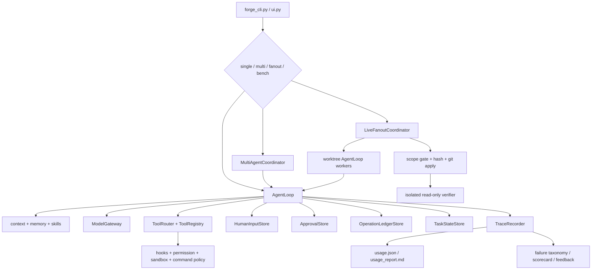

# Runtime Learning Path

For the end-to-end object and call-chain map, read
[`code-reading-map.md`](code-reading-map.md) first. This document then explains
how to exercise each capability.

This guide is the shortest complete route from starting NanoHarness to reading
the runtime evidence behind single-agent execution, durable human input,
sequential roles, live fanout, recovery, and evaluation.

## Start the Project

```bash
cd /Users/chenjiahui/Documents/GitHub/NanoHarness
python3.11 -m venv .venv
source .venv/bin/activate
python -m pip install -e '.[bench]'
forge doctor
bash scripts/verify.sh
```

Open the local workbench:

```bash
source .venv/bin/activate
forge ui
```

## System Map



## Reading Order

| Order | File | Read for | Connected to |
| ---: | --- | --- | --- |
| 1 | `agent_forge/forge_cli.py` | Public arguments, environment preparation, mode dispatch, respond/resume commands | Every runtime path |
| 2 | `agent_forge/runtime/wiring.py` | One registry/model construction boundary | AgentLoop and all workers |
| 3 | `agent_forge/runtime/agent_loop.py` | Clarification, context, model calls, routing, safety, observations, recovery, stopping | Canonical execution kernel |
| 4 | `agent_forge/runtime/human_input.py` | Pending/responded/cancelled informational input | `ask_human`, `forge respond`, resume |
| 5 | `agent_forge/runtime/approval.py` | Authorization for a concrete side effect and stale fingerprint checks | `forge approve` |
| 6 | `agent_forge/runtime/task_state.py` and `operation_ledger.py` | Continuation state and side-effect idempotency | Single/sequential recovery |
| 7 | `agent_forge/multi_agent/coordinator.py` | Sequential role workflow and bounded revision | Explicit artifact handoff |
| 8 | `agent_forge/multi_agent/fanout.py` | Pure DAG batching and overlap algorithms | Live coordinator scheduling |
| 9 | `agent_forge/multi_agent/live_fanout.py` | Real workers, worktrees, scope checks, merge, checkpoint, finalizer | Parallel plan execution |
| 10 | `agent_forge/runtime/git_workspace.py` | Shared tracked/untracked binary patch evidence | Run, benchmark, tools, both coordinators |
| 11 | `agent_forge/observability/trace.py` and `usage_report.py` | Source events and quantitative read models | Reports and debugging |
| 12 | `agent_forge/bench/swebench.py` and `evaluation/` | Candidate patches, official outcomes, scorecards, ablations, feedback | Improvement loop |

## Canonical AgentLoop

```text
task
  -> input guardrail
  -> clarification policy
  -> skill and context assembly
  -> model call
  -> tool routing and schema validation
  -> permission / environment hooks
  -> approval or tool execution
  -> observation / recovery / budget checks
  -> checkpoint and trace
  -> final-answer evidence guardrail
```

Start with these tests:

```bash
.venv/bin/python -m unittest \
  tests.test_agent_loop_policy \
  tests.test_tool_router \
  tests.test_tool_registry_router -v
```

## Durable Human Input

Clarification and authorization are different state machines:

```text
informational question
  -> HumanInputStore.request
  -> WAITING_HUMAN
  -> forge respond
  -> forge resume
  -> question + answer enter continuation context

write authorization
  -> ApprovalStore.request + target fingerprint
  -> WAITING_APPROVAL
  -> forge approve
  -> fingerprint recheck
  -> execute or mark stale
```

Run the deterministic behavior suite:

```bash
.venv/bin/python -m unittest \
  tests.test_human_input \
  tests.test_human_approval \
  tests.test_resume_cli \
  tests.test_operation_ledger -v
```

With a configured provider, a deliberately underspecified task demonstrates the
stop/respond/resume path:

```bash
forge run "fix it" --provider deepseek
forge respond <request-id> --answer "Update agent_forge/runtime/config.py"
forge resume .agent_forge/runs/<run-id> --provider deepseek
```

Inspect the request JSON, latest task-state checkpoint, new run's
`resume_link.json`, and the `Resume Chain` section in `usage_report.md`.

## Sequential Roles

`MultiAgentCoordinator` is an outer deterministic workflow:

```text
Implementer AgentLoop
  -> candidate artifact
  -> Reviewer AgentLoop
  -> PASS / NEEDS_REVISION / BLOCKED
  -> optional bounded Implementer revision
  -> Verifier AgentLoop
  -> multi_agent_summary.json
```

Run it:

```bash
forge run "fix the failing test" \
  --agent-mode multi \
  --profile coding_fix \
  --max-revision-rounds 2 \
  --provider deepseek
```

Read `multi_agent/artifact_index.json` before the report. It makes the role
handoff and revision order concrete.

## Live Fanout

Fanout consumes an explicit JSON DAG. The safe sample contains two read-only
workers:

```bash
forge run "audit runtime and safety evidence" \
  --agent-mode fanout \
  --fanout-plan examples/fanout-plan.sample.json \
  --max-workers 2 \
  --provider deepseek
```

The write path is intentionally stricter:

```text
validate plan
  -> topological levels
  -> split declared write overlap into serial batches
  -> one detached worktree / LLM / registry / AgentLoop per worker
  -> collect tracked and untracked binary patch
  -> verify actual paths remain inside declared scope
  -> detect same-batch overlap
  -> verify patch SHA and git apply --check
  -> apply in deterministic plan order
  -> isolated finalizer with candidate diff visible and pre/post mutation gate
```

Each task can declare `max_steps` (2..32). The effective worker budget is the
lower of that value and the CLI/global budget, so a prompt sentence is not used
as the resource-control mechanism.

Use an outer worktree for a mutating plan:

```bash
forge run "execute the validated task DAG" \
  --agent-mode fanout \
  --fanout-plan path/to/write-plan.json \
  --execution-mode worktree \
  --no-keep-worktree \
  --provider deepseek
```

Run the full deterministic fanout specification:

```bash
.venv/bin/python -m unittest \
  tests.test_subagent_fanout \
  tests.test_live_fanout \
  tests.test_git_workspace -v
```

These tests cover real AgentLoop workers, independent worktrees, new text and
binary files, `.github/` scopes, path escape, dependency failure, conflict
gates, candidate claim boundaries, checkpoint-only recovery, tampered patches,
and durable worker questions.

## Fanout Recovery

```text
fanout_plan.json          exact normalized plan
fanout_checkpoint.json    incremental accepted-task state
fanout_summary.json       terminal run result
workers/<id>/patch.diff   worker candidate patch
workers/<id>/trace.json   worker trajectory
integration.patch         current integrated candidate
```

Resume uses a new clean integration workspace:

```bash
forge run "continue the validated task DAG" \
  --agent-mode fanout \
  --fanout-plan path/to/plan.json \
  --fanout-resume .agent_forge/runs/<previous-run-id> \
  --execution-mode worktree \
  --no-keep-worktree \
  --provider deepseek
```

It rejects a changed plan, changed base commit, missing patch, or patch hash
mismatch. A hard process kill can leave an orphan worktree; inspect with
`git worktree list` and prune only run-owned stale entries.

Worker worktrees are committed `base_head` snapshots. They do not see
uncommitted files from the launching checkout. This provenance boundary is
intentional; commit the input or provide a future explicit seed artifact rather
than assuming ambient dirty state is copied.

## Evidence Reading Order

For one run, read artifacts in this order:

1. `final_answer.txt`: user-visible result and claim boundary.
2. `fanout/fanout_report.md` or `multi_agent/multi_agent_report.md`: workflow outcome.
3. `patch.diff` / `integration.patch`: actual candidate changes.
4. `usage.json`: calls, tokens, cost, latency, failed tools.
5. `trace.json`: exact decisions and stop reason.
6. `execution_environment.json`: workspace, network, image, resource, cleanup facts.
7. Benchmark `scorecard.json`: patch/local/official evidence with denominators.

## Capability Boundaries

- Fanout is local concurrent orchestration, not a distributed queue or swarm.
- The task DAG is explicit; model-driven dynamic decomposition is not claimed.
- Declared overlap is serialized; undeclared conflict requires operator action.
- Durable informational questions work across matching fanout resume.
- Per-operation manual write approval is supported in single/sequential mode;
  write fanout fails fast for that combination until workspace-independent
  operation identity exists.
- Checkpoint recovery restores explicit artifacts, not model process memory.
- A merged patch and verifier PASS are not an official benchmark resolution.

The maintained truth table is
[`docs/CAPABILITY_REALITY_MATRIX.md`](../CAPABILITY_REALITY_MATRIX.md), and the
development case log is
[`docs/evaluation/failure-driven-improvements.md`](../evaluation/failure-driven-improvements.md).
