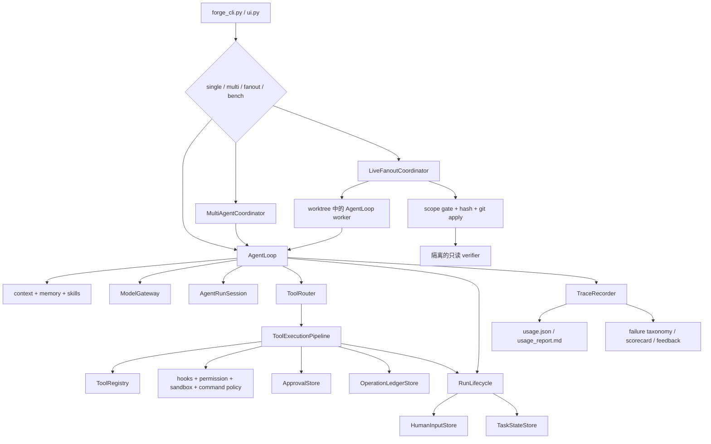

# Runtime 学习路径

先阅读 [`code-reading-map.md`](code-reading-map.md) 中的对象和调用链地图；这份文档
继续说明怎样实际运行每项能力，以及应该检查哪些证据。

这是从启动 NanoHarness 到理解 Single Agent、持久化 Human Input、顺序多角色、
Live Fanout、恢复和评测证据的最短完整路径。

## 启动项目

```bash
cd /Users/chenjiahui/Documents/GitHub/NanoHarness
python3.11 -m venv .venv
source .venv/bin/activate
python -m pip install -e '.[bench]'
forge doctor
bash scripts/verify.sh
```

启动本地工作台：

```bash
source .venv/bin/activate
forge ui
```

## 系统地图



## 阅读顺序

| 顺序 | 文件 | 重点理解 | 连接到 |
| ---: | --- | --- | --- |
| 1 | `agent_forge/forge_cli.py` | 公共参数、环境准备、模式分发、respond/resume 命令 | 所有 runtime 路径 |
| 2 | `agent_forge/runtime/wiring.py` | registry/model 的统一构造边界 | AgentLoop 和全部 worker |
| 3 | `agent_forge/runtime/agent_loop.py` | 只看 `run` 的 start、prepare、turn、stop | 标准执行内核 |
| 4 | `agent_forge/runtime/state.py` | `AgentRunSession` 的显式数据字段 | 一次 run 的状态所有权 |
| 5 | `agent_forge/runtime/tool_execution.py` | 工具调用的固定治理链 | routing 后的 action 落地 |
| 6 | `agent_forge/runtime/run_lifecycle.py` | checkpoint、HITL 和 terminal transition | pause/resume/stop |
| 7 | `agent_forge/runtime/human_input.py` | pending/responded/cancelled 信息状态 | `ask_human`、`forge respond`、resume |
| 8 | `agent_forge/runtime/approval.py` | 对具体副作用授权，以及 stale fingerprint 检查 | `forge approve` |
| 9 | `agent_forge/runtime/task_state.py` 和 `operation_ledger.py` | continuation state 和副作用幂等 | single/sequential recovery |
| 10 | `agent_forge/multi_agent/coordinator.py` | 顺序 role workflow 和有界 revision | 显式 artifact handoff |
| 11 | `agent_forge/multi_agent/fanout.py` | 纯 DAG batching 和 overlap 算法 | Live coordinator scheduling |
| 12 | `agent_forge/multi_agent/live_fanout.py` | 真实 worker、worktree、scope、merge、checkpoint、finalizer | 并行 plan 执行 |
| 13 | `agent_forge/runtime/git_workspace.py` | tracked/untracked binary patch 的统一证据 | run、benchmark、tool、两种 coordinator |
| 14 | `agent_forge/observability/trace.py` 和 `usage_report.py` | 原始 event 和量化 read model | report 和调试 |
| 15 | `agent_forge/bench/swebench.py` 和 `evaluation/` | candidate patch、official outcome、scorecard、ablation、feedback | 改进闭环 |

## 标准 AgentLoop

```text
task
  -> AgentLoop._prepare_run
       -> input guardrail / clarification / skills
  -> AgentLoop._run_turn
       -> context / routing / model call
  -> ToolExecutionPipeline.execute_calls
       -> repeat / HITL / permission / approval / ledger / execute / recovery
  -> RunLifecycle.update or stop
       -> checkpoint / stop hooks / trace
  -> final-answer evidence guardrail
```

折叠所有方法后，第一遍只展开 `AgentLoop.run`。第二遍打开 `AgentRunSession` 看字段，
然后根据问题选择 `ToolExecutionPipeline.execute_calls` 或 `RunLifecycle` 的三个 port。
不需要从任意 helper 反向搜索最初调用者。

先运行这些测试：

```bash
.venv/bin/python -m unittest \
  tests.test_agent_loop_policy \
  tests.test_tool_router \
  tests.test_tool_registry_router -v
```

## 持久化 Human Input

任务补充信息和副作用授权是两套状态机：

```text
informational question
  -> HumanInputStore.request
  -> WAITING_HUMAN
  -> forge respond
  -> forge resume
  -> question + answer 进入 continuation context

write authorization
  -> ApprovalStore.request + target fingerprint
  -> WAITING_APPROVAL
  -> forge approve
  -> fingerprint recheck
  -> execute 或 mark stale
```

运行确定性行为测试：

```bash
.venv/bin/python -m unittest \
  tests.test_human_input \
  tests.test_human_approval \
  tests.test_resume_cli \
  tests.test_operation_ledger -v
```

配置真实 provider 后，可以用一个故意不完整的任务观察 stop/respond/resume：

```bash
forge run "fix it" --provider deepseek
forge respond <request-id> --answer "Update agent_forge/runtime/config.py"
forge resume .agent_forge/runs/<run-id> --provider deepseek
```

依次检查 request JSON、最新 `TaskCheckpoint`、新 run 中的 `resume_link.json`，以及
`usage_report.md` 的 `Resume Chain` 部分。

## 顺序多角色

`MultiAgentCoordinator` 是 `AgentLoop` 外层的确定性 workflow：

```text
Implementer AgentLoop
  -> candidate artifact
  -> Reviewer AgentLoop
  -> PASS / NEEDS_REVISION / BLOCKED
  -> 可选且有上限的 Implementer revision
  -> Verifier AgentLoop
  -> multi_agent_summary.json
```

运行方式：

```bash
forge run "fix the failing test" \
  --agent-mode multi \
  --profile coding_fix \
  --max-revision-rounds 2 \
  --provider deepseek
```

先读 `multi_agent/artifact_index.json`，再读 report。前者能直接说明 role 之间如何
handoff，以及 revision 的真实顺序。

## Live Fanout 实际执行

Fanout 接收一份显式 JSON DAG。安全示例包含两个只读 worker：

```bash
forge run "audit runtime and safety evidence" \
  --agent-mode fanout \
  --fanout-plan examples/fanout-plan.sample.json \
  --max-workers 2 \
  --provider deepseek
```

写入路径更严格：

```text
validate plan
  -> topological levels
  -> 将声明写入范围有重叠的任务拆成顺序 batch
  -> 每个 worker 独占 detached worktree / LLM / registry / AgentLoop
  -> 收集 tracked 和 untracked binary patch
  -> 验证真实修改路径没有逃逸声明 scope
  -> 检查同 batch overlap
  -> 验证 patch SHA 和 git apply --check
  -> 按 plan 顺序确定性 apply
  -> 隔离 finalizer 可见 candidate diff，并经过 pre/post mutation gate
```

每项任务可以声明 `max_steps`，范围是 2 到 32。真实 worker budget 取任务值和
CLI/global budget 的较小者，因此资源限制不是一句无法执行的 prompt 文案。

对于写入型 plan，外层使用 worktree：

```bash
forge run "execute the validated task DAG" \
  --agent-mode fanout \
  --fanout-plan path/to/write-plan.json \
  --execution-mode worktree \
  --no-keep-worktree \
  --provider deepseek
```

运行完整的确定性 fanout 规格测试：

```bash
.venv/bin/python -m unittest \
  tests.test_subagent_fanout \
  tests.test_live_fanout \
  tests.test_git_workspace -v
```

这些测试覆盖真实 AgentLoop worker、独立 worktree、新增文本和 binary 文件、
`.github/` 范围、path escape、dependency failure、conflict gate、candidate claim
boundary、checkpoint-only recovery、patch 篡改，以及持久化 worker question。

## Fanout 恢复

```text
fanout_plan.json          标准化后的精确 plan
fanout_checkpoint.json    增量 accepted-task 状态
fanout_summary.json       终态结果
workers/<id>/patch.diff   worker candidate patch
workers/<id>/trace.json   worker trajectory
integration.patch         当前已集成 candidate
```

Resume 会使用新的干净 integration workspace：

```bash
forge run "continue the validated task DAG" \
  --agent-mode fanout \
  --fanout-plan path/to/plan.json \
  --fanout-resume .agent_forge/runs/<previous-run-id> \
  --execution-mode worktree \
  --no-keep-worktree \
  --provider deepseek
```

如果 plan 改变、base commit 改变、patch 缺失或 patch hash 不一致，恢复会被拒绝。
进程被强制终止时可能遗留 orphan worktree；先用 `git worktree list` 检查，只清理
确认属于历史 run 的 stale entry。

Worker worktree 是 committed `base_head` snapshot，看不到启动 checkout 中未提交的
文件。这是刻意设计的 provenance boundary。应提交输入，或未来通过显式 seed
artifact 传入，不能假设 ambient dirty state 会被自动复制。

## 证据阅读顺序

一次 run 建议按下面顺序阅读：

1. `final_answer.txt`：用户可见结果和 claim boundary。
2. `fanout/fanout_report.md` 或 `multi_agent/multi_agent_report.md`：workflow 结果。
3. `patch.diff` / `integration.patch`：真实 candidate change。
4. `usage.json`：call、token、cost、latency、failed tool。
5. `trace.json`：精确决策和 stop reason。
6. `execution_environment.json`：workspace、network、image、resource、cleanup 事实。
7. benchmark `scorecard.json`：带 denominator 的 patch/local/official evidence。

## 能力边界

- Fanout 是本地并发编排，不是 distributed queue 或 swarm。
- Task DAG 是显式输入，不声称支持 model-driven dynamic decomposition。
- 已声明 overlap 会串行化；未声明 conflict 需要 operator 介入。
- 持久化信息型 question 可以在匹配的 fanout resume 中复用。
- Single/sequential 支持逐操作人工审批；在 operation identity 尚未脱离 workspace
  前，写入型 fanout 与 manual approval 的组合会 fail fast。
- Checkpoint recovery 恢复显式 artifact，不恢复 model process memory。
- merged patch 和 verifier PASS 都不等于 official benchmark resolved。

持续维护的能力真值表见
[`docs/CAPABILITY_REALITY_MATRIX.md`](../CAPABILITY_REALITY_MATRIX.md)，开发问题证据库见
[`docs/evaluation/failure-driven-improvements.md`](../evaluation/failure-driven-improvements.md)。
