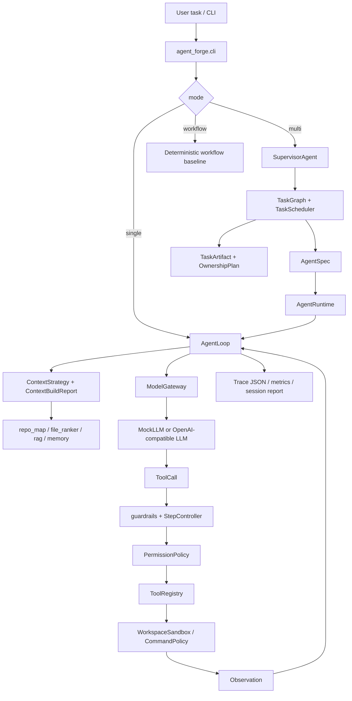

# 01 Code Map And Architecture

## One-Sentence Positioning

Agent Forge is a lightweight CodingAgent runtime. It turns an LLM into a controlled code-execution system by adding context engineering, tool calling, permission checks, recovery, trace, session artifacts, and supervised multi-agent orchestration.

## Architecture



## Directory Map

```text
agent_forge/cli.py
```

Composition root. It parses mode/model/session flags, builds the registry, chooses mock or OpenAI-compatible LLM, creates trace/session artifacts, and dispatches to single, multi, or workflow.

```text
agent_forge/runtime/
```

Core runtime. `agent_loop.py` is the ReAct-style loop. `control.py` owns budgets, failure classification, repeated-action detection, and recovery hints. `session.py` persists resumable runs.

```text
agent_forge/context/
```

Context engineering layer. It ranks files, reads bounded previews, retrieves lexical matches, compresses memory, handles topic shifts, and renders a stable prompt context.

```text
agent_forge/tools/
```

Tool boundary. Tools return `Observation` objects instead of throwing uncontrolled exceptions. `ToolRegistry` validates schema and converts failures into recoverable loop evidence.

```text
agent_forge/safety/
```

Control and trust boundary. It handles input/output guardrails, permission policy, command policy, and workspace path sandboxing.

```text
agent_forge/models/
```

Provider boundary. `ModelGateway` wraps mock, Ollama, company APIs, or online OpenAI-compatible APIs with retry/fallback and usage telemetry.

```text
agent_forge/agents/ + agent_forge/workflows/
```

Multi-agent orchestration. `SupervisorAgent` creates role specs, task graph nodes, ownership claims, artifact contracts, validation, retry, and review.

## Project Talking Points

The project separates agent intelligence from control-plane engineering. The model proposes actions, but runtime code decides what context it sees, which tools exist, whether a tool is allowed, how failures are classified, when to retry, when to stop, and how to audit the run.
