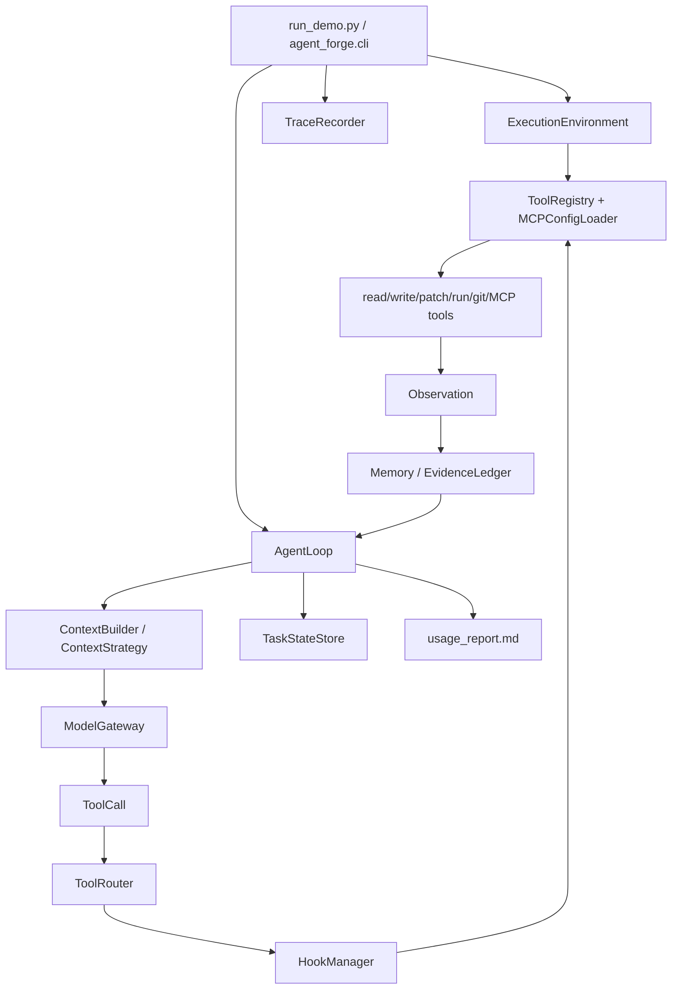

# 01 Runtime Architecture

一句话：Agent Forge 是 production-style CodingAgent runtime core。它把 LLM
放进可控代码执行系统，而不是让模型直接“自由发挥”。

## 主链路

## 目录职责

| path | role |
|---|---|
| `agent_forge/cli.py` | composition root：解析 CLI、准备环境、选择 mode、写报告。 |
| `agent_forge/runtime/agent_loop.py` | ReAct 主循环：context -> model -> tool -> observation -> recovery。 |
| `agent_forge/runtime/execution_environment.py` | local/worktree 边界、网络策略、git 风险命令、环境 manifest。 |
| `agent_forge/runtime/hooks.py` | pre-tool approval、post-tool redaction、stop audit。 |
| `agent_forge/runtime/task_state.py` | checkpoint、resume seed、trace replay。 |
| `agent_forge/context/` | repo map、file ranker、retrieval、memory、token budget。 |
| `agent_forge/tools/` | 本地工具、MCP-style config、stdio 外部工具 adapter。 |
| `agent_forge/safety/` | input/output/tool guardrail、command policy、path sandbox。 |
| `agent_forge/models/` | provider gateway、retry、fallback、token/cost telemetry。 |
| `agent_forge/workflows/` | deterministic workflow、task graph、review gate。 |
| `agent_forge/eval/` | local regression cases、capability breakdown、history diff。 |

## 三个运行模式

| mode | 作用 | 复杂度 |
|---|---|---|
| `single` | 真实主路径，完整 AgentLoop。 | 最高 |
| `multi` | Supervisor + role agents + task graph，复用 AgentLoop。 | 中 |
| `workflow` | 固定链路 baseline，用于对比。 | 低 |
| `review` | 当前 git diff 的 deterministic review gate。 | 中 |

## 读代码顺序

1. `agent_forge/cli.py`：看系统如何组装。
2. `agent_forge/runtime/agent_loop.py`：看 ReAct 执行循环。
3. `agent_forge/context/context_strategy.py`：看上下文怎么选。
4. `agent_forge/runtime/hooks.py`：看工具调用前后的控制面。
5. `agent_forge/tools/registry.py` 和 `agent_forge/tools/mcp_config.py`：看工具协议。
6. `agent_forge/observability/usage_report.py`：看运行证据如何汇总。
