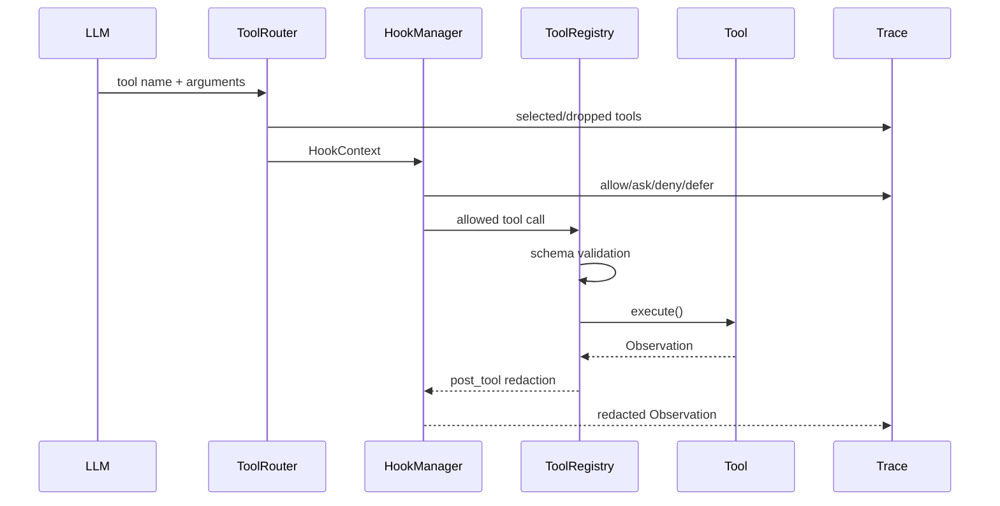

# 03 Tools, Control, Safety

工具调用是 CodingAgent 最容易出事故的地方。本项目把它拆成四层：
ToolRouter、HookManager、ToolRegistry、Concrete Tool。

## Tool Call 生命周期



## Approval Mode

| mode | 语义 |
|---|---|
| `trusted` | 默认模式。读允许，写 ask，可由本地 auto approve 批准。 |
| `on-write` | 写操作必须走 approval event。 |
| `on-risk` | 写操作和命令执行都走 approval event。 |
| `locked` | 只读，所有 side-effect action 拒绝。 |
| `dry-run` | 用于规划/CI，拒绝写和命令执行。 |

命令：

```bash
python run_demo.py --mode single --approval-mode on-risk
python run_demo.py --mode single --approval-mode dry-run
```

## Execution Environment

`ExecutionEnvironment` 不是安全口号，它落地了这些边界：

- `local`：当前 checkout，受 path、command、network policy 约束。
- `worktree`：从 HEAD 创建独立 git worktree，agent 修改不直接污染当前 checkout。
- `network_policy`：默认 deny，阻断 `curl/wget/ssh/scp/nc/telnet`。
- git 风险命令：阻断 `push/reset/checkout/switch/merge/rebase`。
- protected paths：阻断相对 workspace 内 `.git/.venv/.agent_forge`。
- `execution_environment.json`：每个 session 保存 branch、commit、remote、dirty files、active workspace。

命令：

```bash
python run_demo.py --mode single --execution-env worktree
python run_demo.py --mode single --execution-env worktree --cleanup-worktree
```

## Command Policy

`CommandPolicy` 是 allowlist，不是 blocklist：

- 允许：`python -m unittest ...`
- 允许：`git status`, `git diff`
- 拒绝：网络、删除、sudo、push、reset、shell trick、未列入命令。

模型如果尝试被拒绝的命令，结果会变成 failed `Observation`，进入
`StepController` 的 recovery classification。

## MCP / 外部工具

本项目现在同时有 MCP 的两侧能力：

- client side：`MCPConfigLoader` + `MCPStdioClient` 负责启动 server、发现工具、注册到 `ToolRegistry`。
- server side：`python -m agent_forge.mcp.builtin_server` 提供一个项目内置 stdio MCP server。

这不是为了模拟复杂平台，而是为了把真实 Agent 工程里最关键的协议边界跑通：

```mermaid
sequenceDiagram
    participant CLI
    participant Loader as MCPConfigLoader
    participant Server as builtin MCP server
    participant Registry as ToolRegistry
    participant Loop as AgentLoop
    participant LLM

    CLI->>Loader: --mcp-config mcp_tools.example.json
    Loader->>Server: start stdio process
    Loader->>Server: initialize + tools/list
    Server-->>Loader: repo_policy/current_time/web_search/web_fetch schemas
    Loader->>Registry: register forge.* tools
    Loop->>LLM: prompt + selected tool schemas
    LLM->>Loop: tool_call forge.web_search
    Loop->>Registry: execute()
    Registry->>Server: tools/call
    Server-->>Registry: MCP content blocks
    Registry-->>Loop: Observation
```

`MCPConfigLoader` 支持两种接入：

| type | code | 说明 |
|---|---|---|
| local handler | `MCPStyleToolAdapter` | 配置 schema + 内置 safe handler，适合 repo policy/read_text。 |
| stdio server | `MCPStdioClient` + `MCPStdioTool` | 启动 command-backed JSON-RPC server，调用 `tools/list` 和 `tools/call`。 |

内置 server 的工具：

| tool | 作用 | 默认是否联网 |
|---|---|---|
| `forge.repo_policy` | 读取/搜索 `FORGE.md`，让 agent 在改代码前先拿到项目规则。 | 否 |
| `forge.current_time` | 给时间敏感任务提供 local/UTC 时间。 | 否 |
| `forge.web_search` | 查询外部信息；支持 offline、DuckDuckGo、OpenAI hosted web search、Claude hosted web search。 | 默认否 |
| `forge.web_fetch` | 拉取单个 HTTP/HTTPS 页面并转成可读文本。 | 默认否 |

直接验证 MCP server：

```bash
python -m agent_forge.mcp.builtin_server --workspace . --list-tools
python -m agent_forge.mcp.builtin_server --workspace . \
  --call web_search --args-json '{"query":"agent tool protocol","max_results":1}'
scripts/verify_mcp.sh
```

让 AgentLoop 加载 MCP 工具：

```bash
python run_demo.py \
  --mcp-config mcp_tools.example.json \
  --mcp-allowed-tool forge.repo_policy \
  "use the repo_policy tool to summarize command policy"
```

核心设计点：外部工具最终都被转换成统一 `Tool`，所以 AgentLoop 不需要知道工具来自
本地 Python 类、配置文件，还是 stdio server。

### 联网查询的边界

默认 `mcp_tools.example.json` 使用 `AGENT_FORGE_WEB_PROVIDER=offline`。这样公司电脑也能验证
协议链路，不会偷偷联网。真要查外部信息时显式开启：

```bash
AGENT_FORGE_MCP_ALLOW_NETWORK=1 \
AGENT_FORGE_WEB_PROVIDER=duckduckgo \
python run_demo.py --mcp-config mcp_tools.example.json \
  "search the web for current MCP protocol overview"
```

OpenAI / Claude 的 hosted web search 也放在 MCP 工具后面，而不是塞进 AgentLoop：

```bash
# OpenAI hosted web_search. Requires OPENAI_API_KEY.
AGENT_FORGE_MCP_ALLOW_NETWORK=1 \
AGENT_FORGE_WEB_PROVIDER=openai \
python run_demo.py --mcp-config mcp_tools.example.json \
  "search latest public information about MCP tool ecosystems"

# Claude hosted web_search. Requires ANTHROPIC_API_KEY.
AGENT_FORGE_MCP_ALLOW_NETWORK=1 \
AGENT_FORGE_WEB_PROVIDER=claude \
python run_demo.py --mcp-config mcp_tools.example.json \
  "search latest public information about MCP tool ecosystems"
```

技术讲解时可以这样说：Hosted web search 是 provider capability；MCP 是 tool protocol boundary。
本项目把 provider capability 包成 MCP tool，AgentLoop 只看到统一 tool schema、统一权限、
统一 observation、统一 trace。这比在 agent loop 里到处写 provider if/else 更可控。

## 技术口径

不要把 tool calling 讲成 function call API。工程上它是一个治理系统：
候选工具召回、schema validation、权限审批、执行环境、失败恢复、审计日志和成本统计。
