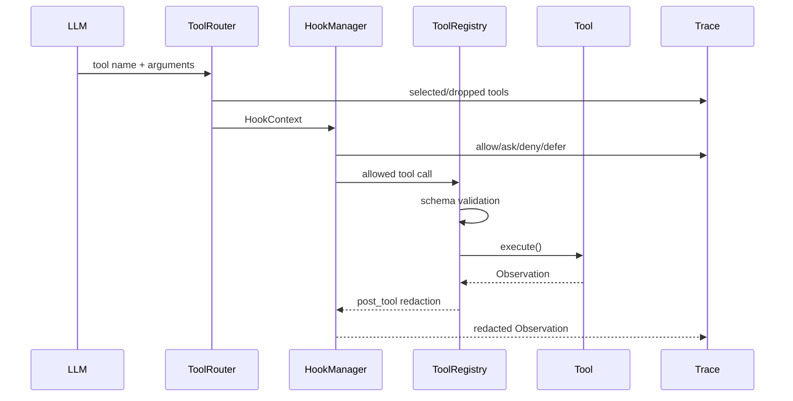

# 03 Tools, Control, Safety

工具调用是 CodingAgent 最容易出事故的地方。本项目把它拆成四层：
ToolRouter、HookManager、ToolRegistry、Concrete Tool。

## Tool Call 生命周期



## Approval Mode

| mode | 语义 |
|---|---|
| `trusted` | 默认模式。读允许，写 ask，可由本地 auto approve 批准。 |
| `on-write` | 写操作必须走 approval event。 |
| `on-risk` | 写操作和命令执行都走 approval event。 |
| `locked` | 只读，所有 side-effect action 拒绝。 |
| `dry-run` | 用于规划/CI，拒绝写和命令执行。 |

命令：

```bash
python run_demo.py --mode single --approval-mode on-risk
python run_demo.py --mode single --approval-mode dry-run
```

## Execution Environment

`ExecutionEnvironment` 不是安全口号，它落地了这些边界：

- `local`：当前 checkout，受 path、command、network policy 约束。
- `worktree`：从 HEAD 创建独立 git worktree，agent 修改不直接污染当前 checkout。
- `network_policy`：默认 deny，阻断 `curl/wget/ssh/scp/nc/telnet`。
- git 风险命令：阻断 `push/reset/checkout/switch/merge/rebase`。
- protected paths：阻断相对 workspace 内 `.git/.venv/.agent_forge`。
- `execution_environment.json`：每个 session 保存 branch、commit、remote、dirty files、active workspace。

命令：

```bash
python run_demo.py --mode single --execution-env worktree
python run_demo.py --mode single --execution-env worktree --cleanup-worktree
```

## Command Policy

`CommandPolicy` 是 allowlist，不是 blocklist：

- 允许：`python -m unittest ...`
- 允许：`git status`, `git diff`
- 拒绝：网络、删除、sudo、push、reset、shell trick、未列入命令。

模型如果尝试被拒绝的命令，结果会变成 failed `Observation`，进入
`StepController` 的 recovery classification。

## MCP / 外部工具

`MCPConfigLoader` 支持两种接入：

| type | code | 说明 |
|---|---|---|
| local handler | `MCPStyleToolAdapter` | 配置 schema + 内置 safe handler，适合 repo policy/read_text。 |
| stdio server | `MCPStdioClient` + `MCPStdioTool` | 启动 command-backed JSON-RPC server，调用 `tools/list` 和 `tools/call`。 |

配置入口：

```bash
python run_demo.py \
  --mcp-config mcp_tools.example.json \
  --mcp-allowed-tool local.repo_policy \
  "use the repo_policy tool to summarize command policy"
```

核心设计点：外部工具最终都被转换成统一 `Tool`，所以 AgentLoop 不需要知道工具来自
本地 Python 类、配置文件，还是 stdio server。

## 技术口径

不要把 tool calling 讲成 function call API。工程上它是一个治理系统：
候选工具召回、schema validation、权限审批、执行环境、失败恢复、审计日志和成本统计。
