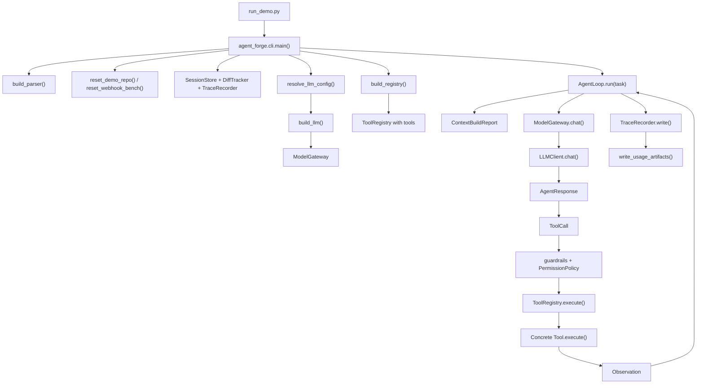
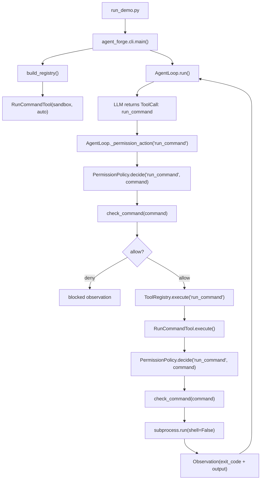
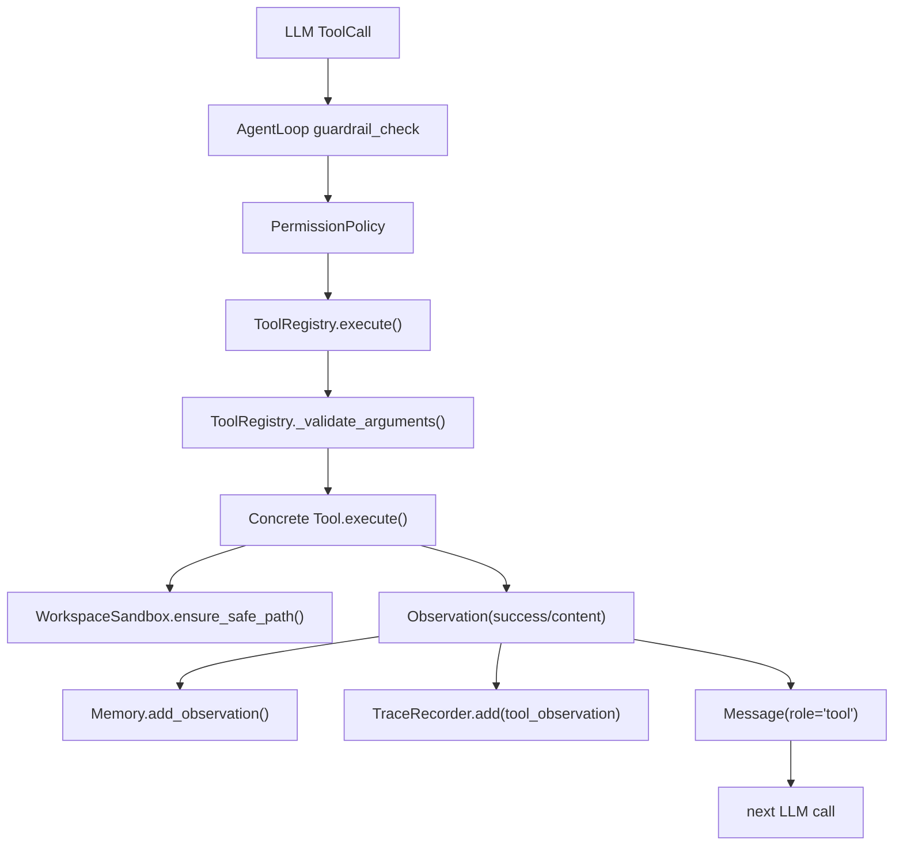
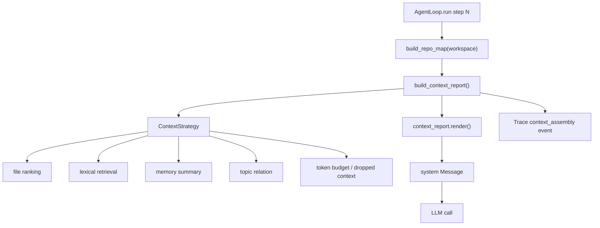
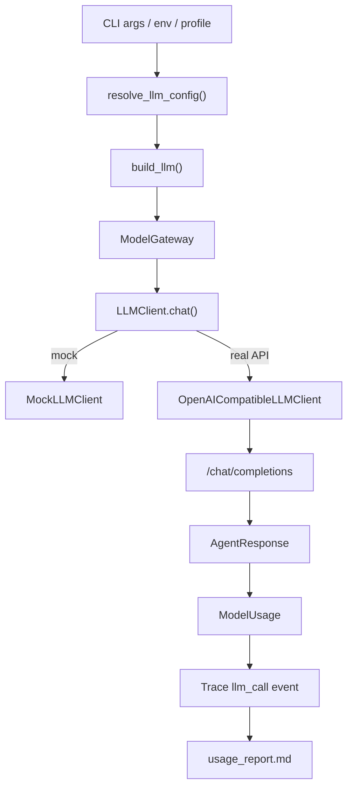
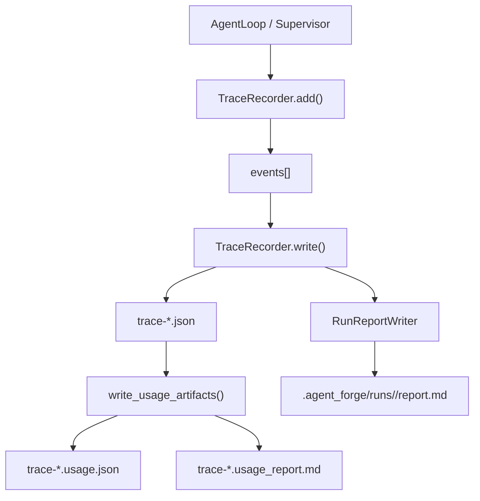
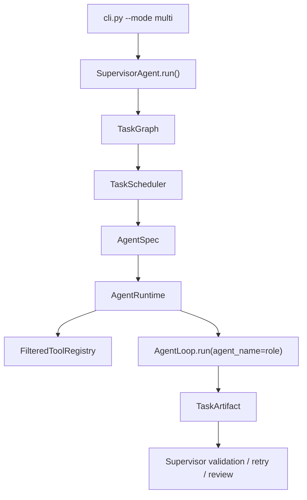
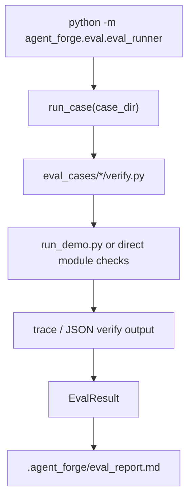

# 08 Runtime Call Chain Map

This document solves a practical reading problem: "I can find direct references
in the IDE, but I still cannot see how this method participates in a real run."

Use it as a map from entrypoint to runtime behavior. Tests and eval scripts are
useful evidence, but they are not always the main production-shaped path.

## How To Read A Function

When you land on a method, classify it first:

```text
entrypoint       run_demo.py, agent_forge/cli.py
runtime loop     agent_forge/runtime/agent_loop.py
context          agent_forge/context/*
model gateway    agent_forge/models/*, agent_forge/runtime/llm_client.py
tool boundary    agent_forge/tools/*
safety policy    agent_forge/safety/*
observability    agent_forge/observability/*
eval/test        eval_cases/*, tests/*
```

Then ask two questions:

1. Who directly calls this method?
2. Which real runtime chain reaches that direct caller?

`Find All References` answers question 1. This file answers question 2.

## Main Single-Agent Chain

This is the canonical path for `local_scripts/run_webhook_deepseek.sh`,
`local_scripts/run_webhook_bench.sh`, and normal `--mode single` runs.



Mental model:

```text
CLI composes dependencies.
AgentLoop owns the loop.
LLM proposes actions.
Policies decide whether actions are allowed.
Tools execute and return observations.
Trace/usage turn the run into evidence.
```

## Command Policy Chain

Example question: where does `check_command()` matter in a real run?

Direct references show:

```text
agent_forge/safety/permission.py
tests / eval_cases
```

But the real single-agent runtime chain is:



Why is it called twice?

```text
AgentLoop permission check:
  records the policy decision in trace before tool execution.

RunCommandTool internal check:
  enforces the same policy at the concrete tool boundary.
```

That duplication is intentional defense in depth. The model cannot skip the
AgentLoop check, and a direct tool call in a test/eval still goes through the
tool's own policy.

What the model sees:

```text
RunCommandTool.schema()
  -> description says prefer python -m unittest discover <test_dir>
  -> description says pytest / cd / python -c / direct file execution are blocked
```

What actually enforces it:

```text
PermissionPolicy.decide()
  -> check_command()
    -> allowlist unittest, git status, git diff
    -> block network, deletion, privilege, push, unknown commands
```

## Tool Execution Chain

All tools follow the same general shape:



Important point:

```text
Tool failures are data, not crashes.
```

For example, a patch mismatch returns:

```text
Observation(success=False, content="old text not found")
```

Then `StepController` classifies it and writes a recovery decision.

## Context Engineering Chain

Context is rebuilt every step.



When you see a method under `agent_forge/context/`, look for it through:

```text
AgentLoop.run()
  -> build_context_report()
    -> context_builder.py
    -> context_strategy.py
    -> repo_map / rag / file_ranker / memory
```

Trace evidence:

```text
event_type = context_assembly
fields = selected_files, retrieved_docs_count, budget_breakdown, dropped_context
```

## Model Call Chain

Mock, DeepSeek, Ollama, and company APIs share the same runtime boundary.



When you read model-related code, separate three layers:

```text
llm_config.py:
  resolves provider/base_url/model/key.

llm_client.py:
  knows provider wire format.

models/gateway.py:
  wraps retry/fallback/usage telemetry.
```

## Trace And Usage Chain

Trace is written incrementally during runtime, then turned into reports at the
end.



Use trace to confirm real execution, not just code references:

```bash
python -m json.tool trace-webhook-deepseek.json > trace-webhook-deepseek.pretty.json
rg '"event_type": "tool_call"|"event_type": "tool_observation"' trace-webhook-deepseek.pretty.json
```

## Multi-Agent Chain

`multi` mode is not the same as single mode. It is a supervised orchestration
path that reuses `AgentLoop` through role-specific runtimes.



When reading multi-agent files, the main path is:

```text
cli.py
  -> SupervisorAgent.run()
    -> task_graph.py
    -> agent_runtime.py
    -> AgentLoop.run()
```

## Eval/Test Chain

Eval and tests are not the main runtime path. They are evidence harnesses.



How to interpret references:

```text
verify.py calls a method:
  eval evidence path.

cli.py / agent_loop.py calls a method:
  runtime path.

tool.execute() calls a method:
  concrete action boundary.

tests/* call a method:
  unit-level behavior proof.
```

## VS Code Workflow

Use IDE navigation in this order:

1. `Go to Definition`
2. `Find All References`
3. `Show Call Hierarchy`
4. Open this document and match the method to a runtime chain.
5. Open the trace file and confirm whether that chain happened in a real run.

Useful terminal checks:

```bash
rg "check_command"
rg "PermissionPolicy"
rg "ToolRegistry.execute"
rg "TraceRecorder.add"
rg "build_context_report"
```

## Concrete Example: check_command()

If you are reading:

```text
agent_forge/safety/command_policy.py::check_command
```

Do not stop at direct references. Read it like this:

```text
1. User runs:
   local_scripts/run_webhook_deepseek.sh

2. Script calls:
   run_demo.py "...webhook task..." --mode single --llm deepseek

3. CLI builds:
   build_registry()
     -> RunCommandTool
   build_llm()
     -> ModelGateway(OpenAICompatibleLLMClient)
   AgentLoop(...)

4. AgentLoop receives model tool call:
   ToolCall(name="run_command", arguments={"command": "python -m unittest discover examples/webhook_service_repo/tests"})

5. Before execution:
   PermissionPolicy.decide("run_command", command)
     -> check_command(command)

6. During concrete tool execution:
   RunCommandTool.execute()
     -> PermissionPolicy.decide("run_command", command)
       -> check_command(command)
     -> subprocess.run(...)

7. Result returns:
   Observation(success=True, content="exit_code=0 ...")
     -> trace tool_observation
     -> next LLM turn
```

That is the difference between "this function is referenced by permission.py"
and "this function is part of the runtime safety gate for every command tool
call."
