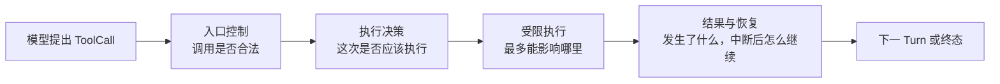

# 运行生命周期与异常处理机制

本文是 NanoHarness 运行机制的总览入口。四层主视图用于说明稳定职责，具体实现类名和调用时序
作为后续实现细节展开。Hook、Guardrail 和目录结构均不能单独代表完整治理模型。

架构依赖和代码位置见[项目架构与代码导航](项目架构与代码导航.md)；能力是否真实接入见
[能力实现状态与使用边界](能力实现状态与使用边界.md)。

## 1. 工具治理四层主视图



| 层级 | 核心问题 | 必须保证的不变量 | 失败或等待时 |
| --- | --- | --- | --- |
| 入口控制 | 这是不是合法、本轮可用的工具调用？ | Provider 格式、工具可见性和参数契约不正确就不进入工具实现 | 拒绝调用或返回可修正的失败 Observation |
| 执行决策 | 这次操作现在是否应该执行？ | 合法调用也必须经过历史状态、权限和人工审批决策；已执行操作不盲目重复 | 拒绝、等待人工、回填旧结果或阻断不安全恢复 |
| 受限执行 | 即使允许，它最多能影响哪里？ | 授权不等于无限权限；命令、路径、网络和运行环境仍受硬边界约束 | 越界命令、路径或网络请求被拒绝并留下原因 |
| 结果与恢复 | 最终发生了什么，中断后从哪里继续？ | 返回结果先脱敏再回填；事实、执行状态和 Run 恢复点分别持久化 | 结果不确定时不自动重试；从最近安全点 continuation |

四层中只有前三层决定“能不能真正调用工具”；第四层记录已经发生的事实并支持恢复。
Hook 是 Runtime 在固定时机调用“生命周期处理器”的实现机制，不是独立的第五层；
`before_tool` 是触发时机，权限判断和执行环境预检才是该时机的具体能力。

### 1.1 架构概览

> 模型只能提出工具调用意图，不能直接改变持久状态。Runtime 先检查调用是否合法，再结合历史
> 执行状态、权限和人工审批决定是否放行；放行后仍受命令、工作区和执行环境的边界约束；
> 最后对结果脱敏并保存事实、操作状态和 Run 恢复点，避免进程中断后盲目重复执行。

### 1.2 实际执行时序

四层是帮助理解职责的**逻辑分层**，不是把代码强行切成四个文件。当前代码的真实时序是：

```text
ToolRouter 决定本轮向模型暴露的工具
→ 模型返回 ToolCall
→ ToolCallNormalizer 归一化 Provider 返回格式
→ ToolExecutionPipeline 复核本轮可见性，并记录轻量检查证据
→ OperationTracker 建立操作身份，查询操作状态表
→ before_tool 时机的具体处理器检查执行环境和权限
→ ToolAuthorizationGate 处理 ALLOW / DENY / ASK，ASK 进入人工审批
→ ToolRegistry 校验工具参数，再调用具体 Tool
→ 具体 Tool 仍在 CommandPolicy / WorkspaceSandbox / ExecutionEnvironment 边界内执行
→ after_tool 时机对 Observation 做最终脱敏
→ 更新操作状态表、Trace 和 Checkpoint，再回到下一 Turn 或终态
```

`tool_guardrail` 是代码中的历史名称，当前只记录 ToolCall 是否存在、本轮可见以及参数是否为对象的
轻量检查证据；本轮路由复核才是这里的实际阻断条件。Guardrail、Hook 和具体类名分别承担局部
职责，不作为整个工具治理的上层概念。

## 2. 单智能体的关键状态

| 场景 | Runtime 动作 | 持久化状态 | 下一步 |
| --- | --- | --- | --- |
| 模型缺信息 | 只保留 `ask_human`，本 turn 其他工具不执行 | `WAITING_HUMAN` + request + checkpoint | 保存回答，创建 continuation Run |
| 写操作需授权 | 工具尚未执行，保存具体工具、参数、operation key 和 fingerprint | `WAITING_APPROVAL` + approval + checkpoint | 保存决定，创建 continuation Run |
| 批准后目标漂移 | 将旧批准标为 stale，禁止工具执行 | stale approval + blocked evidence | 基于新状态重新申请 |
| 操作状态表已是 `executed` | 当前 fingerprint 与上次执行后的 post-fingerprint 一致时，回填既有 Observation | result reuse evidence | 不再次调用工具；第一次执行的改动早已落地 |
| 操作状态表停在 `executing` | 结果不确定，不能猜测成功或失败 | blocked evidence | 人工核实外部状态 |
| 同一 ToolCall 原地重复 | 首次加一次重试；第三次连续相同触发停止 | `repeated_action` | 诊断模型未推进 |
| 连续 3 个工具失败 | 不要求工具或参数相同，任一成功会清零 | blocked checkpoint | 检查失败 Observation 后重跑 |
| 模型给最终答案但仍有待执行 ToolCall | 拒绝把不完整状态写成 completed | `pending_tool_call_at_stop` | 增加预算或要求明确收口 |

### 操作状态表的六个状态

`OperationLedger` 的文档中文统一叫**操作状态表**。它不是 LLM 的 Plan，也不是普通日志；
它以 operation key 为主键，保存一项可能改变持久状态的工具操作走到了哪一步。

```text
人工审批路径：planned -> pending -> approved -> executing -> executed / failed
自动放行路径：approved -> executing -> executed / failed
```

| 代码状态 | 准确含义 | 同一操作再次出现时 |
| --- | --- | --- |
| `planned` | 操作意图已登记，工具尚未启动；不是“LLM 做了 Plan” | 继续进入授权流程 |
| `pending` | 等待审批，工具尚未启动 | 仍未批准则继续暂停；已批准则继续 |
| `approved` | 这项具体操作已获授权，工具尚未启动 | 重新校验目标状态后才可执行 |
| `executing` | Runtime 已准备调用或已调用工具，但尚未提交最终结果 | 结果可能已影响外部状态，阻断自动重试并要求人工核实 |
| `executed` | 工具成功结果、Observation 和执行后 fingerprint 已提交 | 当前目标仍等于执行后状态时，只回填上次结果；目标已变化则阻断旧结果复用 |
| `failed` | 工具返回失败，失败事实已提交 | 不后台自动重试；模型再次提出时重新经过重复策略、授权和执行管线 |

这里“当前目标仍等于执行后状态”不是说“可以再 apply 一次”，恰好相反：第一次执行已经完成了修改。
Runtime 只是把上次 Observation 回填给模型，相当于幂等请求返回原结果，而不是再次执行操作。

### Approval 当前到底怎样恢复

当前实现是**复用授权记录，不是直接重放 pending ToolCall**：

```text
模型提出写操作
  -> Runtime 保存 ApprovalRequest 和 WAITING_APPROVAL Checkpoint，旧 Run 结束
  -> 人保存 approved / rejected
  -> Harness.resume 创建新的 continuation Run
  -> 新模型调用根据任务与 checkpoint 摘要重新规划
  -> 只有重新提出相同 tool + canonical arguments + workspace + action
     才得到同一个 operation key，并复用既有批准
  -> fingerprint 未变化才执行；变化则批准失效
```

因此，`approved` 回答的是“**若相同操作再次出现，是否允许执行**”，不保证模型一定再次提出它。
确定性演示中，因为任务和 workspace 未变化，模型通常会重提；但生产级工作流若要求“批准后该动作
必须执行”，应把完整 pending command 持久化并在批准后直接重放，同时重新校验 Tool schema、策略、
operation key、fingerprint 和操作状态表。NanoHarness 当前没有实现这条 durable-command 语义。

这个取舍的边界是：重新规划更能适应 continuation 时的新上下文，也更简单；代价是批准动作可能
没有被重新命中。它适合作为本地 Agent Runtime 的保守 continuation，不应包装成工作流引擎式原地续跑。

## 3. 容易混淆的持久化对象

| 对象 | 回答的问题 | 工程类比 | 不能代替什么 |
| --- | --- | --- | --- |
| Trace | 发生过什么 | 审计流水 | 不是恢复状态或授权 |
| Checkpoint | Run 从哪个安全点 continuation | 流程实例快照 | 不保存完整消息和 Python 栈 |
| ApprovalRequest | 人是否允许这个具体操作 | 人工审批单 | 不是永久权限 |
| Operation key | 重新出现的是不是同一操作意图 | 幂等键 / 业务请求号 | 不证明目标没变化 |
| Fingerprint | 目标是否还是批准时状态 | 乐观锁版本 / before image | 不证明动作是否执行 |
| 操作状态表（代码名 `OperationLedger`） | 某项持久状态变更操作执行到哪一阶段 | 操作状态机 + 幂等记录 | 不是整个 Agent Run 的 Checkpoint |
| Artifact | 工作产物是什么 | 构建产物 / 交付件 | 文件存在不等于正确 |
| Evaluation | 产物支持哪一级结论 | 验收报告 | 不能改写 Runtime 事实 |

文档统一把这类调用叫作**持久状态变更操作**。代码中的 `side_effect=True` 是执行前风险分类：
表示该操作如果执行，可能写文件或改变外部状态，因此需要审批和防重复保护；它不表示变更已经发生。

## 4. Fanout：从 Plan 到 Finalizer

```text
FanoutPlan
  -> 按依赖和声明 write_scope 划分 Batches
  -> 每个 Batch 中的 Workers 在隔离 worktree 并发运行
  -> 每个 Worker 产出 candidate patch（仓库中保存为 unified-diff 文件）
  -> Coordinator 检查真实 touched_files，并按稳定顺序 check/apply patch
  -> 全部任务成功集成且无冲突，才启动只读 Finalizer
  -> 发布 summary、checkpoint、trace、usage 和 integrated diff
```

### 术语边界

| 术语 | 含义 |
| --- | --- |
| Plan | 整次 Fanout 的目标、任务、依赖、写范围和预算 |
| Task | DAG 中一个可独立调度的子任务 |
| Batch | 当前依赖已满足且写范围不重叠、可同时执行的一组 Task；它是调度批次，不是文件 |
| Worker | 在独立 workspace 执行一个 Task 的 AgentLoop |
| Patch | 一组候选代码改动；内部以 `.diff` 文件承载 unified diff |
| Integrated diff | Coordinator 已接受并应用的所有 Worker patch 的合并结果 |
| Finalizer | 对集成结果做只读验收的最后质量门；不合并、不修复、不回滚 |

一个 Batch 可以有多个 Worker；一个 Worker 通常产生一份 candidate patch。**Batch 管“何时并发”，
Patch 管“改了什么”。**

### 冲突、失败和后续动作

| 场景 | Coordinator 怎样处理 | 其他成果 | 最终状态 / 后续 |
| --- | --- | --- | --- |
| 声明 `write_scope` 重叠 | 运行前拆到不同 Batch | 全部保留 | 串行执行，不算失败 |
| Worker 实际修改同一路径 | 冲突 Worker 均不合并 | 无关 Worker 可继续合并 | `conflict_resolution_required`；修 Plan 后新 Run |
| candidate patch 无法 check/apply | 该 Task 标记 `merge_conflict` | 已合并和后续无关 patch 保留 | `conflict_resolution_required` |
| Worker 失败 | 不进入 `merged_task_ids` | 独立任务继续 | `partial_failure`；依赖任务为 `blocked_dependency` |
| 全部合并，Finalizer 非 PASS | 不回滚集成结果 | diff、Trace、Usage、Finalizer Evidence 全保留 | `needs_revision`；人工根据证据修订后开始新 Run |
| 全部合并，Finalizer PASS | 发布集成证据 | 全部保留 | `passed`，但仍不等于 official benchmark resolved |

`needs_revision` 是**终态证据**，不是后台自动修订队列。当前实现不会自动把 Finalizer 意见交给
另一个 LLM，也不会原地继续；操作者读取 Finalizer Evidence，修改任务、Plan、Prompt 或代码后启动
新的 Fanout Run。已合并结果不自动回滚，因为它们仍是可检查的候选成果。

### Fanout 怎样恢复

Checkpoint 只在运行前、完整 Batch 验收合并后和最终收口前写入。Resume 校验 plan digest、base
commit 和 candidate diff SHA-256，在新 workspace 重放已接受 patch，再只运行未接受 Task。若同批
Worker 尚未经过整批验收就被强杀，该批重跑；改过 Plan 或 base 后拒绝复用旧 Checkpoint。

## 5. Context、Memory 与 Evaluation

| 机制 | 当前规则 | 当前边界 |
| --- | --- | --- |
| Context | 预算完整请求；system 保留；ToolCall 与 Observation 不拆；摘要带 source hash | token 是近似估算；不恢复 KV Cache |
| Tool visibility | Registry 是全集，Router 选择本轮可见子集，执行前再次校验 | 当前 routing 含透明启发式，不是 learned router |
| Long-term Memory | 用户显式 `remember` 后跨 Run 召回；每个 Run 固定一次快照 | 不自动画像，不在同一 Run 热更新 |
| Failure Taxonomy | ordered rules 读取真实 Evidence，取第一条命中 | 不调用 LLM，不猜 official result |
| Evidence ladder | candidate -> local verified -> official resolved | 后一级不能由前一级、Reviewer 或 Finalizer PASS 推导 |

## 6. 代码与证据入口

本页负责定义机制和异常语义。按触发时机查当前策略与可点击代码 Owner，见
[核心运行机制与代码索引](核心运行机制与代码索引.md)；模块依赖见[项目架构与代码导航](项目架构与代码导航.md)；需要动手跑断点时，进入
[Debug Lab](../examples/debug_lab/README.md)。
